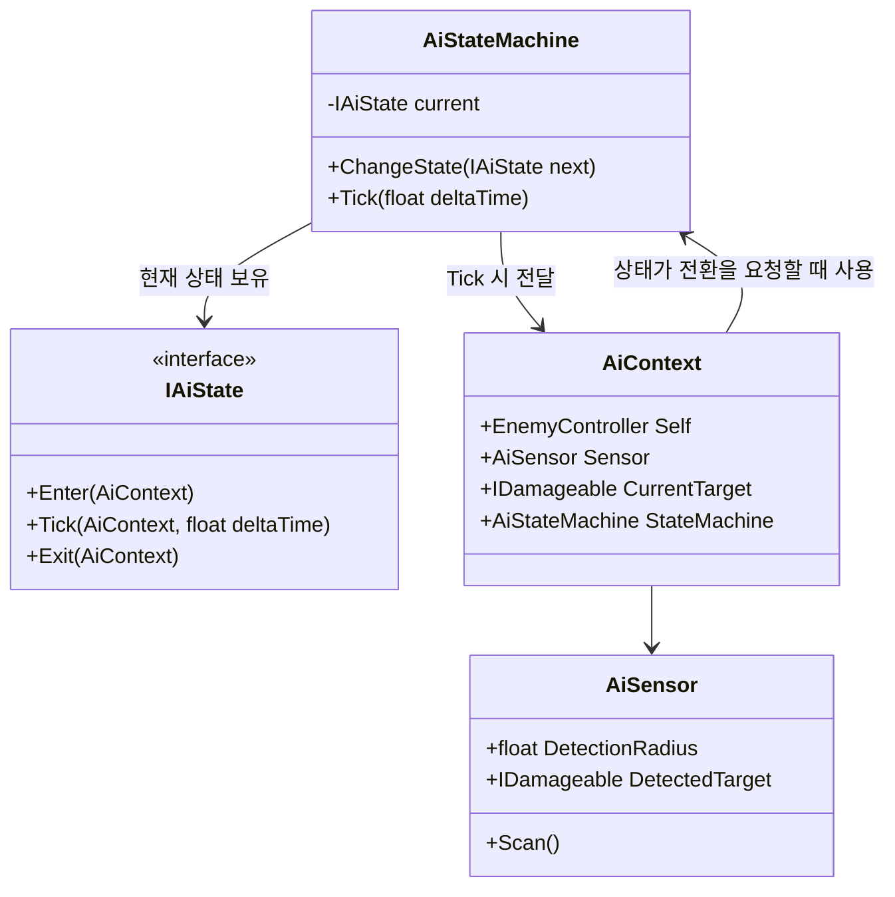
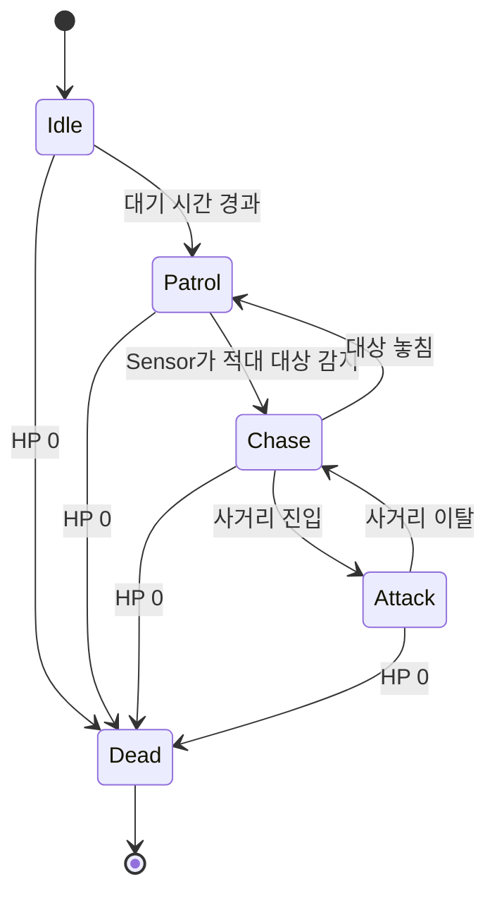
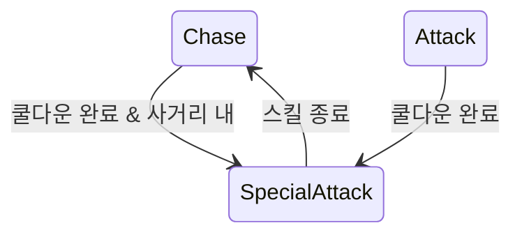
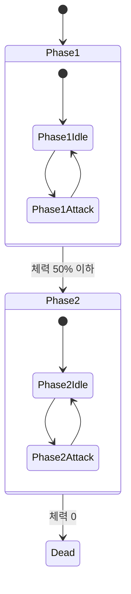

# AI 상태 패턴 설계

Enemy 및 전투 도움용 NPC의 행동을 상태 패턴(State Pattern)으로 구현한다. 예정 코드 위치는 `Assets/Scripts/AI/StateMachine`(프레임워크, `Game.AI` 네임스페이스)과 `Assets/Scripts/AI/States`(구체 상태들, `Game.AI.States`). [character-system.md](character-system.md)의 `EnemyController`와 [npc-roles.md](npc-roles.md)의 전투 도움용 NPC가 공통으로 `IAiBrain`(`Game.AI`)을 통해 이 프레임워크를 사용한다.

## 왜 상태 패턴인가

if/else나 enum 스위치로 AI 행동을 분기하면 상태가 늘어날수록 하나의 거대한 메서드가 모든 상태의 조건을 알아야 한다. 상태 패턴으로 뽑으면:

- 상태 하나 = 클래스 하나 (단일 책임) — Idle이 무엇을 하는지 보려면 `IdleState`만 보면 된다.
- 새 상태 추가가 기존 상태 코드를 건드리지 않는다 (개방-폐쇄 원칙) — Elite의 `SpecialAttackState` 추가가 `ChaseState`를 건드리지 않는다.
- 상태 머신 자체(`AiStateMachine`)는 "현재 상태를 Tick하고, 전환 요청이 오면 Exit→Enter를 호출한다"는 것만 알면 되고, 전환 조건은 각 상태가 스스로 판단한다.

## 프레임워크 구조



### `IAiState`

```
void Enter(AiContext context);
void Tick(AiContext context, float deltaTime);
void Exit(AiContext context);
```

전환 조건은 각 상태의 `Tick` 안에서 직접 판단하고, 필요하면 `context.StateMachine.ChangeState(nextState)`를 호출한다. 예: `ChaseState.Tick`에서 공격 사거리 안에 들어오면 `AttackState`로 전환.

### `AiStateMachine`

- `ChangeState(next)` 호출 시 `current.Exit(context)` → `current = next` → `current.Enter(context)` 순서만 보장한다.
- 상태 전환 조건이나 상태 목록을 전혀 모른다 — 그래서 Normal/Elite/Boss가 서로 다른 상태 집합을 써도 `AiStateMachine` 코드는 하나로 충분하다.

### `AiContext` (블랙보드)

각 상태가 필요로 하는 참조를 한 번에 묶어 전달하는 객체. 상태 클래스가 `EnemyController`나 다른 MonoBehaviour를 직접 캐스팅해서 찾지 않도록 해서 결합도를 낮춘다.

- `Self` — 이동 명령(`CharacterMotor`), 공격 실행 등을 요청할 대상.
- `Sensor` — 주변 적대 진영 `IDamageable` 탐지 결과. 탐지 로직 자체는 `AiSensor`에 있고 상태는 결과만 읽는다(단일 책임 분리).
- `CurrentTarget` — 현재 추적/공격 대상.
- `StateMachine` — 전환 요청용.

### `AiSensor`

- 일정 주기로 `Physics.OverlapSphere` 등을 이용해 감지 반경 내 오브젝트 중 `IDamageable`을 구현하고 `FactionMember.Faction`이 적대 관계인 대상을 찾는다.
- 상태 클래스들은 탐지 알고리즘을 몰라도 되고, `context.Sensor.DetectedTarget`만 읽는다.

## 공통 상태 (Normal 티어 기준)



| 상태 | 책임 |
|---|---|
| `IdleState` | 제자리 대기, 일정 시간 후 `PatrolState`로 전환하거나 Sensor 감지 시 즉시 `ChaseState`로 |
| `PatrolState` | 지정된 경로/반경 배회. `CharacterMotor`에 이동 목표만 넘김 |
| `ChaseState` | `CurrentTarget`을 향해 이동. 사거리 진입 시 `AttackState`, 대상 소실 시 `PatrolState` |
| `AttackState` | 공격 판정 실행(쿨다운 관리) — 공격 자체는 `DamageInfo`를 만들어 대상의 `IDamageable.TakeDamage()`를 호출하는 것으로 [combat-system.md](combat-system.md)와 연결됨 |
| `DeadState` | 모든 상태에서 `HealthComponent.Died` 이벤트 구독으로 강제 전환. 이동/공격 중단, 사망 처리 후 상태 전환을 더 이상 받지 않음 |

`DeadState`로의 전환은 각 상태가 매 프레임 체력을 폴링하는 대신, `EnemyController`가 `health.Died` 이벤트를 구독해 `stateMachine.ChangeState(deadState)`를 직접 호출하는 방식을 쓴다 — 모든 상태에 사망 체크 코드를 중복시키지 않기 위함(DRY).

## Elite 확장



- `NormalEnemyBrain`이 구성하는 상태 그래프에 `SpecialAttackState` 하나만 추가한 것이 `EliteEnemyBrain`이다.
- 기존 `IdleState`/`PatrolState`/`ChaseState`/`AttackState`/`DeadState`는 코드 변경 없이 그대로 재사용된다.

## Boss 확장 (다중 페이즈)

보스는 상태 패턴 자체를 바꾸지 않고, **페이즈도 하나의 상태**로 취급해서 계층을 만든다.



- `Phase1State`/`Phase2State`는 각각 `IAiState`를 구현하면서 내부적으로 **자신만의 작은 `AiStateMachine`을 하나 더 들고 있는 복합 상태(nested state machine)** 다. 바깥에서 보면 `EnemyController`의 최상위 `AiStateMachine`에는 `Phase1State` → `Phase2State` → `DeadState` 세 개만 있는 것처럼 보이지만, `Phase1State.Tick` 내부에서는 자체 상태 머신이 `Phase1Idle`/`Phase1Attack`을 돌리는 구조다.
- **경계 규칙**: `Phase1Idle`/`Phase1Attack` 같은 내부 상태는 `Phase1State`가 들고 있는 **자신만의 nested `AiStateMachine`**만 전환시킨다(`context.StateMachine`을 직접 건드리지 않는다). 최상위 `context.StateMachine.ChangeState(phase2State)` 호출은 오직 `Phase1State` 자신(바깥쪽 상태)만 한다 — 그렇지 않으면 내부 상태가 실수로 최상위 상태를 건너뛰어 바꿔버릴 수 있다. 즉 같은 `AiContext`를 공유하더라도 "이 계층에서 어떤 상태 머신을 조작할 권한이 있는가"는 계층별로 분리해서 지킨다.
- 페이즈 전환 조건은 `HealthComponent.Damaged` 이벤트에서 `Current / Max` 비율을 확인해 `Phase1State`가 스스로 판단하고 최상위 `StateMachine.ChangeState(phase2State)`를 호출한다.
- 새 보스를 만들 때는 `BossEnemyBrain`이 어떤 `PhaseState`들을 몇 개, 어떤 임계값으로 연결할지만 다르게 구성하면 된다 — `AiStateMachine`, `IAiState` 등 프레임워크 코드는 전혀 손대지 않는다.

## 스코프 밖으로 둔 것 (다음 단계 후보)

- 상태 그래프를 비주얼 에디터로 구성하는 툴(현재는 `IAiBrain` 구현체 코드로 배선)
- 그룹 AI(여러 Enemy가 정보를 공유하는 스쿼드 행동)
- 애니메이션 이벤트와 `AttackState`의 정밀 동기화(현재는 타이밍을 코드 쿨다운으로만 가정)
- NPC 전용 상태 세트의 세부 설계는 [npc-roles.md](npc-roles.md)에서 다룸(여기서는 Enemy 기준 상태만 정의)
