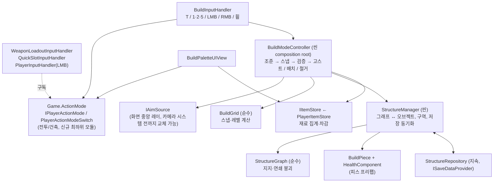

# 건축(맵빌딩) 시스템 — 엔지니어링 설계

상태: **1단계 구현됨**(2026-09-21 — 벽·바닥·문·필러, 세이브 저장, 건축 모드 입력 게이팅, 재료 소모. 구현 결과와 구현 중 고친 설계 오류는 16장). 기획 문서 [`Docs/기획문서_건축시스템설계.md`](../Docs/기획문서_건축시스템설계.md)를 **현재 코드(브랜치 병합 전 기준의 우리 구조)에 맞춰 다시 설계**한 것이다. 기획 문서의 전제 중 코드와 다른 것(숫자키, 길찾기, 모터, 저장 등)은 [design-conflict-review.md](design-conflict-review.md) 13번에 정리했고, 이 문서는 그 결과를 **코드 쪽을 기준으로** 바로잡았다. 기획과 달라진 점은 11장에 모았다.

## 1. 결정 사항

사용자가 정한 것(2026-09-21):

| 항목 | 결정 |
|---|---|
| 1단계 범위 | **벽 · 바닥 · 문 · 코너 필러**. 계단·사다리는 2단계 |
| 저장 | **세이브에 저장, 씬별 복원** |
| 카테고리 선택 | **`1`~`5` 재해석 + 모드 게이팅**(새 키 추가 없음) |
| 적 대응 | **1단계는 건축만**, 적 대응(NavMesh, 구조물 공격)은 2단계 |

이 설계가 정한 기본값(바꾸려면 알려 주세요): 환급 비율 50%(`BuildPieceData.refundRatio`), 1단계 최대 층수 0(1층만), 건축 구역(`BuildZone`) 안에서만 건축, 배치 사거리 5m, 문 키는 기획대로 `5`(3·4는 2단계 자리 비움).

## 2. 범위

| | 1단계 | 2단계 |
|---|---|---|
| 피스 | 벽, 바닥, 문, 코너 필러(자동) | 계단, 사다리 |
| 층 | 1층(레벨 0). **좌표·그래프는 다층을 이미 지원**하고 테스트도 하지만 구역 설정으로 막아 둠 | 계단·사다리와 함께 다층 개방 |
| 적 | 구조물을 인식하지 않음(진영 없음 → `AiSensor`가 무시). 구조물은 파괴 가능하지만 파괴 원인은 디버그/테스트뿐 | NavMesh 도입, 경로 막힘 시 구조물 공격, 구조물 진영 정책 |
| 모터 | 변경 없음 | 경사 투영·스텝업, 사다리 등반 상태 |

## 3. 좌표와 기하

### 3.1 격자

- 1 셀 = 1m × 1m. **격자는 건축 구역(`BuildZone`, 씬에 배치하는 박스)의 원점 기준**이다. 구역은 평탄해야 하고(레벨 디자이너 책임) 구역 밖에는 지을 수 없다 — 기획 문서에 없던 "지면 높이" 규칙을 이렇게 메운다.
- 좌표 타입(모두 값 타입, 딕셔너리 키로 사용): `CellCoord(x, z, level)`, `VertexCoord(x, z, level)`, `EdgeCoord(x, z, axis, level)` — 엣지는 **시작 꼭짓점 + 축**으로 표현한다(`Axis.X`: (x,z)→(x+1,z), `Axis.Z`: (x,z)→(x,z+1)).

| 관계 | 정의 |
|---|---|
| 엣지가 가르는 두 셀 | `Axis.X`: (x, z−1), (x, z) / `Axis.Z`: (x−1, z), (x, z) |
| 셀의 네 엣지 | X축 (x,z), (x,z+1) / Z축 (x,z), (x+1,z) |
| 꼭짓점에 닿는 엣지 | X축 (x−1,z), (x,z) / Z축 (x,z−1), (x,z) |
| 셀의 네 꼭짓점 | (x,z), (x+1,z), (x,z+1), (x+1,z+1) |

### 3.2 수직 배치 — 바닥을 지면에 **묻는다**(기획과 다른 점)

기획은 바닥 슬래브(0.5m)를 지면 위에 얹는다. 그러면 **캐릭터가 0.5m 턱을 못 넘는다**(`CharacterMotor`에 스텝업이 없음). 그래서 슬래브 윗면이 지면과 같아지도록 묻는다.

- `top(level) = groundY + level × 3.0` — 그 층 바닥의 윗면 높이.
- 바닥 슬래브: `[top − 0.5, top]` / 벽·문·필러: `[top, top + 2.5]` / 다음 층 슬래브: `[top + 2.5, top + 3.0]`. 층고 3.0m, 내부 높이 2.5m는 기획과 같다(전체가 0.5m 내려갔을 뿐).
- 조준 높이 → 레벨: `level = floor((y − groundY + 0.5) / 3.0)` (바닥 옆면 `y∈[2.5,3.0]`이 1층 슬래브로, 벽 옆면은 그 층으로 판정된다).

### 3.3 스냅(`BuildGrid`, 순수 함수)

조준점 `p`(구역 원점 기준 셀 단위)에서:

- **바닥**: `(floor(p.x), floor(p.z))`.
- **벽·문(엣지)**: `dx = |p.x − round(p.x)|`, `dz = |p.z − round(p.z)|`. `dx ≤ dz`이면 Z축 엣지 `(round(p.x), floor(p.z))`, 아니면 X축 엣지 `(floor(p.x), round(p.z))` — 조준점에서 가장 가까운 격자선에 붙는다.
- **필러**: 플레이어가 놓지 않는다. 엣지 양 끝 꼭짓점에 자동 생성.

### 3.4 코너 필러

- 엣지 피스(벽/문)를 놓으면 **양 끝 꼭짓점에 필러가 없을 때만** 만든다(공유). 0.5×0.5×2.5.
- 그 꼭짓점에 닿는 엣지 피스가 하나도 없게 되면 필러도 사라진다.
- 필러는 자체 HP를 갖는다. **피해로 파괴되면 그 꼭짓점에 닿는 모든 벽·문이 함께 사라진다**(기획 4장). 규칙 제거(철거·연쇄)로 사라지는 필러는 이를 일으키지 않는다.
- 필러는 별도 비용·환급이 없다(벽 비용에 포함).

## 4. 구조 그래프(`StructureGraph`, 순수 C#)

기획 4장(필러 파괴 → 벽 붕괴)과 9장(벽 지지 = 바닥만)이 어긋나던 것을 이렇게 푼다: **필러는 지지 관계에 넣지 않는 파생 노드**로 두고, "필러가 피해로 파괴되면 인접 엣지 피스 제거"를 별도 이벤트 규칙으로 처리한다. 그러면 필러↔벽 순환 의존이 생기지 않는다.

### 4.1 배치 조건

| 피스 | 조건 |
|---|---|
| 바닥 (레벨 0) | 구역 안 (그래프가 아니라 호출 측 판정 함수로 주입) |
| 바닥 (레벨 ≥ 1) | 그 셀의 네 엣지 중 하나에 **레벨 L−1 벽/문**이 있거나, 네 꼭짓점 중 하나에 **레벨 L−1 필러**가 있음 |
| 벽 / 문 (레벨 L) | 엣지가 가르는 두 셀 중 하나에 **레벨 L 바닥**이 있음 |
| 문 | 벽과 같은 조건. **같은 엣지 슬롯을 벽과 공유**(둘 다 놓을 수 없음). 벽 위에 문을 놓으면 교체 |
| 이미 같은 슬롯에 같은 피스 | 거부(`Occupied`) |

### 4.2 연쇄 붕괴

제거가 일어나면 작업 큐로 영향받는 것만 다시 검사한다(전체 순회 없음).

| 제거된 것 | 다시 검사할 것 |
|---|---|
| 바닥 (c, L) | 그 셀의 네 엣지의 레벨 L 벽/문 — 반대편 셀 바닥이 없으면 붕괴 / 꼭짓점 필러 정리 |
| 엣지 피스 (e, L) | 그 엣지가 가르는 두 셀의 레벨 L+1 바닥 — 지지 상실 시 붕괴 / 양 끝 필러 정리 |
| 필러(피해 파괴) | 그 꼭짓점의 모든 엣지 피스를 제거 → 위 규칙으로 계속 |

고정점에 도달할 때까지 반복하고, 결과로 **제거된 모든 키**를 돌려준다(호출 측이 오브젝트를 파괴). 기획 4장의 "벽만 부수면 위층으로 침투할 수 있다"는 의도가 그대로 표현된다.

### 4.3 API 개요

```
PlaceResult TryPlace(PieceKind kind, coord, Func<CellCoord,bool> groundSupport)  // added / replaced / 실패 사유
RemoveResult Remove(PieceKey key)            // 철거·연쇄 붕괴 (제거된 키 목록)
IReadOnlyList<PieceKey> Destroy(PieceKey key)  // 피해로 파괴: 자기 + 규칙이 정한 함께 무너지는 것(필러 → 그 꼭짓점의 벽·문)
bool Contains(PieceKey), IEnumerable<PieceKey> All
```

물리(겹침·사거리·재료)는 이 클래스가 모른다 — 토폴로지만 다룬다. 그래서 EditMode 테스트로 전부 잠글 수 있다.

## 5. 클래스 구조



| 클래스 | 위치 / 모듈 | 책임 |
|---|---|---|
| `IPlayerActionMode`(읽기), `IPlayerActionModeSetter`(쓰기), `PlayerActionMode`(`Combat`/`Build`), `PlayerActionModeSwitch`(구현) | `Assets/Scripts/ActionMode` / `Game.ActionMode`(새 leaf 모듈) | 현재 조작 모드와 변경 이벤트. 소비자는 **읽기 인터페이스만** 본다(`IsCombat()` 확장 — 소스가 없으면 전투로 취급해 게이팅이 옵션). **`Game.Input`이 아닌 이유**: `UnityEngine.Input`을 쓰는 코드와 이름이 겹친다. `QuickSlot`·`Weapons`가 `Characters.Player`(그것들을 참조하는 쪽)에 의존하면 순환이라 최하위에 둔다 |
| `BuildGrid`, `CellCoord`/`VertexCoord`/`EdgeCoord`/`PieceKey` | `Game.Building`(순수) | 3장 |
| `StructureGraph` | 〃(순수) | 4장 |
| `BuildPieceData`(SO) | 〃 | `pieceId`, `displayName`(문자열 — 지역화는 후속), `kind`, `prefab`, `maxHealth`, `cost: BuildCost[]{ItemData, count}`, `refundRatio` |
| `BuildCatalog`(SO) | 〃 | `entries: {BuildCategory, BuildPieceData}[]` + 필러 데이터. **순수 데이터** — 새 종류·카테고리는 항목 추가(코드 변경 없음). `Get(category)`, `ForKind(kind)`(데이터의 `Kind`로 조회), `Find(pieceId)` |
| `BuildZone` | 〃(MonoBehaviour) | 격자 원점·`groundY`·범위·`maxLevel`. 구역 밖에는 배치 불가 |
| `BuildPiece` | 〃(MonoBehaviour) | 키·데이터·HP 연결. 프리팹에 `HealthComponent`와 함께(`RequireComponent`). 레이·오버랩에 맞은 콜라이더에서 **`GetComponentInParent<BuildPiece>()`** 로 식별한다 — 레이어도 태그도 쓰지 않는다 |
| `BuildDoor` | 〃(MonoBehaviour, `IInteractable`) | 경첩(`hinge`)을 돌려 여닫는 문. 열림·경첩 방향을 저장 |
| `StructureManager` | 〃(MonoBehaviour, 씬) | 그래프 소유, 오브젝트 생성/파괴, `HealthComponent.Died` 구독 → 붕괴 처리, 저장 동기화 |
| `BuildModeController` | 〃(MonoBehaviour, 씬 composition root) | 아래 협력자들을 조립하고 선택 상태·대상·고스트를 관리, 배치/철거를 요청(7장 흐름) |
| `BuildTargetResolver` | 〃(순수 C# 클래스) | 조준 레이 → 캐릭터 제외·피스 우선 → 그리드 스냅. 철거 대상 피스 찾기 |
| `PlacementValidator` | 〃(순수 C# 클래스) | 구역·받침·사거리·캐릭터 막힘·재료를 검사해 `PlacementStatus`를 돌려줌 |
| `BuildEconomy` | 〃(순수 C# 클래스) | 비용 확인·원자적 지불·환급(넘치는 것은 `IItemDropper`로 드롭) |
| `IPieceRule` + `PieceRules` | 〃(순수) | **종류별 구조 규칙**(`FloorRule`/`EdgeRule`/`PillarRule`): 배치 조건, 함께 생기는 것, 의존하는 것, 지지 여부, 파괴 시 함께 무너지는 것. `StructureGraph`는 종류를 모르고 규칙에 묻는다 |
| `IPieceGeometry` + `PieceGeometries` | 〃(순수) | **종류별 기하**(스냅·크기·중심·회전). `BuildGrid`는 이 레지스트리에 위임 |
| `IBuildPieceState` | 〃 | 상태를 가진 피스(문)가 구현. `StructureManager`는 이 인터페이스로만 배치·저장·복원 시 상태를 다룸 |
| `IItemDropper` + `WorldItemDropper` | `Game.Items` | 아이템을 월드에 떨어뜨림 — `WorldItemFactory` 싱글턴 직접 호출을 대신 |
| `IAimSource`, `CameraAimSource` | 〃 | `bool TryGetRay(out Ray)`. `CameraAimSource`는 화면 중앙 또는 마우스 위치(탑다운 테스트 씬)의 레이. 카메라/시점 시스템(#6)이 생기면 교체 |
| `GhostPreview` | 〃 | 고스트 인스턴스, `BuildGhost` 셰이더(Unlit 반투명), 초록↔빨강 0.1초 보간 |
| `BuildInputHandler` | 〃 | 폴링 관용구(`Keyboard.current`/`Mouse.current`). `IsAnyWindowOpen`이면 무시 |
| `BuildPaletteUIView` | `Game.Building.UI` | 건축 모드일 때 핫바 자리에 5칸 팔레트(이름·재료·보유량, 3·4는 비활성 표시) |
| `IItemStore`, `PlayerItemStore` | `Game.Items` / `Game.Items.Equipment` | 8장 |
| `StructureRepository`, `StructureSaveData` | `Game.Building`(지속 오브젝트) | 10장 |

의존 방향: `Building → Items, Items.Equipment, Combat, Interaction, Persistence, ActionMode, UI.Windows`. **`Building`을 참조하는 모듈은 없다**(씬 배선만). 새로 생기는 유일한 역방향은 `QuickSlot`·`Weapons`·`Characters.Player`가 `ActionMode`를 참조하는 것이고 `ActionMode`는 아무것도 참조하지 않아서 순환이 없다.

## 6. 입력과 모드

우리는 Action Map을 쓰지 않는다([design-conflict-review.md](design-conflict-review.md) #3) — 기획의 "Player 맵에 액션 추가"는 **핸들러 게이팅**으로 옮긴다. 기존 `windowManager` 게이팅과 같은 패턴이다: 각 핸들러가 (선택 필드인 `MonoBehaviour actionModeSource`를 `IPlayerActionMode`로 캐스팅해) 들고 있다가 `!mode.IsCombat()`이면 즉시 리턴한다.

| 입력 | 전투 모드 | 건축 모드 |
|---|---|---|
| `T` | 건축 모드 진입(창/대화가 열려 있지 않을 때) | 전투 모드로 복귀 |
| `1` `2` `3` | 무기 전환(`WeaponLoadoutInputHandler`) | `1`=벽, `2`=바닥, `3`=(2단계, 계단, 지금은 무시) |
| `4` `5` … `0`, `` ` `` | 퀵슬롯(`QuickSlotInputHandler`) | `4`=(2단계, 사다리, 무시), `5`=문, 나머지 무시 |
| LMB | 공격(`PlayerInputHandler`) | 배치(`PlacePiece`) |
| RMB | (조준, 후속) | 철거(`BuildPiece`가 있는 콜라이더만 대상) |
| 마우스 휠 | (무기 순환/줌, 후속) | 문 경첩 반전(벽·바닥은 의미 없어 무시) |
| WASD / Space / Shift / `F` | 그대로 | **그대로**(건축 중에도 이동·달리기·점프·문 열기 가능) |

- 이동을 막지 않는 게 기존 `IsAnyWindowOpen`(이동까지 막음)과 다른 점이라 별도 모드가 필요했다.
- 다음 경우 건축 모드는 자동으로 전투로 돌아간다: 창이 열림, 대화 시작, 씬 전환.
- `PlayerLocomotion`(Space/Shift)과 `PlayerInteractionController`(F)는 게이팅하지 않는다.
- HUD 핫바는 건축 모드일 때 `BuildPaletteUIView`로 대체된다.

## 7. 배치·철거 흐름

`BuildModeController.Update`(건축 모드일 때만):

1. `IAimSource`의 레이를 `Physics.RaycastNonAlloc`(길이 40m, 트리거 무시)로 쏜다. **캐릭터(`CharacterMotor`)에 맞은 것은 건너뛰고**, 지면과 피스가 거의 같은 거리(지면과 같은 높이인 바닥)면 **피스를 우선**한다.
2. 맞은 지점과 선택한 카테고리로 `BuildGrid`가 대상 좌표(레벨은 3.2절 공식)를 정한다.
3. **검증**(모두 통과해야 초록):
   1. 구역 안이고 `maxLevel` 이내
   2. `StructureGraph.CanPlace`(4.1절 지지 조건, 슬롯 점유)
   3. **캐릭터 겹침 없음**(`Physics.OverlapBox`로 약간 줄인 박스(0.45배) 안에 `CharacterMotor`가 있으면 막힘). 피스끼리는 검사하지 않는다 — 필러와 벽 끝이 0.25m, 두께 0.5m 벽이 인접 셀로 0.25m씩 겹치는 게 설계상 정상이고, 중복은 토폴로지(슬롯 점유)가 막는다. 지면 바닥은 지면 아래에 묻히므로 그 위에 선 캐릭터는 바닥 배치를 막지 않는다(월드 장애물은 1단계에서 검사하지 않음)
   4. 재료 충분(`IItemStore.CountOf`)
   5. 사거리: 플레이어 → 스냅된 피스 중심 ≤ 5m (카메라가 플레이어 뒤에 있어도 성립하도록 레이는 카메라에서, 거리 판정은 플레이어 기준)
4. 고스트가 결과에 맞춰 색을 바꾼다. 실패는 조용히 무시(팝업 없음).
5. LMB → 재료 차감 → `StructureManager.Place`(그래프 → 오브젝트 생성 → 필러 자동 생성).
6. RMB → 조준 레이가 맞은 `BuildPiece`(사거리 5m 이내) → `StructureManager.Demolish`: 재료 `refundRatio`만큼 환급(못 담는 만큼은 `WorldItemFactory`로 발밑에 드롭), `Remove`로 연쇄 붕괴(연쇄로 사라진 것은 환급 없음).

## 8. 재료

- `IItemStore`: `int CountOf(ItemData)`, `bool TryConsume(ItemData, int)`(**원자적** — 모자라면 아무것도 차감하지 않음), `int Add(ItemData, int)`(못 담은 수 반환).
- `PlayerItemStore`가 **Pocket → Rig → Backpack → 플랫 인벤토리** 순으로(줍기 순서와 같게) 합산·차감한다. 그리드에는 아이템 수량 기준 제거가 없어 `GridInventory`에 `CountOf(item)`·`RemoveQuantity(item, count)`를 추가한다(스택 수량 감소, 0이면 배치 제거, `GridChanged` 발생).
- `buildCost`는 기획의 `resourceId`(문자열) 대신 **`ItemData` 참조**다(`ItemDatabase` 관례).
- 상점은 아직 코드가 없다. 재료는 월드 아이템/드롭으로 얻고, 상점이 생기면 "일반 아이템으로 카탈로그에 추가"하면 된다.

## 9. HP와 파괴

- 피스 프리팹에 기존 **`HealthComponent`**(`IDamageable`)를 둔다. `BuildPieceData.maxHp`를 `SetMaxHealth`로 주입.
- `Died` → `StructureManager`가 `StructureGraph.Destroy`(필러면 그 꼭짓점의 벽·문이 함께 나옴 — `PillarRule.Collateral`) → 돌려받은 키의 오브젝트를 모두 파괴. 피해로 파괴된 것은 환급 없음.
- **1단계에서는 구조물에 `FactionMember`를 달지 않는다** → `AiSensor`가 무시하고, 플레이어 공격도 적대 판정에 실패해 구조물을 깎지 않는다(자기 벽을 부수는 사고 방지). 진영 정책은 2단계에서 정한다.
- 문은 새 `BuildDoor`(`IInteractable`, `F`)로 여닫는다 — 기존 `DoorInteractable`은 `Animator` 파라미터(`IsOpen`)를 요구해서 애니메이터 애셋 없이 쓸 수 없다. 닫힘일 때 문짝 콜라이더가 통행을 막고 열리면 경첩을 돌려 문틀을 비운다(95°, 방향은 휠로 반전). 열림·경첩 방향은 저장한다.

## 10. 저장

기존 저장 구조에는 한계가 있다: `SaveGameService.SaveToDisk`는 **그 순간 등록돼 있는 provider만** 파일에 쓴다. 씬에 붙은 provider는 그 씬이 열려 있을 때만 존재하므로, **씬 단위 provider로 만들면 다른 씬에서 저장할 때 그 씬의 구조물이 파일에서 사라진다.** 그래서:

- **`StructureRepository`**(지속 오브젝트, Boot 씬에서 `SaveDataRegistry`/`SaveGameService`와 함께 생성 — 대화 플래그 저장소와 같은 자리)가 **모든 씬의 구조물을 한꺼번에 들고** `ISaveDataProvider`(키 `building.structures`)로 저장한다.
- `StructureSaveData { scenes: [ { sceneId, pieces: [ { pieceId, x, z, level, axis, hp, doorOpen, doorFlipped } ] } ] }` — **좌표 기반**이라 `supportRefs` 같은 참조 직렬화가 필요 없다.
- 씬의 `StructureManager`는 활성화될 때 저장소에 자신을 등록하고 자기 씬 기록을 받아 **재구성**한다. 저장소의 `CaptureState`는 등록된 매니저의 현재 상태를 먼저 기록(flush)한 뒤 직렬화한다. 씬을 나갈 때도 기록한다.
- **복원 검증**: 레벨 순으로 `TryPlace`를 재실행해(재료 차감 없음) 지지 조건이 깨진 조각은 경고와 함께 건너뛴다 — 다른 저장 어댑터의 "안 맞는 항목 건너뜀"과 같은 방식. HP는 `RestoreHealth`.
- 저장소가 씬에 없으면(테스트 씬 단독 실행) `StructureManager`는 저장 없이 동작한다(다른 provider들의 null-safe 관례).

## 11. 기획 문서와 달라진 점

| # | 기획 | 이 설계 | 이유 |
|---|---|---|---|
| 1 | 바닥 슬래브를 지면 위에 얹음 | 윗면이 지면과 같도록 **묻음** | 모터에 스텝업이 없어 0.5m 턱을 못 넘음 |
| 2 | "지면 위" 바닥, 높이 규칙 없음 | **`BuildZone`**(평탄한 구역) 안에서만 | 지면 높이 미정의를 메움 |
| 3 | 숫자키 `1`~`5` 전제: 무기 슬롯 `1~4`, `5`는 빈 키 | `1`/`2`/`3`은 무기, `4`~`0`은 퀵슬롯이 **이미 사용 중** → 건축 모드에서만 재해석하고 핸들러 게이팅 | 기획 전제가 옛 상태 |
| 4 | Player 맵에 액션 추가 | `Game.ActionMode` + 핸들러 게이팅 | 우리는 Action Map을 쓰지 않음(#3) |
| 5 | 필러 파괴 → 벽 붕괴(4장), 벽 지지 = 바닥만(9장) | 필러는 **지지 그래프 밖 파생 노드**, 피해 파괴 시에만 인접 엣지 제거 | 4장↔9장 순환 해소 |
| 6 | "겹침 없음" 검사 | 피스끼리는 검사 안 함, 캐릭터·월드만 | 설계상 겹침이 정상 |
| 7 | `resourceId`(문자열) | `ItemData` 참조 | `ItemDatabase` 관례 |
| 8 | `Buildable` **태그** | 레이어도 태그도 없이 **`BuildPiece` 컴포넌트**로 판정 | 태그는 오타에 조용히 실패하고, 컴포넌트 기반 판정이 우리 관례이며 레이어를 새로 등록할 필요도 없다 |
| 9 | 계단·사다리 포함 | 2단계 | 모터에 경사·등반 상태가 없음 |
| 10 | 휠 = 회전(피스 전반) | 휠 = 문 경첩 반전만 | 벽 방향은 조준으로, 바닥은 회전 무의미 |
| 11 | 카메라 화면 중앙 레이 | `IAimSource`(기본 화면 중앙) | 카메라/시점 시스템 미구현(#6) |
| 12 | 상점 구매 탭 연동 | 상점 미구현 — 월드 아이템으로 대체 | 상점 코드 없음 |
| 13 | 환급 "권장" | 기본 50%, `refundRatio`로 조정 | 기획 권장을 기본값으로 채택 |

## 12. 테스트 계획

**EditMode(자동)** — 순수 로직 전부:
- `BuildGrid`: 셀/엣지/꼭짓점 스냅(경계값, 음수 좌표), 레벨 공식(바닥 옆면·벽 옆면·경계).
- `StructureGraph`: 배치 조건(바닥·벽·문·다층), 슬롯 점유·문↔벽 교체, 필러 생성·공유·제거, 연쇄 붕괴(바닥 제거 → 벽, 엣지 제거 → 위층 바닥, 필러 파괴 → 인접 벽), 고정점 도달, 제거 키 목록의 정확성.
- `PlayerItemStore`: 합산 순서, 원자적 차감(모자라면 변화 없음), 스택 부분 감소, `GridChanged`.
- `StructureSaveData`: 왕복, 지지가 깨진 조각 건너뜀.
- `PlayerActionModeSwitch`와 핸들러 게이팅(모드가 `Build`일 때 무기/퀵슬롯이 반응하지 않음).

**Play 모드(API)**: 배치·철거·연쇄 붕괴 후 오브젝트 수, 재료 차감/환급, 저장→복원 왕복, 고스트 색. **눈으로 확인**(렌더링·조작감): 고스트 보간, 스냅 느낌, 문 여닫기 — `Test_Building` 씬(신규).

## 13. 구현 순서 (모두 완료 — 16장)

1. **선행**: `Game.ActionMode` + 세 핸들러 게이팅(동작 변화 없음, 테스트) → `IItemStore`/`PlayerItemStore` + `GridInventory` 수량 제거(테스트).
2. **순수 로직**: `BuildGrid`, `StructureGraph`(+ 위 EditMode 테스트).
3. **런타임**: `BuildZone`, `BuildPieceData`/`BuildCatalog`, 피스 프리팹(자리표시 큐브: 벽·바닥·문·필러), `StructureManager`, `BuildModeController`, `IAimSource`, `GhostPreview`(+ `BuildGhost` 셰이더), `BuildInputHandler`, 레이어 `Buildable` 설정 도구.
4. **저장**: `StructureRepository` + Boot 배선, 복원 검증.
5. **UI·씬**: `BuildPaletteUIView`, `Test_Building` 씬, 문서 갱신.

## 14. 2단계의 전제(지금은 하지 않음)

- **계단·사다리**: `CharacterMotor`에 경사 투영·접지 히스테리시스(내려갈 때 공중 판정으로 조향을 잃는 문제)·스텝업, 등반 상태(중력 끔·점프/스프린트 게이팅). 계단이 경사로인지 단인지 결정. 메인 기획서의 "벽타기 등 고급 이동은 백로그"와의 경계 확인. 계단 도착 칸 지지 규칙과 머리 위 개구부 규칙 정의(기획에 없음).
- **적 대응**: `com.unity.ai.navigation` 도입, 피스에 `NavMeshModifier`/장애물, 배치·철거 시 증분 재계산, `CharacterMotor`의 경로 추종, 구조물 진영 정책(경로가 막혔을 때만 공격), 문 대응.
- **다층**: `BuildZone.maxLevel` 상향(그래프는 이미 지원).
- 지붕·창문, 블루프린트 저장, 협동 시 소유권(`ownerId`) — 기획 15장의 후속 범위 그대로.

## 15. 열린 항목

- 환급 비율(50%)과 각 피스의 비용·HP 수치 — 밸런싱 단계.
- 건축 진입 시 무기를 집어넣는 연출(무기 시스템에 holster 개념이 없음) — 지금은 입력만 막는다.
- 배치 중 플레이어 공격/조준 액션이 구현되면(조준·발사) 게이팅 대상에 추가.
- `DropPlacement`의 지면 탐색이 벽 윗면을 지면으로 잡을 수 있음 — **미해결**(벽·문·필러를 지면 후보에서 빼야 함, 아직 손대지 않음).

## 16. 구현 결과 (2026-09-21)

1단계를 13장 순서대로 모두 구현했다. 코드는 `Assets/Scripts/Building`(+`UI`), `Assets/Scripts/ActionMode`, `Items`(`IItemStore`, `PlayerItemStore`, `GridInventory.CountOf/RemoveQuantity`), 입력 핸들러 3개의 게이팅, 셰이더 `Assets/Shaders/BuildGhost.shader`, 데이터 `Assets/Data/Building`, 프리팹 `Assets/Prefabs/Building`, 테스트 씬 `Test_Building`.

### 검증

- **EditMode 198개 통과**(기존 131 + 신규 67): `BuildGridTests`(스냅·레벨·중심·크기), `StructureGraphTests`(배치 조건, 필러 생성·공유·제거, 문↔벽 교체, 연쇄 붕괴, 필러 파괴), `BuildingSupportTests`(저장 데이터, `PlayerItemStore`, 액션 모드, 카탈로그, 환급).
- **변이 확인**: `StructureGraph`를 일부러 망가뜨려 테스트가 잡는지 봤다 — ① 필러 제거가 위층 바닥을 다시 검사하지 않게 → 4개 실패, ② 엣지가 바닥 없이도 서게 → 8개 실패(원복 후 통과).
- **Play 모드 API 프로브 33개 통과**(`Test_Building`에서 조준 레이를 고정해 컨트롤러를 구동): 바닥·벽 배치와 재료 차감, 점유/받침 없음/사거리/캐릭터 막힘/재료 부족 판정, 문이 벽을 교체하며 재료 환급, 문 열기, **저장 → 비우기 → 복원**(열린 문 포함), 필러 파괴 연쇄, 철거 환급, 전투 모드에서 고스트 숨김. 팔레트가 건축 모드에서만 나타나고 한글이 `NeoHyundai`로 나오는 것, 고스트 셰이더의 컴파일 메시지 0건도 확인.
- **눈으로 못 본 것**(헤드리스): 실제 마우스·키 입력 반응, 고스트의 색 보간, 스냅 느낌, 문이 열리는 모습, 조작감 — 아래 "직접 확인".

### 구현 중에 발견해 고친 설계 오류

1. **벽 윗면을 조준하면 층이 한 칸 올라갔다.** 레벨 공식(3.2)에서 높이 2.5m(레벨 0 벽의 윗면)는 1층 슬래브 옆면과 같은 값이라, 벽을 조준해 문으로 바꾸려 하면 층 1 판정이 나서 "구역 아님"이 떴다. **맞은 표면 안쪽으로 0.05m 들어간 점**으로 스냅한다(윗면이면 아래로, 옆면이면 벽 중심선 쪽으로 — 엣지 스냅도 더 안정적).
2. **지면과 같은 높이의 바닥은 레이가 지면에 먼저 닿을 수 있다**(같은 거리). 그러면 바닥을 조준해 철거할 수 없었다. 거의 같은 거리(0.02m)의 히트가 있으면 **피스를 우선**한다.
3. **바닥이 캐릭터를 막는지**: 지면 바닥은 지면 아래에 묻히므로 그 위에 선 캐릭터와 겹치지 않는다 — 바닥은 캐릭터가 서 있어도 놓을 수 있다(문서에 없던 결과, 의도에 맞음).
4. **`DoorInteractable`을 재사용할 수 없었다** — `Animator`의 `IsOpen` 파라미터가 필수라 애니메이터 애셋이 있어야 한다. 새 `BuildDoor`로 대체(9장).
5. **레이어가 필요 없었다** — 컴포넌트(`BuildPiece`)로 판정하면 된다(11장 8번).
6. **`MonoBehaviour`는 파일 이름과 클래스 이름이 같아야 한다.** `CameraAimSource`를 `IAimSource.cs`에 같이 뒀더니 씬에서 스크립트가 연결되지 않아(`aimSource must implement IAimSource`) 프로브가 조준을 강제로 바꾼 채 통과할 뻔했다. 파일을 분리했다.

### 알려진 한계 / 후속

- **월드 장애물**(캐릭터가 아닌 바위·상자)은 배치를 막지 않는다 — 지금은 캐릭터만 검사.
- **`QuickSlotInputHandler`/`WeaponLoadoutInputHandler`의 `actionMode` 필드는 옵션**이라 그 핸들러가 있는 씬(`Test_QuickSlotWeapons`)에서는 연결하지 않았다. `Player.prefab`에는 `PlayerActionModeSwitch`와 `PlayerItemStore`가 있고 `PlayerInputHandler`는 연결돼 있다. 건축을 쓰는 실제 씬에서 두 핸들러를 연결해야 건축 모드 중 `1`~`3`·`4`~`0`이 무기/퀵슬롯으로 새지 않는다.
- **`StructureRepository`를 Boot 씬에 배선하지 않았다**(Boot에는 아직 어떤 저장 대상도 없음). `Test_Building`은 저장소를 씬에 두고 API로 왕복을 검증했다. 실제로 저장하려면 `SaveGameService`가 있는 지속 오브젝트에 `StructureRepository`를 붙인다.
- 팔레트 문자열은 한국어 리터럴(UI 문자열 지역화는 후속). `BuildPieceData.displayName`도 문자열.
- 2단계(계단·사다리·NavMesh·적 대응·다층)는 14장 그대로.

### 직접 확인 (`Test_Building`, 에디터 Play)

`T`로 건축 모드 → 왼쪽 위 하니스의 `Give 40 wood + 10 metal` → `2`로 바닥 → 마우스를 바닥 위로(초록 고스트) → 좌클릭 → `1`로 벽을 바닥 가장자리에 → 좌클릭 → `5`로 문을 벽 위에 놓아 교체 → `F`로 문 열기(휠로 경첩 반전) → 우클릭으로 철거(재료 환급) → 하니스의 `Destroy nearest pillar`로 연쇄 붕괴, `Capture`/`Clear`/`Restore`로 저장 왕복. 건축 모드에서는 좌클릭이 공격이 아니라 배치이고 이동은 그대로 되는지도 본다.

## 17. SOLID 점검과 리팩터링 (2026-09-21)

1단계 구현 뒤 SOLID를 점검해서 아쉬운 곳을 2단계(계단·사다리)를 넣기 **전에** 고쳤다. 점검 결과와 조치:

| 원칙 | 발견 | 조치 |
|---|---|---|
| **S** | `BuildModeController`가 조준·스냅·검증 5종·재료·고스트·선택 상태를 모두 했음(333줄). `StructureManager`는 문 상태를 직접 알고 있었음 | `BuildTargetResolver`(조준·스냅), `PlacementValidator`(검증), `BuildEconomy`(재료)로 분리 — 컨트롤러는 조립·상태·고스트만(약 200줄). 문 상태는 `IBuildPieceState`로 |
| **O** | `PieceKind` `switch`가 `BuildCatalog`·`BuildGrid`·`StructureGraph`에 흩어져 있어 새 종류마다 여러 곳 수정 | 종류별 차이를 **전략 객체**로: 구조 규칙 `IPieceRule`, 기하 `IPieceGeometry`, 카탈로그는 데이터 항목. 새 종류 = 규칙 + 기하 + 데이터 항목 |
| **L** | `BuildCatalog.KindOf`가 사용 불가 카테고리에 `Wall`을 돌려주던 방어 코드 | 삭제(카테고리 → 데이터의 `Kind`로 결정) |
| **I** | 이미 작음 | 모드는 읽기(`IPlayerActionMode`)와 쓰기(`IPlayerActionModeSetter`)를 분리 — 쓰기는 `BuildInputHandler`만 |
| **D** | `IPlayerActionMode`를 만들고도 소비자는 구체 클래스 `PlayerActionModeSwitch` 참조. `WorldItemFactory.Instance` 직접 호출. `CharacterMotor` 구체 타입 | 소비자를 `MonoBehaviour` 소스 + 인터페이스 캐스팅(프로젝트 관례)으로, 드롭은 `IItemDropper`, "캐릭터인가"는 컨트롤러 한 곳(`IsCharacter`)에서만 주입 |

- **남긴 의도적 예외**: `StructureManager`→`StructureRepository.Instance`, `StructureRepository`→`SaveDataRegistry.Instance`는 정적 접근을 유지했다. 저장소는 다른 씬(Boot)에 있어서 인스펙터로 참조할 수 없고, 프로젝트의 다른 저장 어댑터가 같은 방식이다.
- **2단계에 미치는 효과**: 계단은 `IPieceRule`(3칸 점유·시작 칸 받침)과 `IPieceGeometry`(3칸 경사 배치)를 새로 만들어 `PieceRules`/`PieceGeometries`에 등록하고 `PieceKind` 값과 카탈로그 항목을 추가하면 된다 — `StructureGraph`·`BuildGrid`·`StructureManager`·`BuildModeController`는 바뀌지 않는다.
- **검증**: 기존 테스트를 그대로 통과했고(내부 구조만 바뀜) 확장 지점 테스트 `BuildingDesignTests` 15개를 더했다(규칙/기하 교체, 카탈로그 데이터, 경제, 모드 인터페이스). 변이 확인 1건 추가(필러 파괴가 벽을 안 데려가게 → 2개 실패). EditMode **211개** 통과, Play 프로브 33개 재통과, 5개 씬에서 새 콘솔 에러 없음.
- **부수적으로 알게 된 것**: 이 과정에서 에디터가 한 번 응답 없음 상태가 되어 재시작했다(코드 무한 루프는 아니었고, 재시작 뒤 같은 테스트가 모두 통과) — 원인은 확인하지 못했다.

## 18. 푸시 전 설계 점검 (2026-09-21)

코드를 다시 읽고 Play 모드 프로브로 확인해서 찾은 문제와 조치.

**고친 것**
1. **씬을 나갈 때 구조물이 사라질 위험** — 저장소가 매니저의 `OnDisable`에서 스냅샷을 뜨는데, 씬이 내려가는 순서에 따라 피스 오브젝트가 먼저 없어지면 스냅샷이 불완전해져 저장된 구조물을 덮어쓸 수 있었다. 이제 ① 저장소가 매니저의 `Changed`마다 스냅샷을 갱신하고, ② **모든 피스 오브젝트가 살아 있을 때만**(`CanSnapshotCompletely`) 저장하며, ③ 불완전하면 마지막 정상 스냅샷을 유지하고, ④ `Snapshot`은 이미 없어진 피스를 건너뛴다. (프로브: 피스 하나를 몰래 파괴하고 매니저를 끈 뒤에도 4개가 그대로 남는 것 확인.)
2. **재료를 내지 않고 지어질 수 있던 경로** — 배치 후에 비용을 냈다. 이제 **지불 먼저**(`TryPay`), 배치가 실패하면 전액 반환(`BuildEconomy.RefundAll`).
3. **물리 질의 버퍼가 작았다** — 조준 레이(16→32), 겹침 검사(16→64). 피스가 빽빽한 곳에서 캐릭터 콜라이더가 버퍼 밖으로 밀려 막힘 검사를 놓칠 수 있었다.
4. **카탈로그 설정 실수가 조용히 통과했다** — 피스를 종류로 찾기 때문에 같은 종류의 항목이 둘이면 둘째는 절대 쓰이지 않는다. `BuildCatalog.FindProblems()`(+`OnValidate` 경고)가 중복 종류·중복 카테고리·데이터/프리팹 누락·필러가 카테고리에 들어간 경우를 알려 준다.

**알고 있는 한계 (고치지 않음)**
- **같은 종류의 변형(나무 벽 / 금속 벽)은 지원하지 않는다** — 좌표 키에 변형이 없고 저장·생성이 종류로 조회한다. 필요해지면 `PieceKey`나 레코드에 변형 id를 더해야 한다(위 4번이 경고해 준다).
- 문의 경첩이 X축 엣지에서는 시작 쪽, Z축 엣지에서는 반대쪽 끝에 붙는다(프리팹을 90° 돌리기 때문) — 순수 외관 문제.
- 건축 모드에서 퀵슬롯 HUD(핫바)가 팔레트와 같은 화면 아래쪽에 겹쳐 보일 수 있다(핫바를 팔레트로 바꾸는 규칙은 HUD 쪽 작업이 필요).
- 환급은 내림이라 비용 1짜리 재료는 돌려받지 못한다. 월드 장애물은 배치를 막지 않는다. `BuildZone`은 회전·스케일하면 안 된다. 다층은 그래프 테스트로만 검증(씬은 1층만).
- `StructureManager`·`BuildTargetResolver`·`PlacementValidator` 같은 씬 쪽 클래스는 EditMode가 아니라 Play 프로브로 검증했다(자동화된 회귀 테스트가 아님).
- 이전에 적은 남은 일: `StructureRepository` Boot 배선, 실제 건축 씬의 무기·퀵슬롯 핸들러 연결, `DropPlacement`의 벽 윗면 문제.
