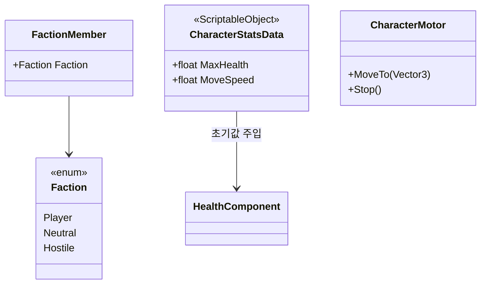
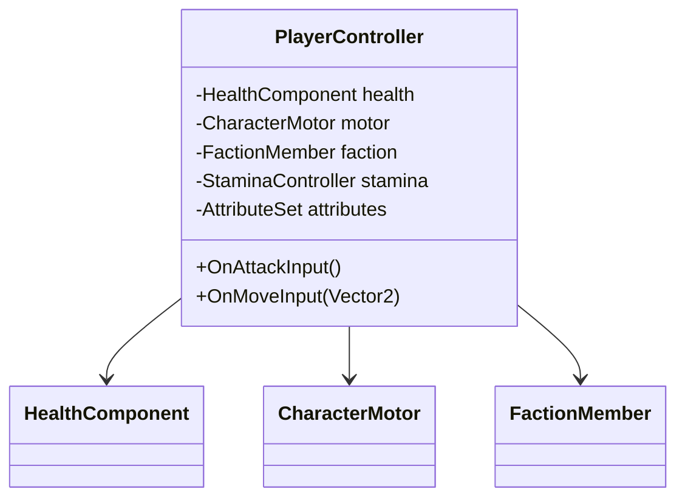
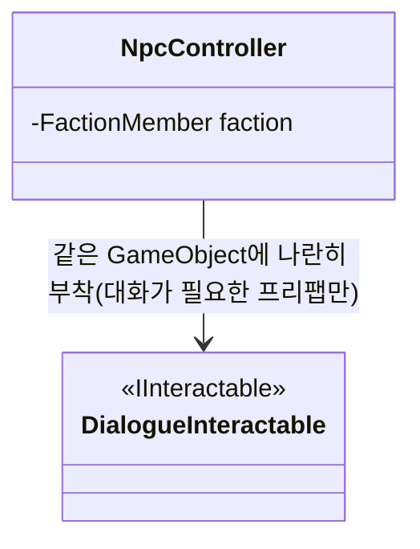
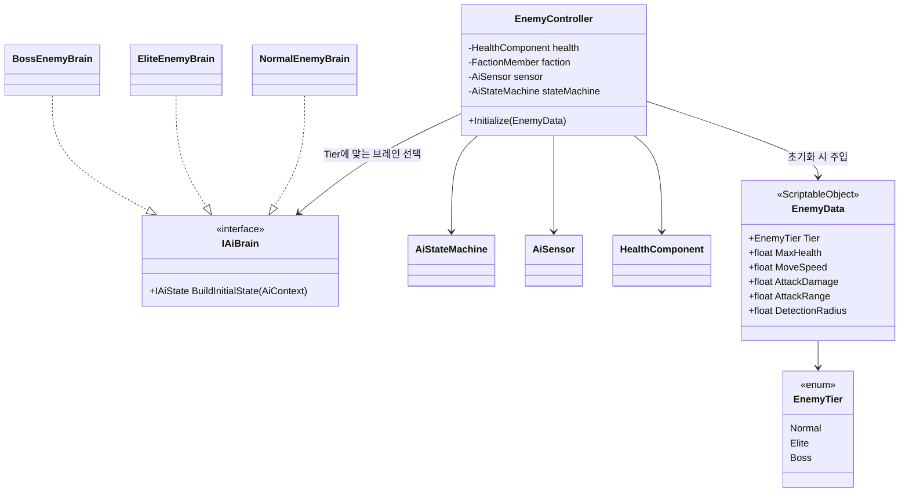

# 캐릭터 시스템 — Player / NPC / Enemy(Normal, Elite, Boss)

플레이어블 캐릭터, NPC, Enemy를 하나의 깊은 상속 계층(`Character` → `Npc` → `Enemy` → `EliteEnemy` → `BossEnemy`)으로 만들지 않고, **공통 능력을 컴포넌트로 조립(합성)**하는 방식으로 설계한다. 코드 위치는 `Assets/Scripts/Characters` 하위 (`Game.Characters`, `Game.Characters.Player`, `Game.Characters.Npc`, `Game.Characters.Enemy`) — 넷 다 구현 완료.

## 왜 상속이 아니라 합성인가

Enemy 티어(Normal/Elite/Boss)마다 서브클래스를 만들면(`NormalEnemy : Enemy`, `EliteEnemy : Enemy`, `BossEnemy : Enemy`) 새 티어나 새 보스가 추가될 때마다 클래스가 늘어나고, 공통 로직 수정이 상위 클래스를 통해 하위 전체에 번져 리스코프 치환을 깨뜨리기 쉽다. 대신:

- **체력/피격**은 [combat-system.md](combat-system.md)의 `HealthComponent`(`IDamageable`)를 그대로 붙인다.
- **소속(적아 식별)**은 `FactionMember` 컴포넌트로 분리한다.
- **AI 유무와 종류**는 [ai-state-machine.md](ai-state-machine.md)의 상태 패턴 기반 `AiStateMachine`을 붙이거나 안 붙이거나로 결정한다(플레이어는 안 붙임).
- **티어별 수치 차이**는 코드가 아니라 `ScriptableObject` 데이터(`EnemyData`)로 준다 — 아이템 시스템에서 이미 쓴 패턴([item-system.md](item-system.md)의 `ItemData`)과 동일한 방식이라 프로젝트 전반에서 일관적이다.

## 공통 구성 요소

- **`Faction`** (`Player` / `Neutral` / `Hostile`) — 공격 대상 판별에 쓰는 최소 분류. `FactionUtility.IsHostileTo(a, b)` 같은 순수 함수로 "누가 누구를 적대하는지"를 한 곳에서 관리한다(하드코딩된 태그 비교를 여기저기 흩뿌리지 않기 위함).
- **`FactionMember`** — GameObject에 소속을 붙이는 최소 컴포넌트. AI 센서가 "적대 진영의 `IDamageable`"을 찾을 때 사용.
- **`CharacterStatsData`** — Player/NPC/Enemy가 공통으로 갖는 기본 스탯(최대 체력, 이동 속도)을 담는 `ScriptableObject`. `EnemyData`는 이를 확장(포함)해서 전투 관련 수치를 추가한다.
- **`CharacterMotor`** — 실제 이동을 담당(NavMeshAgent 래핑 등 구현은 후속 과제). Player는 입력을 받아 호출하고, Enemy는 AI 상태가 호출한다 — 이동 구현 자체를 공유해서 중복을 없앤다.

## Player

(`StaminaController`/`AttributeSet`은 [player-attributes.md](player-attributes.md)에서 정의 — 다이어그램에 필드만 표시)

- 입력(Input System)을 받아 `CharacterMotor`/공격 판정을 직접 호출하는 얇은 컨트롤러. AI 상태 머신을 갖지 않는다 — "AI 없음"도 하나의 유효한 조합이라는 점이 합성 방식의 장점이다.
- `Faction = Player`로 고정.
- 인벤토리/장비는 이미 설계된 [inventory-system.md](inventory-system.md)의 `ContainerEquipmentController`(pocket/rig/backpack)와 [quickslot-and-skills.md](quickslot-and-skills.md)의 `QuickSlotController`(퀵슬롯)를 그대로 붙여서 사용한다(중복 설계 없음).
- 스태미나(달리기/점프 제한)와 지구력/힘/행운 등 기초 스탯은 [player-attributes.md](player-attributes.md)에서 별도로 다룬다 — `PlayerController`는 `StaminaController`, `AttributeSet`을 추가로 보유하게 된다.

## NPC

NPC를 "전투 도움용(Companion)"과 "마을용(Village)"으로 나누되, 서브클래스가 아니라 어떤 선택적 컴포넌트를 붙이느냐로 구분한다. 두 역할의 공통 뼈대와 세부 구성은 [npc-roles.md](npc-roles.md)에서 다룬다. 여기서는 두 역할 모두가 공유하는 최소 계약만 남긴다.

- **`IInteractable`을 그대로 재사용한다.** 처음에는 아이템 시스템(`Game.Items`)에 있었지만, 문(Door) 등 다른 상호작용 종류가 생기면서 `Game.Interaction`(`Assets/Scripts/Interaction`)으로 일반화해 옮겼다 — 자세한 내용과 확장 방식은 [interaction-system.md](interaction-system.md) 참고. **`NpcController` 자신은 `IInteractable`을 구현하지 않는다** — 실제 구현 단계에서 확정된 결정으로, 대화가 필요한 Village NPC 프리팹은 기존 `DialogueInteractable` 컴포넌트를 `NpcController` 옆에 별도로 붙인다(한 GameObject에 두 개의 경쟁하는 `IInteractable` 구현이 생기는 것을 피하기 위함). CombatHelper NPC는 애초에 상호작용이 필요 없으므로 아무것도 안 붙인다.
- `HealthComponent`를 붙일지는 NPC 성격에 따라 선택: 공격받을 수 없는 퀘스트 NPC는 아예 컴포넌트를 안 붙이면 되고(→ 공격 로직이 `IDamageable`을 못 찾아 자연히 무시), 다치거나 죽을 수 있는 NPC(호위 대상, 전투 도움용 NPC 등)는 Enemy와 동일한 `HealthComponent`를 붙인다.
- AI가 필요한 NPC(전투 도움용)는 Enemy와 동일한 `AiStateMachine` 프레임워크를 그대로 쓴다 — 자세한 내용과 상태 재사용 방식은 [npc-roles.md](npc-roles.md) 참고.

## Enemy (Normal / Elite / Boss)

> **참고**: 브레인 팩토리 인터페이스는 처음에 `IEnemyBrain`으로 이름 붙였지만, "`AiContext`로부터 초기 상태 그래프를 만든다"는 계약 자체는 Enemy 전용일 이유가 없다. 전투 도움용 NPC도 같은 방식으로 AI를 구성하므로 `Game.AI.IAiBrain`으로 일반화해서 `Game.AI` 프레임워크 쪽으로 옮겼다 — 자세한 내용은 [npc-roles.md](npc-roles.md) 참고. `NormalEnemyBrain`/`EliteEnemyBrain`/`BossEnemyBrain`은 여전히 `Game.Characters.Enemy`에 있는 `IAiBrain` 구현체다.

- **`EnemyTier`**는 분류/루팅 테이블/UI(보스 체력바 노출 여부) 판단용 값일 뿐, 클래스 상속의 근거로 쓰지 않는다.
- **`EnemyData`**는 티어별 수치를 담은 애셋. "Normal Goblin", "Elite Goblin", "Goblin Chieftain(Boss)"는 전부 같은 `EnemyController` 프리팹 + 서로 다른 `EnemyData` 애셋 조합으로 표현한다.
- **`EnemyController`는 하나뿐이다.** 티어가 달라져도 컴포넌트 코드를 바꾸지 않는다(개방-폐쇄 원칙). 대신 `EnemyData.Tier`에 맞는 `IAiBrain` 구현을 골라 AI 상태 그래프를 구성하도록 위임한다.
- **`IAiBrain`**은 "이 액터는 어떤 상태들로 시작하는가"만 결정하는 아주 작은 팩토리 인터페이스:
  - `NormalEnemyBrain` — Idle → Patrol → Chase → Attack → Dead.
  - `EliteEnemyBrain` — Normal과 동일한 상태 + 쿨다운 기반 `SpecialAttackState` 하나 추가.
  - `BossEnemyBrain` — 페이즈 전환을 포함하는 복합 상태 그래프. 상태 패턴 자체를 바꾸지 않고 상태 개수/전환 조건만 늘어난 것 — 자세한 내용은 [ai-state-machine.md](ai-state-machine.md)의 "보스 확장" 절 참고.
- 새 Elite 몬스터나 새 Boss를 추가할 때: (1) `EnemyData` 애셋 추가 (2) 필요하면 전용 `IAiState` 몇 개 + `IAiBrain` 구현 추가. `EnemyController`, `HealthComponent`, `IDamageable` 등 기존 코드는 전혀 건드리지 않는다.

## 스코프 밖으로 둔 것 (다음 단계 후보)

- 실제 애니메이션 연동(애니메이터 파라미터 매핑)
- 장비/스탯이 전투력에 미치는 계산식(방어력, 치명타 등)
- NPC 대화 트리/상점 UI 자체(‘`Interact`가 무엇을 여는지’는 이 문서 범위 밖)
- 멀티플레이어 동기화
