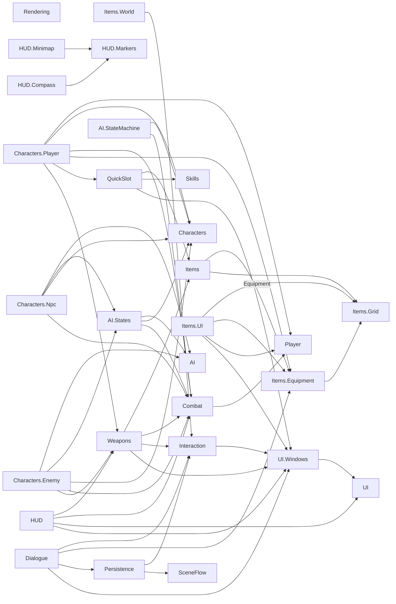

# 코드베이스 맵 (기계 판독용 인덱스)

> 이 문서는 사람의 가독성이 아니라 **코드 파악 속도**(다음 세션에서 파일을 다시 열지 않고 구조를 복원하는 것)를 목표로 작성됨. 왜(why) 이렇게 설계했는지는 `documents/*.md`(설계 문서)를 참조 — 여기는 무엇이 어디 있고 무엇에 의존하는지(what/where)만 기록.
> 생성 시점: 2026-09-18, `Assets/Scripts` 138개 .cs 파일 전수 grep(namespace/타입 선언/`using Game.*`) 기반. 이후 파일 추가/변경 시 이 문서는 갱신 필요(자동 동기화 아님).
> 갱신: 2026-09-18 — 입력 모드 게이팅(design-conflict-review.md #3)으로 `Interaction`이 `UI.Windows`에 처음 의존하게 됨, `QuickSlotInputHandler`/`WeaponLoadoutInputHandler`도 동일하게 `UI.Windows` 의존 추가, `UI.Windows`에 `WindowCloseInputHandler` 신설, `Items.ItemData`에 `OnUse` 가상 훅 추가 + `Weapons.ThrowableItemData` 신설(#10), `Characters.Player.StaminaController`에 `Exhausted`/`Recovered` 이벤트 추가(#4). 아래 표/그래프에 반영됨.
> 갱신: 2026-09-18 (2차) — `Characters.Enemy`(Normal/Elite/Boss), `Characters.Npc`(Village/CombatHelper), `SceneFlow`, `Persistence` 4개 모듈 신규 구현·병합. `Combat.HealthComponent.SetMaxHealth`/`AI.AiSensor.SetDetectionRadius` 추가(EnemyData 값을 런타임에 주입할 공개 API가 없던 gap 메움). `Game.AI.States`에 `FollowState`/`HoldState` 추가.
> 모든 경로는 `Assets/Scripts/`부터 시작하는 상대경로. 각 섹션 헤더에 공통 prefix 명시 후 표에서는 생략.

## A. 폴더 → 네임스페이스 매핑

| 폴더 | 네임스페이스 | 비고 |
|---|---|---|
| `Items/Core`, `Items/Inventory`, `Items/Crafting`, `Items/World` | `Game.Items` | 4개 폴더가 네임스페이스 1개 공유 (폴더≠네임스페이스) |
| `Items/Grid` | `Game.Items.Grid` | |
| `Items/Equipment` | `Game.Items.Equipment` | |
| `Items/UI` | `Game.Items.UI` | |
| `Player` | `Game.Player` | **`Characters/Player`(`Game.Characters.Player`)와 이름 유사하지만 다른 모듈** — 혼동 주의 |
| `UI` (루트) | `Game.UI` | |
| `UI/Windows` | `Game.UI.Windows` | |
| `UI/Windows/Popups` | `Game.UI.Windows.Popups` | |
| `Skills` | `Game.Skills` | |
| `QuickSlot` | `Game.QuickSlot` | |
| `QuickSlot/UI` | `Game.QuickSlot.UI` | |
| `Interaction` | `Game.Interaction` | |
| `Interaction/UI` | `Game.Interaction.UI` | |
| `Dialogue` | `Game.Dialogue` | 2026-09-19 신설. `DialogueInteractable`도 여기(Interaction → Dialogue → Items → Interaction 순환 방지) |
| `Combat` | `Game.Combat` | |
| `Characters/Core` | `Game.Characters` | 폴더명 `Core`가 네임스페이스에 안 붙음 |
| `Characters/Player` | `Game.Characters.Player` | 위 `Player`(`Game.Player`)와 별개 |
| `Characters/Enemy` | `Game.Characters.Enemy` | |
| `Characters/Npc` | `Game.Characters.Npc` | |
| `AI/StateMachine` | `Game.AI` | 폴더명 `StateMachine`이 네임스페이스에 안 붙음 |
| `AI/States` | `Game.AI.States` | |
| `HUD` (루트) | `Game.HUD` | |
| `HUD/Markers`, `HUD/Compass`, `HUD/Minimap` | `Game.HUD.Markers` / `.Compass` / `.Minimap` | |
| `Weapons` | `Game.Weapons` | |
| `Weapons/UI` | `Game.Weapons.UI` | |
| `Rendering` | `Game.Rendering` | |
| `SceneFlow` | `Game.SceneFlow` | |
| `Persistence` | `Game.Persistence` | |

**어셈블리(2026-09-19)**: `Assets/Scripts` 전체가 `Game` 어셈블리, `Assets/Scripts/Editor`가 `Game.Editor`, `Assets/Tests/EditMode`가 `Game.Tests.EditMode`다 — [testing.md](testing.md). 새 외부 패키지를 쓰면 `Game.asmdef` 참조에 추가해야 한다.

C# 네임스페이스 중첩 규칙 주의: `Game.X.Y`는 `Game.X`를 `using` 없이 본다(부모 자동 노출). **형제 네임스페이스**(예: `Game.Items.UI` → `Game.Items.Grid`)는 명시적 `using`이 필요 — 아래 그래프의 간선은 이 명시적 `using Game.*` 51건(38개 파일)을 grep한 결과이며, 부모-자식 자동 노출 관계는 간선에 포함하지 않음(예: `Weapons.UI`가 `Game.Weapons`를 보는 것은 당연하므로 그래프에 없음).

## B. 모듈 의존 그래프

### B-1. 레이어 (foundation → composition)

```
Layer 0 (외부 Game.* 의존 0, leaf):
  Player, Skills, Rendering,
  Items(Core/Inventory/Crafting), Items.Grid,
  Combat-core(IDamageable/DamageInfo/DamageType),
  AI-core(IAiState/AiStateMachine/IAiBrain),
  UI-core(IBackgroundObscurer), UI.Windows-core(IWindow/SimpleWindow/PopupWindow/IPopupContent),
  Characters(Core: Faction/AttributeSet/CharacterMotor 등)

Layer 1 (Layer 0에만 의존):
  Combat(HealthComponent/ArmorComponent) -> Player
  Items.Equipment -> Items.Grid
  UI.Windows(WindowManager) -> UI
  Characters.Player(StaminaController) -> Player
  Characters.Player(PlayerLocomotion) -> Characters(Core), UI.Windows  [2026-09-19: Space/Shift 게이팅]

Layer 2 (Layer 0~1 조합):
  Interaction(PlayerInteractionController) -> UI.Windows  [2026-09-18 추가, #3]
  Items.World(WorldItem) -> Interaction
  QuickSlot -> Items, Skills, UI.Windows  [QuickSlotInputHandler, #3]
  Weapons -> Items, Combat, Interaction, UI.Windows  [WeaponLoadoutInputHandler, #3; WeaponWorldSpawner/WeaponPickup -> Items.World 팩토리, 2026-09-19]
  Items.UI -> Items.Grid, Items.Equipment, Player, UI.Windows
  Dialogue -> Interaction, Items(+Equipment), Persistence, UI.Windows  [DialogueInteractable/DialoguePlayer/GiveItemEventHandler/DialogueFlagStore, 2026-09-19]
  HUD.Markers/Compass/Minimap -> (내부) HUD.Markers
  AI.StateMachine(AiSensor/AiContext) -> Characters, Combat

Layer 3 (composition root / 가장 많이 의존):
  Characters.Player.PlayerController -> Combat, Characters, Items.Equipment, QuickSlot, Weapons  [5개 모듈]
  AI.States(Idle/Patrol/Chase/Attack/Dead/Follow/Hold) -> AI, Characters, Combat
  HUD(WeaponInfoUIView/PlayerVitalsHudPanel/HudRootView/HotbarLayoutController) -> Weapons, Combat, UI, UI.Windows

Layer 4 (Layer 0~3 조합, 2026-09-18 추가):
  Characters.Enemy(EnemyController) -> AI, AI.States, Characters, Combat, Weapons(선택적, WeaponLoadout)
  Characters.Npc(NpcController/CompanionBrain/WanderBrain) -> AI, AI.States, Characters, Combat

독립 서브시스템 (아직 다른 모듈이 참조하지 않음, 2026-09-18 추가):
  SceneFlow -> (게임플레이 모듈 의존 없음 — LoadingProgressChanged 이벤트로 UI와도 역방향 디커플링)
  Persistence -> Interaction(SaveTriggerPoint : IInteractable), SceneFlow(SaveGameService가 SceneFlowController.LoadingScreenEntered 구독)
```

**격리된 모듈(주목)**: `Rendering`, `Skills`, `Player`, `AI.StateMachine`의 프레임워크 3종(`IAiState`/`AiStateMachine`/`IAiBrain`), `SceneFlow`는 다른 게임플레이 모듈을 전혀 참조하지 않음 — 이 모듈들만 수정할 땐 컴파일 영향 범위가 자기 자신 + 자신을 참조하는 쪽(아래 "피참조" 참고)으로 국한됨. `Interaction`은 2026-09-18부터 더 이상 격리 모듈이 아님(`UI.Windows` 의존 추가, #3). `Characters.Enemy`/`Characters.Npc`/`Persistence`는 아직 어느 모듈로부터도 참조되지 않는 "말단"(다른 걸 깨뜨릴 위험 없이 자유롭게 수정 가능).

### B-2. mermaid (모듈 단위, 방향 = "의존한다")



### B-3. 피참조(reverse edge) 요약 — "이 모듈을 바꾸면 뭐가 깨질 수 있나"

| 모듈 | 이 모듈을 참조하는 쪽 |
|---|---|
| `Player` | `Combat`(Health/Armor), `Characters.Player`(Stamina/PlayerController), `UI`(StatBarUIView), `Items.UI`(InventoryLayoutView) |
| `Combat` | `Weapons`(Firearm/MeleeInstance), `AI.StateMachine`(Sensor/Context), `AI.States`, `Characters.Player`(PlayerController), `HUD`(PlayerVitalsHudPanel), **+2026-09-18**: `Characters.Enemy`(EnemyController), `Characters.Npc`(NpcController/CompanionBrain) |
| `Interaction` | `Items.World`(WorldItem), `Weapons`(WeaponPickup), **+2026-09-18**: `Persistence`(SaveTriggerPoint) |
| `Items`(Core) | `Weapons`(AmmoData/WeaponItemData/WeaponPartData), `QuickSlot`(ItemQuickSlotEntry) |
| `Items.Grid` | `Items.Equipment`, `Items.UI` |
| `Items.Equipment` | `Characters.Player`(PlayerController), `Items.UI` |
| `Skills` | `QuickSlot`(SkillQuickSlotEntry) |
| `QuickSlot` | `Characters.Player`(PlayerController) |
| `Weapons` | `HUD`(WeaponInfoUIView), `Characters.Player`(PlayerController), **+2026-09-18**: `Characters.Enemy`(EnemyController, 선택적 WeaponLoadout) |
| `Characters`(Core) | `Characters.Player`, `AI.States`, `AI.StateMachine`, **+2026-09-18**: `Characters.Enemy`, `Characters.Npc` |
| `UI` | `UI.Windows`, `HUD`(PlayerVitalsHudPanel) |
| `UI.Windows` | `Items.UI`(InventoryScreenController/MapScreenController 등은 같은 모듈), `HUD`(HudRootView/HotbarLayoutController) — **+2026-09-18**: `Interaction`(PlayerInteractionController), `QuickSlot`(QuickSlotInputHandler), `Weapons`(WeaponLoadoutInputHandler) 전부 `IsAnyWindowOpen` 게이팅용(#3), **+2026-09-19**: `Characters.Player`(PlayerLocomotion), `Dialogue`(입력 차단자) |
| `HUD.Markers` | `HUD.Compass`, `HUD.Minimap` |
| `AI`(StateMachine core) | `AI.States`, **+2026-09-18**: `Characters.Enemy`, `Characters.Npc` |
| `AI.States` | **+2026-09-18**: `Characters.Enemy`, `Characters.Npc` (Idle/Patrol/Chase/Attack/Dead 재사용; Follow/Hold는 Npc 트랙이 이 모듈에 신설) |
| `SceneFlow` | **+2026-09-18**: `Persistence`(SaveGameService가 `LoadingScreenEntered` 구독) |

## C. 모듈별 파일 인벤토리

표기: `파일 — 종류 이름 : Base/Impl` (역할은 이름으로 자명하지 않을 때만 괄호로 추가)

### Items/Core, Items/Inventory, Items/Crafting (`Game.Items`)
- `Core/ItemDatabase.cs` — class ItemDatabase : ScriptableObject (`itemId` 조회, 2026-09-19) + `Assets/Scripts/Editor/ItemDatabaseEditor.cs`(Collect 버튼)
- `Core/ItemData.cs` — class ItemData : ScriptableObject (+ `virtual void OnUse(GameObject user)` 훅, 2026-09-18 추가, 기본 no-op — `Weapons.ThrowableItemData`가 오버라이드, §10 결정)
- `Core/ItemType.cs` — enum ItemType
- `Core/ItemStack.cs` — class ItemStack (개수/스택 로직, Add가 leftover 반환하는 Try* 컨벤션)
- `Inventory/IInventory.cs` — interface IInventory
- `Inventory/Inventory.cs` — class Inventory : MonoBehaviour, IInventory (플랫 슬롯형, +`SetSlotStack` 복원용)
- `Inventory/InventorySaveProvider.cs` — class InventorySaveProvider : MonoBehaviour, ISaveDataProvider → `Game.Persistence` (2026-09-19)
- `Inventory/InventorySlot.cs` — class InventorySlot
- `Crafting/CraftingRecipe.cs` — class CraftingRecipe : ScriptableObject
- `Crafting/CraftingIngredient.cs` — class CraftingIngredient
- `Crafting/CraftingSystem.cs` — static class CraftingSystem

### Items/World (`Game.Items`)
- `World/WorldItem.cs` — class WorldItem : MonoBehaviour, IInteractable → `Game.Interaction`, `Game.Items.Equipment` (`ContainerEquipmentController`의 Pocket→Rig→Backpack 그리드 우선, 없으면 플랫 `IInventory` 폴백. +`SetStack`)
- `World/ContainerPickup.cs`, `World/ContainerWorldSpawner.cs`, `World/ContainerDropExtensions.cs` — 내용물을 든 컨테이너의 월드 표현(착용 가능), 스포너(팩토리에 자동 등록), 드롭 헬퍼 (2026-09-19)
- `World/WorldItemFactory.cs` — class WorldItemFactory : MonoBehaviour, IWorldItemFactory (월드에 아이템을 만드는 단일 진입점, `Instance`는 씬에 없으면 자동 생성, 종류별 `IWorldItemSpawner` 등록, `SpawnAll`은 흩뿌려 지면에 놓음, 2026-09-19)
- `World/IWorldItemFactory.cs`, `World/IWorldItemSpawner.cs`, `World/WorldSpawnRequest.cs` — 인터페이스와 요청(아이템+수량+선택적 `object State`)
- `World/ItemWorldSpawner.cs` — 기본 스포너(`WorldPrefab` 또는 기본 표현 + `WorldItem`) / `World/DefaultWorldVisual.cs` — 프리팹 없을 때의 트리거 큐브 / `World/DropPlacement.cs` — 흩뿌리기 오프셋·지면 탐색(순수 함수)

### Items/Grid (`Game.Items.Grid`)
- `IGridInventory.cs` — interface IGridInventory (`TryPlaceAt`에 `rotated` 인자 추가, 2026-09-19)
- `GridInventory.cs` — class GridInventory : MonoBehaviour, IGridInventory (자동 배치가 원래 방향이 안 되면 90° 회전 재시도. 기존 스택에 병합될 때도 `GridChanged` 발생, 2026-09-19)
- `GridShapeData.cs` — class GridShapeData : ScriptableObject (pocket/rig/backpack 모양 정의)
- `PlacedItem.cs` — class PlacedItem (+`IsRotated`, 정적 `GetFootprint(item, rotated)`)
- `GridItemDragMover.cs` — static class GridItemDragMover (드래그 이동: 정확한 칸 → 자동 배치 → 원위치 복귀. UI 비의존, 2026-09-19)

### Items/Equipment (`Game.Items.Equipment`)
- `ContainerCategory.cs` — enum ContainerCategory (Pocket/Rig/Backpack)
- `ContainerItemData.cs` — class ContainerItemData : ItemData → `Game.Items.Grid`
- `ContainerEquipmentController.cs` — class ContainerEquipmentController : MonoBehaviour → `Game.Items.Grid`
- `ContainerContents.cs` — class ContainerContents + struct EquippedContainer/EquipResult (내용물 스냅샷, 컨테이너와 함께 벗기고 입는 단위, 2026-09-19). 컨트롤러에 `Detach`/`EquipWithContents` 추가
- `ContainerEquipmentSaveProvider.cs` — class ContainerEquipmentSaveProvider : MonoBehaviour, ISaveDataProvider → `Game.Items.Grid`, `Game.Persistence` (키 `player.containers`, 2026-09-19)

### Items/UI (`Game.Items.UI`)
- `ItemSlotUIView.cs` — class ItemSlotUIView : MonoBehaviour, IPointerClickHandler
- `InventoryUIView.cs` — class InventoryUIView : MonoBehaviour
- `CraftingUIView.cs` — class CraftingUIView : MonoBehaviour
- `GridCellUIView.cs` — class GridCellUIView : MonoBehaviour
- `GridItemUIView.cs` — class GridItemUIView : MonoBehaviour, IPointerClickHandler, IBeginDragHandler, IDragHandler, IEndDragHandler → `Game.Items.Grid` (드래그 소스: 실제 아이콘 복제 고스트, R 회전, 소스 파괴 시에도 고스트 정리)
- `EquipmentSlotUIView.cs` — class EquipmentSlotUIView : MonoBehaviour, IPointerClickHandler → `Game.Items.Equipment`
- `InventoryLayoutView.cs` — class InventoryLayoutView : MonoBehaviour → `Game.Items.Equipment`, `Game.Player` (장비 슬롯 클릭 = `Detach` 후 컨테이너를 내용물째 드롭, 2026-09-19)
- `GridInventoryUIView.cs` — class GridInventoryUIView : MonoBehaviour, IDropHandler → `Game.Items.Grid` (드롭 타깃 + 놓일 자리 미리보기, 첫 렌더링은 `Start`)
- `InventoryScreenController.cs` — class InventoryScreenController : SimpleWindow → `Game.UI.Windows` (전체화면 인벤토리 진입점)

### Player (`Game.Player`) — Layer 0
- `Stats/PlayerStat.cs` — interface IReadOnlyStat; class PlayerStat : IReadOnlyStat
- `Stats/PlayerVitals.cs` — class PlayerVitals : MonoBehaviour (Hunger/Thirst)

### UI 루트 (`Game.UI`)
- `IBackgroundObscurer.cs` — interface IBackgroundObscurer
- `DarkenOverlayObscurer.cs` — class DarkenOverlayObscurer : MonoBehaviour, IBackgroundObscurer
- `StatBarUIView.cs` — class StatBarUIView : MonoBehaviour → `Game.Player`

### UI/Windows (`Game.UI.Windows`)
- `IWindow.cs` — interface IWindow
- `SimpleWindow.cs` — abstract class SimpleWindow : MonoBehaviour, IWindow
- `IPopupContent.cs` — interface IPopupContent
- `PopupWindow.cs` — class PopupWindow : MonoBehaviour, IWindow
- `PopupLauncher.cs` — class PopupLauncher : MonoBehaviour
- `FullScreenWindowEntry.cs` — struct FullScreenWindowEntry (카탈로그 항목: id/label/window/hotkey)
- `WindowManager.cs` — class WindowManager : MonoBehaviour → `Game.UI` (풀스크린 상호배타 + 팝업 스택 통합 관리자, **핵심 composition root**) — `IsAnyWindowOpen`/`CloseTopMost()` 추가(2026-09-18, #3), `AddInputBlocker`/`RemoveInputBlocker`(창이 아닌 대화창이 게이팅에 참여, 2026-09-19)
- `FullScreenWindowHotkeyRouter.cs` — class FullScreenWindowHotkeyRouter : MonoBehaviour
- `WindowCloseInputHandler.cs` — class WindowCloseInputHandler : MonoBehaviour (2026-09-18 신설, Escape → `WindowManager.CloseTopMost()`, #3)
- `FullScreenWindowTabBarUIView.cs`, `FullScreenWindowTabButtonUIView.cs` — MonoBehaviour(+IPointerClickHandler)
- `MapScreenController.cs` — class MapScreenController : SimpleWindow
- `QuestScreenController.cs` — class QuestScreenController : SimpleWindow
- `SettingsScreenController.cs` — class SettingsScreenController : SimpleWindow

### UI/Windows/Popups (`Game.UI.Windows.Popups`)
- `CodeEntryPuzzleContent.cs` — class CodeEntryPuzzleContent : MonoBehaviour, IPopupContent
- `ChoiceEventContent.cs` — class ChoiceEventContent : MonoBehaviour, IPopupContent

### Skills (`Game.Skills`) — Layer 0
- `SkillData.cs` — abstract class SkillData : ScriptableObject
- `ScanSkillData.cs` — class ScanSkillData : SkillData (예시 스킬)
- `SkillInstance.cs` — class SkillInstance
- `SkillExecutionContext.cs` — readonly struct SkillExecutionContext

### QuickSlot (`Game.QuickSlot`)
- `IQuickSlottable.cs` — interface IQuickSlottable
- `IQuickSlotController.cs` — interface IQuickSlotController
- `QuickSlotUseContext.cs` — readonly struct QuickSlotUseContext
- `ItemQuickSlotEntry.cs` — class ItemQuickSlotEntry : IQuickSlottable → `Game.Items`
- `SkillQuickSlotEntry.cs` — class SkillQuickSlotEntry : IQuickSlottable → `Game.Skills`
- `QuickSlotBank.cs` — class QuickSlotBank (뱅크 1개 = 7칸, 키 4~0)
- `QuickSlotController.cs` — class QuickSlotController : MonoBehaviour, IQuickSlotController (뱅크 2개, `` ` `` 스왑)
- `QuickSlotInputHandler.cs` — class QuickSlotInputHandler : MonoBehaviour (4~0 입력만 처리, 1/2/3은 Weapons 쪽) → `Game.UI.Windows`(`WindowManager.IsAnyWindowOpen` 게이팅, 2026-09-18, #3)

### QuickSlot/UI (`Game.QuickSlot.UI`)
- `QuickSlotUIView.cs` — class QuickSlotUIView : MonoBehaviour, IPointerClickHandler
- `QuickSlotBarUIView.cs` — class QuickSlotBarUIView : MonoBehaviour (인벤토리 열림=2줄/닫힘=1줄 전환 대상)

### Interaction (`Game.Interaction`) — Layer 0
- `IInteractable.cs` — interface IInteractable
- `InteractionDetector.cs` — class InteractionDetector : MonoBehaviour
- `PlayerInteractionController.cs` — class PlayerInteractionController : MonoBehaviour (F키 입력) → `Game.UI.Windows`(게이팅, 2026-09-18, #3)
- `DoorInteractable.cs` — class DoorInteractable : MonoBehaviour, IInteractable
- (`DialogueInteractable`은 순환 의존 방지를 위해 2026-09-19 `Dialogue` 모듈로 이동)

### Dialogue (`Game.Dialogue`, 2026-09-19 신설) — 상세: [dialogue-system.md](dialogue-system.md)
- `DialogueNodeType.cs`, `DialogueEventType.cs`, `DialogueState.cs` — enum들 (Line/Choice/Branch/Event/Wait/End, SetFlag/GiveItem/StartQuest/OpenQuestOffer/OpenQuestTurnIn/OpenShop, Idle/Playing/WaitingForAdvance/ChoicePending/ModalPending/Waiting)
- `DialogueCondition.cs`, `DialogueChoiceOption.cs`, `DialogueNode.cs` — [Serializable] 데이터(평면 구조), `DialogueNode` → `Game.Items`(`eventItem`)
- `DialogueSequence.cs` — class DialogueSequence : ScriptableObject
- `IDialogueFlags.cs` — interface / `DialogueFlagStore.cs` — class DialogueFlagStore : MonoBehaviour, IDialogueFlags, ISaveDataProvider → `Game.Persistence` (키 `dialogue.flags`)
- `DialogueRunner.cs` — class DialogueRunner (순수 C#, 재생 상태 머신. `Cancel()`/`FastForward()` — 구 `Skip()` 대체, 2026-09-19) / `DialogueLogEntry.cs`
- `IDialogueEventHandler.cs` — interface + `DialogueEventContext`; `SetFlagEventHandler.cs`, `GiveItemEventHandler.cs` → `Game.Items`, `Game.Items.Equipment`
- `IDialogueView.cs` — interface / `DialogueBoxUIView.cs` — class DialogueBoxUIView : MonoBehaviour, IDialogueView (TextMeshPro로 전환 2026-09-20 — `maxVisibleCharacters` 타이핑, 본문에 텍스트 이펙트, 로그/선택지는 정적 색)
- `DialoguePlayer.cs` — class DialoguePlayer : MonoBehaviour (**씬 composition root**, `Instance`) → `Game.UI.Windows`(`AddInputBlocker`)
- `DialogueInputHandler.cs` — class DialogueInputHandler : MonoBehaviour (Submit F/Enter, Navigate W/S, Cancel Esc=대화 취소, Skip Tab=빨리 넘기기, Log L. 시작 프레임·실제 창이 열려 있을 때는 입력 무시. 2026-09-19 재작성)
- `Text/` (2026-09-20, 상세: [dialogue-text-effects.md](dialogue-text-effects.md)) — `DialogueMarkup.cs`(인라인 태그 파서, 순수 C#), `ParsedText.cs`(+`TextSpan`/`TextPause`), `TextTagArgs.cs`, `ITextEffect.cs`(+`GlyphContext`/`GlyphStyle`), `BuiltInTextEffects.cs`(Color/Sway/Wave/Shake/Rainbow), `TextEffectRegistry.cs`(이름 → 효과 팩토리), `TextTypist.cs`(타이핑 시계·일시정지), `DialogueTextAnimator.cs`(MonoBehaviour, TMP 글자별 정점 조작) → `TMPro`
- `DialogueInteractable.cs` — class DialogueInteractable : MonoBehaviour, IInteractable → `Game.Interaction` (구 `Interaction/` 폴더에서 이동)

### Interaction/UI (`Game.Interaction.UI`)
- `InteractionPromptUIView.cs` — class InteractionPromptUIView : MonoBehaviour

### Combat (`Game.Combat`)
- `IDamageable.cs` — interface IDamageable — Layer 0
- `DamageInfo.cs` — readonly struct DamageInfo (Source: GameObject) — Layer 0
- `DamageType.cs` — enum DamageType — Layer 0
- `HealthComponent.cs` — class HealthComponent : MonoBehaviour, IDamageable, IReadOnlyStat → `Game.Player` (+`SetMaxHealth(float)`, 2026-09-18 — EnemyData 등 데이터 기반 초기화용, 전투 중 힐과는 별개)
- `ArmorComponent.cs` — class ArmorComponent : MonoBehaviour, IReadOnlyStat → `Game.Player` (IDamageable 미구현 — 의도적)

### Characters/Core (`Game.Characters`) — Layer 0
- `Faction.cs` — enum Faction
- `FactionUtility.cs` — static class FactionUtility
- `FactionMember.cs` — class FactionMember : MonoBehaviour
- `CharacterStatsData.cs` — class CharacterStatsData : ScriptableObject
- `CharacterMotor.cs` — class CharacterMotor : MonoBehaviour (Rigidbody 기반, +`IsGrounded`(충돌 법선 기반, 2026-09-19) — 공중에서는 수평 속도를 조향/정지하지 않아 점프 모멘텀이 착지까지 유지됨)
- `AttributeType.cs` — enum AttributeType
- `AttributeModifier.cs` — sealed class AttributeModifier
- `AttributeFormula.cs` — class AttributeFormula : ScriptableObject ((base+Σflat)×(1+Σpercent))
- `AttributeSet.cs` — class AttributeSet : MonoBehaviour (nested struct BaseValue)

### Characters/Player (`Game.Characters.Player`)
- `PlayerActionType.cs` — enum PlayerActionType
- `PlayerActionCosts.cs` — class PlayerActionCosts : ScriptableObject (nested struct Entry)
- `StaminaController.cs` — class StaminaController : MonoBehaviour → `Game.Player` (+`Exhausted`/`Recovered` 이벤트, 2026-09-18, design-conflict-review.md #4)
- `PlayerLocomotion.cs` — class PlayerLocomotion : MonoBehaviour → `Game.Characters`, `Game.UI.Windows` (자체 Input System 키 처리. `TryJump`는 `motor.IsGrounded`일 때만 가능 — 공중 연속 점프 방지. 선택적 `windowManager`로 Space/Shift를 게이팅해 대화·창이 열려 있으면 점프/달리기 불가, 2026-09-19)
- `PlayerInputHandler.cs` — class PlayerInputHandler : MonoBehaviour → `Game.UI.Windows` (WASD + 좌클릭을 `PlayerController.OnMoveInput`/`OnAttackInput`으로 전달, `IsAnyWindowOpen`이면 이동 정지. 프로젝트 관례대로 `Keyboard.current`/`Mouse.current` 직접 폴링, 2026-09-19)
- `PlayerController.cs` — class PlayerController : MonoBehaviour → `Game.Combat`, `Game.Characters`, `Game.Items.Equipment`, `Game.QuickSlot`, `Game.Weapons`, `Game.SceneFlow` (**최상위 composition root**, §D 참고. `Awake`에서 `PlayerRuntimeContext.Instance?.BindActivePlayer` 호출)

### Characters/Enemy (`Game.Characters.Enemy`, 2026-09-18 신설)
- `EnemyTier.cs` — enum EnemyTier (Normal/Elite/Boss)
- `EnemyData.cs` — class EnemyData : ScriptableObject (Tier/MaxHealth/MoveSpeed/AttackDamage/AttackRange/DetectionRadius)
- `EnemyController.cs` — class EnemyController : MonoBehaviour → `Game.AI`, `Game.AI.States`, `Game.Characters`, `Game.Combat`, `Game.Weapons`(선택적 `WeaponLoadout`) — **composition root**, `Initialize(EnemyData)`가 `HealthComponent.SetMaxHealth`/`AiSensor.SetDetectionRadius`로 데이터 주입 + Tier에 맞는 `IAiBrain` 선택, `HealthComponent.Died`를 구독해 `DeadState`로 직접 전환(§D 참고)
- `EnemySpawner.cs` — static class EnemySpawner (`Spawn(prefab, EnemyData, pos, rot)` — 인스턴스화 후 `Initialize` 호출. 프리팹: `Assets/Prefabs/Characters/Enemy.prefab`, 티어는 프리팹이 아니라 `EnemyData`로 결정, 2026-09-19)
- `NormalEnemyBrain.cs` — class NormalEnemyBrain : IAiBrain (Idle/Patrol/Chase/Attack 재사용, 신규 상태 없음)
- `EliteEnemyBrain.cs` — class EliteEnemyBrain : IAiBrain (+`SpecialAttackState`/`SpecialAttackGate`)
- `SpecialAttackState.cs`, `SpecialAttackGate.cs` — Elite 전용 쿨다운 특수 공격
- `BossEnemyBrain.cs` — class BossEnemyBrain : IAiBrain (2페이즈, `HealthComponent.Damaged` 기준 전환)
- `BossPhaseState.cs`, `PhaseIdleState.cs`, `PhaseAttackState.cs` — 페이즈별 파라미터만 다르게 구성되는 재사용 클래스(페이즈마다 별도 클래스를 만들지 않음, DRY)
- (순환 구성 프록시는 `Game.AI.ForwardingAiState`로 통합됨 — 아래 `AI/StateMachine` 절 참고. Enemy 트랙이 처음 `DeferredAiState`로 로컬 구현했던 것을 2026-09-18에 NPC 트랙의 동일한 클래스와 통합하며 삭제)

### Characters/Npc (`Game.Characters.Npc`, 2026-09-18 신설)
- `NpcRole.cs` — enum NpcRole (Village/CombatHelper)
- `NpcData.cs` — class NpcData : ScriptableObject (Role/DisplayName/Faction/BaseStats)
- `NpcController.cs` — class NpcController : MonoBehaviour → `Game.AI`, `Game.AI.States`, `Game.Characters`, `Game.Combat` — **composition root**(Enemy의 `EnemyController`와 동일 패턴). `IInteractable`은 구현하지 않음(§D 참고) — `NpcData`+`FactionMember`+선택적 `HealthComponent`/`AiSensor`가 항상 있고, AI는 `InitializeAi(IAiBrain)`을 호출해야만 켜짐(안 켜진 채로 있는 것 = 가만히 서 있는 Village NPC)
- `CompanionOrder.cs` — enum CompanionOrder (Follow/Hold/AttackTarget)
- `CompanionOrderReceiver.cs` — class CompanionOrderReceiver : MonoBehaviour (현재 주문 + AttackTarget 보관)
- `NpcSpawner.cs` — static class NpcSpawner (`Spawn(prefab, pos, rot, brain = null)` — brain이 있을 때만 `InitializeAi`. 프리팹: `VillageNpc.prefab`(정적, 대화 전용)/`CompanionNpc.prefab`(이동·AI), 2026-09-19)
- `CompanionBrain.cs` — class CompanionBrain : IAiBrain (Follow/Hold/AssistCombat 그래프, AssistCombat = `Game.AI.States.ChaseState`/`AttackState` 그대로 재사용)
- `WanderBrain.cs` — class WanderBrain : IAiBrain (Village NPC용, Idle/Patrol 재사용 — Chase/Attack도 배선하지만 Neutral 진영이라 실질적으로 도달 불가)
- (마찬가지로 `Game.AI.ForwardingAiState`로 통합됨 — 이 트랙의 로컬 구현은 삭제)

### AI/StateMachine (`Game.AI`)
- `IAiState.cs` — interface IAiState — Layer 0
- `AiStateMachine.cs` — class AiStateMachine — Layer 0
- `IAiBrain.cs` — interface IAiBrain — Layer 0
- `AiSensor.cs` — class AiSensor : MonoBehaviour → `Game.Characters`, `Game.Combat` (+`SetDetectionRadius(float)`, 2026-09-18 — 위 `HealthComponent.SetMaxHealth`와 동일한 이유)
- `AiContext.cs` — class AiContext → `Game.Combat` (Self: GameObject, Sensor/CurrentTarget/StateMachine 블랙보드)
- `ForwardingAiState.cs` — sealed class ForwardingAiState : IAiState (2026-09-18 신설, Layer 0). `ChaseState`/`AttackState`/`PatrolState` 등이 서로를 `readonly` 생성자 인자로 요구해 생기는 순환 구성 문제를 깨는 자리표시자(`Target`을 실제 상태 생성 후 대입) — Enemy 트랙의 `DeferredAiState`와 NPC 트랙의 동일 클래스가 각자 독립적으로 이 문제를 풀었던 것을 병합 후 이 파일 하나로 통합(DRY). `NormalEnemyBrain`/`EliteEnemyBrain`/`BossEnemyBrain`/`CompanionBrain`/`WanderBrain` 전부 이걸 씀

### AI/States (`Game.AI.States`)
- `IdleState.cs`, `PatrolState.cs`, `ChaseState.cs`, `AttackState.cs`, `DeadState.cs` — 전부 `class X : IAiState` → `Game.AI`, `Game.Characters`, `Game.Combat` (단, `context.Self` 미사용 — `AiSensor` 경유만)
- `FollowState.cs`, `HoldState.cs` (2026-09-18, Npc 트랙이 신설) — `class X : IAiState`. NPC 전용 개념(`CompanionOrder` 등)을 직접 참조하지 않고 `Func<bool>`/`Func<IDamageable>` 델리게이트로 필요한 판단만 주입받음(의존성 역전) — `CompanionBrain`(`Game.Characters.Npc`)이 이 델리게이트를 채워서 넘김

### HUD 루트 (`Game.HUD`)
- `WeaponInfoUIView.cs` — class WeaponInfoUIView : MonoBehaviour → `Game.Weapons`
- `PlayerVitalsHudPanel.cs` — class PlayerVitalsHudPanel : MonoBehaviour → `Game.Combat`, `Game.UI`
- `HudRootView.cs` — class HudRootView : MonoBehaviour → `Game.UI.Windows`
- `HotbarLayoutController.cs` — class HotbarLayoutController : MonoBehaviour → `Game.UI.Windows` (1줄/2줄 레이아웃 스위치)

### HUD/Markers (`Game.HUD.Markers`) — Layer 1
- `IWorldMarker.cs` — interface IWorldMarker
- `MarkerCategory.cs` — enum MarkerCategory
- `WorldMarkerRegistry.cs` — class WorldMarkerRegistry : MonoBehaviour (나침반/미니맵 공유 레지스트리)
- `WorldMarkerSource.cs` — class WorldMarkerSource : MonoBehaviour, IWorldMarker

### HUD/Compass, HUD/Minimap
- `Compass/CompassUIView.cs`, `Compass/CompassMarkerIconView.cs` → `Game.HUD.Markers`
- `Minimap/MinimapCameraRig.cs`, `Minimap/MinimapUIView.cs`, `Minimap/MinimapMarkerIconView.cs` → `Game.HUD.Markers`

### Weapons (`Game.Weapons`)
- `IWeapon.cs` — interface IWeapon
- `IWeaponDisplay.cs` — interface IWeaponDisplay
- `IWeaponInfo.cs` — interface IWeaponInfo : IWeaponDisplay
- `WeaponUseContext.cs` — readonly struct WeaponUseContext (Wielder: GameObject)
- `WeaponItemData.cs` — abstract class WeaponItemData : ItemData → `Game.Items`
- `WeaponStatType.cs` — enum WeaponStatType
- `WeaponStatModifier.cs` — class WeaponStatModifier ((base+Σflat)×(1+Σpercent), AttributeFormula와 동형이나 독립 구현)
- `WeaponPartSlot.cs` — enum WeaponPartSlot
- `WeaponPartData.cs` — abstract class WeaponPartData : ItemData → `Game.Items`
- `GenericWeaponPartData.cs` — class GenericWeaponPartData : WeaponPartData
- `AmmoType.cs` — enum AmmoType
- `AmmoData.cs` — class AmmoData : ItemData → `Game.Items`
- `MagazineData.cs` — class MagazineData : WeaponPartData
- `MagazineInstance.cs` — class MagazineInstance (TryLoadRounds 등 Try* 컨벤션)
- `FireMode.cs` — enum FireMode
- `FirearmData.cs` — class FirearmData : WeaponItemData
- `FirearmInstance.cs` — class FirearmInstance : IWeapon, IWeaponInfo → `Game.Combat`
- `MeleeWeaponData.cs` — class MeleeWeaponData : WeaponItemData
- `MeleeWeaponInstance.cs` — class MeleeWeaponInstance : IWeapon, IWeaponDisplay → `Game.Combat`
- `WeaponLoadoutSlot.cs` — enum WeaponLoadoutSlot (Primary/Secondary/Melee)
- `WeaponLoadout.cs` — class WeaponLoadout : MonoBehaviour (2 firearm + 1 melee, 키 1/2/3 고정)
- `WeaponLoadoutInputHandler.cs` — class WeaponLoadoutInputHandler : MonoBehaviour (1/2/3 전용, QuickSlotInputHandler와 배타적 키 분리) → `Game.UI.Windows`(게이팅, 2026-09-18, #3)
- `WeaponPickup.cs` — class WeaponPickup : MonoBehaviour, IInteractable → `Game.Interaction`, `Game.Items` (밀려난 무기를 `WorldItemFactory`로 드롭 — `dropPrefab` 삭제, 2026-09-19)
- `WeaponWorldSpawner.cs` — class WeaponWorldSpawner : IWorldItemSpawner → `Game.Items` (무기 인스턴스/데이터를 `WeaponPickup`으로 생성, `RuntimeInitializeOnLoadMethod`로 팩토리에 자동 등록)
- `ThrowableItemData.cs` — class ThrowableItemData : ItemData (2026-09-18 신설, §10 결정 — `WeaponLoadoutSlot`에 안 들어가는 퀵슬롯 전용 투척 아이템, `ItemData.OnUse` 오버라이드)

### Weapons/UI (`Game.Weapons.UI`)
- `WeaponSlotUIView.cs` — class WeaponSlotUIView : MonoBehaviour, IPointerClickHandler
- `WeaponLoadoutBarUIView.cs` — class WeaponLoadoutBarUIView : MonoBehaviour

### Rendering (`Game.Rendering`) — Layer 0, 완전 격리
- `EffectCategory.cs` — enum EffectCategory
- `ScreenEffectParams.cs` — struct ScreenEffectParams
- `ScreenEffectCompositor.cs` — class ScreenEffectCompositor
- `DebuffScreenEffectFeature.cs` — class DebuffScreenEffectFeature : ScriptableRendererFeature
- `DebuffScreenEffectPass.cs` — internal sealed class DebuffScreenEffectPass : ScriptableRenderPass (유일하게 `public`이 아닌 타입)

### SceneFlow (`Game.SceneFlow`, 2026-09-18 신설, 게임플레이 모듈 의존 없음)
- `SceneKind.cs` — enum SceneKind (Boot/Title/Loading/Lobby/Combat)
- `SceneDefinitionData.cs` — class SceneDefinitionData : ScriptableObject (Kind/SceneName/RequiresSaveDataLoaded)
- `SceneCatalog.cs` — class SceneCatalog : ScriptableObject (`Get(SceneKind)`)
- `ISceneFlowController.cs` — interface ISceneFlowController (`RequestTransition(SceneKind)`)
- `SceneFlowController.cs` — class SceneFlowController : MonoBehaviour, ISceneFlowController — **composition root**(§D). 이벤트: `TransitionStarted`/`LoadingScreenEntered`/`TransitionCompleted`/`LoadingProgressChanged`(설계 문서의 `LoadingProgressUIView.Instance` 직접 참조 대신 이벤트로 대체 — SceneFlow가 UI 타입을 몰라도 되게, 의존성 역전)
- `PlayerRuntimeContext.cs` — class PlayerRuntimeContext : MonoBehaviour (싱글턴, `DontDestroyOnLoad`). `ActivePlayer`를 설계 문서의 `PlayerController` 대신 `GameObject`로 타입 지정 — `Characters.Player`에 하드 컴파일 의존을 안 만들기 위한 의도적 이탈

### Persistence (`Game.Persistence`, 2026-09-18 신설)
- `ISaveDataProvider.cs` — interface ISaveDataProvider (`SaveKey`/`CaptureState()`/`RestoreState(...)`) — 실제 구현체: `Game.Player.PlayerVitalsSaveProvider`(`player.vitals`), `Game.Combat.HealthSaveProvider`(`player.health`), `Game.Items.Equipment.ContainerEquipmentSaveProvider`(`player.containers`), `Game.Items.InventorySaveProvider`(`inventory.flat`), `Game.Dialogue.DialogueFlagStore`(`dialogue.flags`), 퀵슬롯/AttributeSet/무기는 아직(§4-4). 플레이어에 붙는 provider는 씬이 달라 직렬화 참조를 못 쓰므로 `SaveDataRegistry.Instance`로 등록
- `SaveTriggerReason.cs` — enum SaveTriggerReason (SceneTransition/ManualSavePoint/QuestCompleted/AppQuit/Custom)
- `ISaveRequestSink.cs` — interface ISaveRequestSink (`RequestSave(SaveTriggerReason)`)
- `SaveDataRegistry.cs` — class SaveDataRegistry : MonoBehaviour (`Register`/`Unregister`/`Providers`)
- `SaveGameService.cs` — class SaveGameService : MonoBehaviour, ISaveRequestSink → `Game.SceneFlow`(`SceneFlowController.LoadingScreenEntered` 구독). `JsonUtility`가 다형적 `object`를 못 다루는 문제는 provider별 POCO를 개별 `JsonUtility.ToJson`으로 직렬화한 `(key, json)` 목록을 하나의 봉투 클래스로 감싸는 방식으로 해결(설계 문서가 코드 단계로 미뤄둔 결정)
- `SaveTriggerPoint.cs` — class SaveTriggerPoint : MonoBehaviour, IInteractable → `Game.Interaction`. `saveSink` 필드는 설계 문서의 `ISaveRequestSink` 직접 직렬화 대신 `MonoBehaviour`(인스펙터 대입 후 `Awake`에서 캐스팅) — Unity가 순수 인터페이스 필드를 직렬화 못 하기 때문(`WindowManager.backgroundObscurerSource`와 동일 패턴)

## D. Composition root 상세 (누가 무엇을 조립하는가)

- **`Characters.Player.PlayerController`** (`Characters/Player/PlayerController.cs`) — 최상위 조립점. 같은 GameObject에서 구성: `HealthComponent`(Combat), `CharacterMotor`(Characters), `FactionMember`(Characters), `StaminaController`(Characters.Player→Player), `AttributeSet`(Characters), `ContainerEquipmentController`(Items.Equipment), `QuickSlotController`(QuickSlot), `WeaponLoadout`(Weapons). **`PlayerRuntimeContext`(SceneFlow, 아래)가 씬 전환 시 재결합 대상으로 삼는 바로 그 컴포넌트 묶음** — 단, `PlayerRuntimeContext.ActivePlayer`는 컴파일 의존을 피하려고 `GameObject`로만 들고 있어서 실제 재결합 배선은 `PlayerController.Awake`가 `PlayerRuntimeContext.Instance`(있을 때만)에 자기 자신을 `BindActivePlayer`하는 것으로 완료(2026-09-19). `Assets/Prefabs/Characters/Player.prefab`이 이 묶음 + `PlayerLocomotion`/`PlayerInputHandler`를 하나로 조립한 첫 실제 프리팹(`PlayerInputHandler.windowManager`만 씬마다 연결).
- **`UI.Windows.WindowManager`** — `FullScreenWindowEntry[]` 카탈로그로 `InventoryScreenController`/`MapScreenController`/`QuestScreenController`/`SettingsScreenController`(전부 `SimpleWindow` 상속)를 상호 배타 관리 + 별도 팝업 스택(`PopupWindow`/`IPopupContent` 구현체 2종). `CurrentFullScreenId`를 `HUD.HotbarLayoutController`가 구독해 퀵슬롯 1줄/2줄을 스위치. `IsAnyWindowOpen`(2026-09-18 추가)을 `QuickSlotInputHandler`/`PlayerInteractionController`/`WeaponLoadoutInputHandler`가 구독해 게이팅.
- **`AI.StateMachine.AiStateMachine` + `AiContext` + `AiSensor`** — `AI.States`의 상태(Idle/Patrol/Chase/Attack/Dead/Follow/Hold)를 갈아끼우는 블랙보드. 상태들은 `context.Self`를 쓰지 않고 `context.Sensor`만 사용 → **2026-09-18부터 실제로 Enemy(`Characters.Enemy.EnemyController`)와 Companion NPC(`Characters.Npc.NpcController.InitializeAi`) 둘 다에서 사용 중** — 설계 의도가 실제로 검증됨.
- **`Characters.Enemy.EnemyController`** — Enemy 전용 composition root. `HealthComponent`/`FactionMember`/`CharacterMotor`/`AiSensor`/`AiStateMachine`(+선택적 `WeaponLoadout`)을 구성하고, `EnemyData.Tier`에 따라 `NormalEnemyBrain`/`EliteEnemyBrain`/`BossEnemyBrain` 중 하나를 골라 초기 상태를 만든다. `EnemyController`는 하나뿐 — 티어 서브클래스 없음(개방-폐쇄).
- **`Characters.Npc.NpcController`** — NPC 전용 composition root, `EnemyController`와 동일 패턴이지만 AI가 선택적: `InitializeAi(IAiBrain)`을 호출한 경우에만 `AiSensor`/`AiStateMachine`이 켜짐(가만히 서 있는 Village NPC는 호출 안 함). `IInteractable`은 구현하지 않고, Village 프리팹은 기존 `DialogueInteractable`을 별도 컴포넌트로 나란히 붙인다.
- **`SceneFlow.SceneFlowController` + `Persistence.SaveGameService`** — `SaveGameService`가 `SceneFlowController.LoadingScreenEntered`를 구독해, 씬 전환에 딸린 세이브는 Loading 화면이 뜬 뒤에만 실제로 디스크에 쓰인다(`scene-and-persistence-system.md` §4-2). 둘 다 아직 씬 자산(.unity)이나 다른 모듈의 `ISaveDataProvider` 구현체와 연결되지 않은 순수 프레임워크 상태.
- **`HUD.Markers.WorldMarkerRegistry`** — `Compass`/`Minimap` 양쪽이 공유 구독하는 유일한 마커 소스. 새 마커 종류 추가 시 `WorldMarkerSource`만 배치하면 나침반+미니맵에 동시 반영.
- **`Items.Equipment.ContainerEquipmentController`** — `Items.Grid`의 `GridInventory`/`GridShapeData`를 Pocket/Rig/Backpack 3개 슬롯에 대해 관리, `PlayerController`가 소유.
- **`Weapons.WeaponLoadout` + `WeaponLoadoutInputHandler`** vs **`QuickSlot.QuickSlotController` + `QuickSlotInputHandler`** — 키 입력 공간을 1/2/3(무기, 고정)과 4~9,0(퀵슬롯, `` ` ``로 뱅크 스왑)으로 하드 분리한 두 개의 독립 시스템. 서로 참조하지 않음(둘 다 `PlayerController`가 조립). 투척물은 로드아웃 슬롯이 아니라 `Weapons.ThrowableItemData`(`ItemData.OnUse` 오버라이드)로 퀵슬롯에 들어감(#10).

## E. 설계만 있고 코드 없는 영역

`documents/README.md`의 "코드 위치 요약" 표에서 아직 "설계만 완료"로 표시된 항목 = 이 문서의 그래프에 아직 등장하지 않는 노드:
- 무기 정확도/반동 정밀 모델(스칼라 스탯 → Spread/Recoil 런타임 상태로 재설계 필요) — `design-conflict-review.md` #2
- 부적(Talisman) 효과 라우팅 브릿지(`AttributeType` vs `WeaponStatType`) — `design-conflict-review.md` #5
- 1인칭/3인칭 시점 전환(ViewSwitch) — `design-conflict-review.md` #6
- `ISaveDataProvider` 남은 구현체(AttributeSet/퀵슬롯/무기 로드아웃) — `scene-and-persistence-system.md` §4-4 (PlayerVitals/Health는 완료)
- 실제 게임 씬 콘텐츠 — Boot/Title/Loading/Lobby/Combat은 `Assets/Scenes/Tests/SceneFlow`에 테스트용 골격만 있음. 테스트 씬 목록은 [test-scenes.md](test-scenes.md)

## F. 문서 상호 참조

각 파일의 "왜"는 아래 설계 문서가 1차 출처. 이 코드맵은 갱신 시 grep 재실행으로 검증할 것(수동 유지):
`item-system.md`, `inventory-system.md`, `combat-system.md`, `character-system.md`, `ai-state-machine.md`, `npc-roles.md`, `player-attributes.md`, `window-system.md`, `hud-system.md`, `interaction-system.md`, `quickslot-and-skills.md`, `weapon-system.md`, `scene-and-persistence-system.md`, `design-conflict-review.md`.
