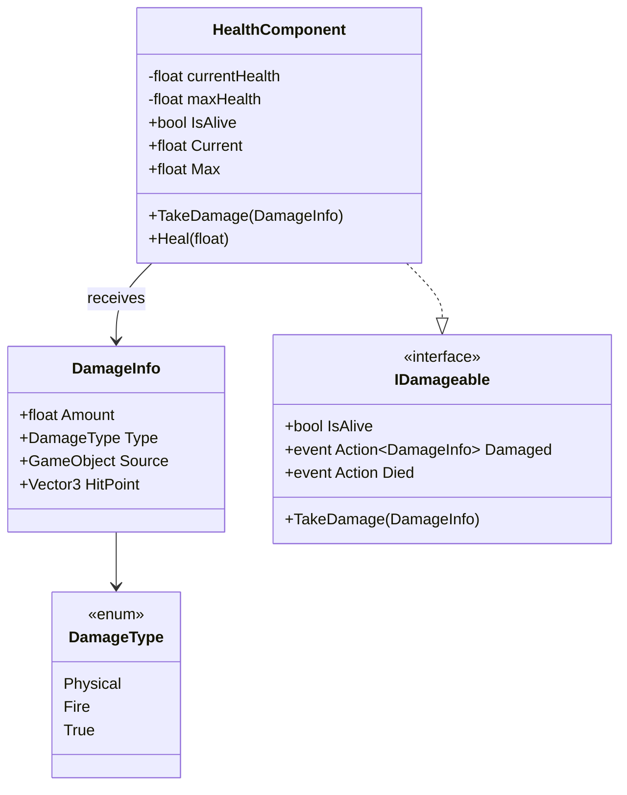
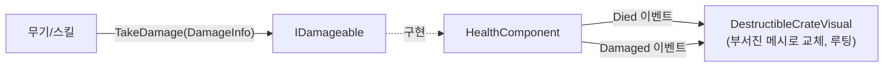

# 전투 시스템 — 피격 가능(Damageable) 인터페이스

"공격을 당할 수 있다"는 성질을 캐릭터에 종속시키지 않고 별도 인터페이스로 뽑아내서, 플레이어/NPC/Enemy는 물론 나중에 부서지는 상자·벽 같은 오브젝트에도 그대로 붙일 수 있도록 설계한다. 코드 위치는 `Assets/Scripts/Combat` (`Game.Combat` 네임스페이스) — 캐릭터/AI 네임스페이스에 두지 않는 것이 핵심이다. 캐릭터 시스템이 이 네임스페이스를 참조하지, 그 반대가 아니다 (의존 방향: `Game.Characters` → `Game.Combat`). [weapon-system.md](weapon-system.md)에서 총기/근접무기가 실제로 데미지를 넣어야 했기 때문에 `IDamageable`/`HealthComponent`를 이때 실제 코드로 구현했다 — 캐릭터 시스템(`Game.Characters`) 자체는 여전히 설계 문서 단계다.

## 설계 원칙

- **인터페이스 분리**: "피격당할 수 있다"(`IDamageable`)와 "체력을 가진다"는 개념을 하나로 묶지 않는다. 체력 없이 즉시 파괴되는 오브젝트(유리창 등)도 `IDamageable`만 구현하면 되고, 체력이 필요한 대상은 `HealthComponent`라는 구현체를 붙이면 된다.
- **관심사 분리**: `IDamageable` 구현체는 "데미지를 받아서 상태가 바뀐다"는 사실만 이벤트로 알릴 뿐, 그 결과로 무엇을 할지(이펙트 재생, 메시 교체, 루팅, AI 어그로)는 전혀 모른다. 반응은 전부 이벤트 구독자가 담당한다 (Observer 패턴 → 개방-폐쇄 원칙).
- **캐릭터에 대한 의존 없음**: `IDamageable`/`HealthComponent`는 `Game.Characters`나 `Game.AI`를 전혀 참조하지 않는다. 그래야 부서지는 상자, 파괴 가능한 벽 같은 비-캐릭터 오브젝트에도 아무 문제 없이 붙일 수 있다.

## 구조



### `IDamageable` (interface)

```
bool IsAlive { get; }
void TakeDamage(DamageInfo damageInfo);
event Action<DamageInfo> Damaged;
event Action Died;
```

- `TakeDamage`는 값을 반환하지 않는다 — 데미지를 받았는지 여부가 궁금한 쪽은 `Damaged` 이벤트를 구독한다(무적 상태 등으로 실제로는 아무 일도 없었다면 이벤트를 아예 발생시키지 않는 식으로 구현체가 판단).
- `Died`는 체력 시스템이 없는 구현체(예: 즉시 파괴되는 오브젝트)에서도 반드시 제공해야 하는 계약이다.

### `DamageInfo` (struct)

```
float Amount;
DamageType Type;      // Physical / Fire / True 등, 저항 계산에 사용
GameObject Source;    // 가해자 — 아군 화력 확인, 어그로 대상 지정 등에 사용
Vector3 HitPoint;     // 피격 이펙트 위치
```

공격을 가하는 쪽(무기, 스킬, 함정)은 이 구조체를 만들어 `target.TakeDamage(info)`를 호출하기만 하면 되고, `IDamageable` 쪽의 구체 구현은 몰라도 된다 (의존성 역전).

### `HealthComponent` (MonoBehaviour, `IDamageable` 구현체)

- `CurrentHealth`/`MaxHealth`를 갖는 표준 구현. 플레이어, NPC, 일반/엘리트/보스 Enemy가 전부 이 컴포넌트를 그대로 붙여서 쓴다.
- 초기치는 캐릭터별 스탯 데이터(`CharacterStatsData`/`EnemyData`, [character-system.md](character-system.md) 참고)에서 주입받는다 — `HealthComponent` 자체는 "누구 것인지" 모른다.
- 데미지 적용 시 `Current <= 0`이 되는 순간 `Died` 발생 후 더 이상 `TakeDamage`를 받지 않도록(사망 후 중복 처리 방지) 가드한다.
- **`Game.Player.IReadOnlyStat`도 함께 구현한다**(`Current`/`Max`는 이미 있으니 `Changed`를 체력 변화 시(피격/회복 모두) 추가로 올리기만 하면 된다). `Damaged`/`Died`는 "왜 바뀌었는지"를 아는 전투 로직용 이벤트로 남기고, `Changed`는 "값이 바뀌었다"만 아는 UI 바인딩용 이벤트로 구분한다 — 이렇게 해두면 [hud-system.md](hud-system.md)의 체력 바가 기존 `StatBarUIView`를 그대로 재사용할 수 있다. `ArmorComponent`(방어구 수치, HUD용)도 같은 이유로 `IReadOnlyStat`을 구현하는 것을 전제로 설계했다 — 자세한 내용은 [hud-system.md](hud-system.md) 참고.

## 오브젝트 재사용 예시 (파괴 가능한 상자)



`DestructibleCrateVisual`은 캐릭터 코드를 전혀 모르는 상태로 `HealthComponent`(정확히는 `IDamageable`)만 참조해서, `Damaged`가 오면 금 가는 이펙트를, `Died`가 오면 부서진 메시 교체 + 루팅을 실행한다. Enemy가 죽었을 때 로직(루팅 드롭, 사망 애니메이션)도 동일한 이벤트 구조를 그대로 재사용한다 — 캐릭터 전용 분기가 필요 없다.

## 공격을 가하는 쪽 (참고, 이번 설계의 본 대상은 아님)

이 문서는 "맞는 쪽" 계약(`IDamageable`)에만 집중한다. "때리는 쪽"은 아직 별도 인터페이스로 뽑아내지 않았다 — [ai-state-machine.md](ai-state-machine.md)의 `AttackState`가 지금은 `DamageInfo`를 직접 만들어 대상의 `TakeDamage()`를 호출하는 정도로만 정의되어 있다. 공격 판정 방식(히트박스, 투사체, 범위 공격 등)이 여러 종류로 늘어나면 그때 `IDamageDealer` 같은 대칭 인터페이스를 이 문서에 추가하는 것을 고려한다 — 지금은 하나의 호출 패턴만 존재해서 인터페이스로 뽑을 실익이 아직 없다(YAGNI).

## 스코프 밖으로 둔 것 (다음 단계 후보)

- 방어력/저항 계산(현재는 `Amount`가 최종 데미지라고 가정)
- 무적 프레임, 상태이상(넉백/기절 등)
- 데미지 텍스트/이펙트 스포너(이벤트만 정의, 구독자는 추후 구현)
- 공격을 가하는 쪽의 추상화(`IDamageDealer`/히트박스) — 위 항목 참고
