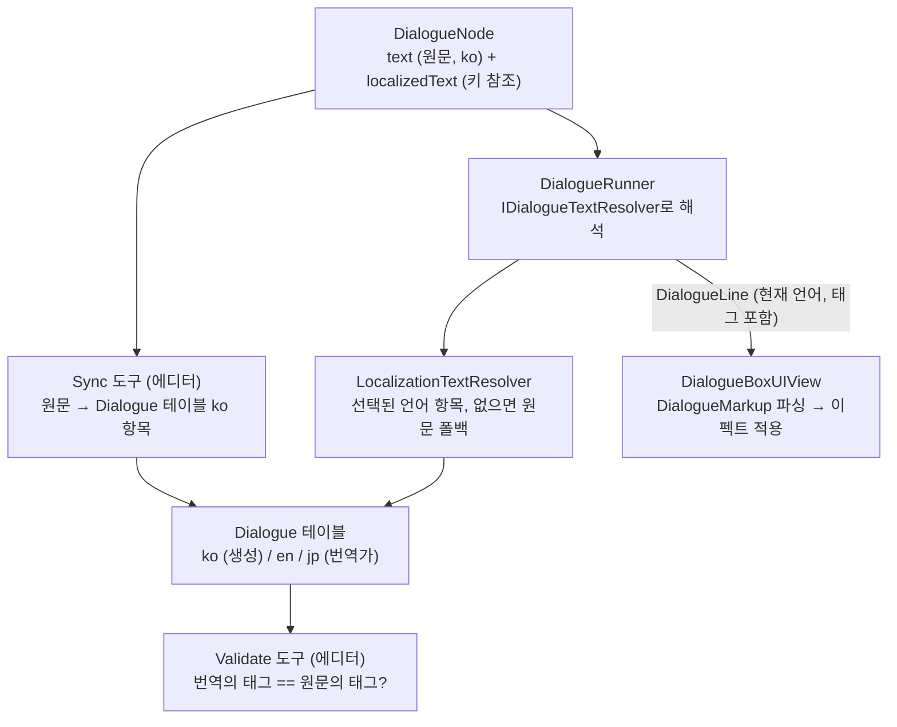

# 대화 로컬라이제이션 (다국어 + 텍스트 이펙트 태그)

대사를 여러 언어로 번역하면서도 [텍스트 이펙트 태그](dialogue-text-effects.md)(`<wave>`, `<color=…>` …)가 살아 있게 하는 구조. 상태: **구현됨**(2026-09-20). 기획 문서 [7장](../Docs/기획문서_대화시네마틱구조설계.md)의 "로컬라이제이션 대비(키로 저장)" 권장을 실제로 채운 것이다.

## 현재 프로젝트 설정 (Unity Localization)

- **일본어 로케일 코드는 `jp`**(2026-09-20 `ja`에서 변경 — 프로젝트 관례). 주의: 표준 언어 코드(ISO 639-1)는 `ja`이고 `jp`는 일본의 국가 코드라서 Unity가 맞는 `CultureInfo`를 찾지 못한다. 대사 조회에는 영향이 없지만 **시스템 언어 자동 선택**(Startup Locale Selector가 OS 언어와 로케일을 맞춤)과 언어별 숫자·날짜·복수형 서식은 `jp`에서는 동작하지 않는다 — 그런 기능을 쓰게 되면 코드를 `ja`로 되돌리거나 수동으로 매핑한다.
- 패키지 `com.unity.localization 1.5.13`(Addressables가 함께 들어옴). 설정 애셋은 `Assets/Localization/LocalizationSettings.asset`, 로케일은 **영어(`en`)·한국어(`ko`)·일본어(`jp`)**(`Assets/Localization/Locales`).
- 기본 UI 문자열 테이블 `UIStrings`(현재 `language.name` 항목만 — 언어 선택 화면용). 이 셋업은 메뉴 `Game > Localization > Setup Default Locales and Tables`(`LocalizationSetup.cs`)가 만들었고 여러 번 실행해도 안전하다.
- 대사는 **별도 테이블 `Dialogue`**(`Assets/Localization/Tables/Dialogue_*.asset`)를 쓴다. UI 문자열과 분리한 이유: 키 수가 훨씬 많고, 번역가가 대사만 따로 다루기 쉽고, 대사 테이블은 도구가 자동으로 채우기 때문.

## 결론

1. **노드에 적은 `text`는 원문(source language = `ko`)이자 번역이 없을 때의 폴백**이다. 저작 위치는 여기 한 곳뿐이다.
2. 도구(`Game > Dialogue > Sync Sequences To String Table`)가 그 원문을 `Dialogue` 테이블의 **`ko` 항목으로 복사**하고, 노드의 `localizedText`/`localizedSpeaker`/선택지 `localizedText`가 그 항목을 가리키게 한다. **`ko` 항목은 도구가 생성하는 값이라 손으로 고치지 않는다**(다음 Sync에서 노드의 원문으로 덮어써진다). 번역가는 `en`/`jp` 항목만 편집한다.
3. 런타임에는 `DialogueRunner`가 `IDialogueTextResolver`로 **현재 언어의 문자열을 해석**해서 뷰에 넘긴다(`DialogueLine`, 선택지 라벨). 뷰는 언어를 모르고, 받은 문자열(태그 포함)을 파싱해서 이펙트를 입힌다.
4. **태그는 번역 문자열 안에 그대로 들어간다.** 번역가가 문장 어순에 맞게 태그를 옮기고, 검증 도구가 원문과 번역의 태그가 일치하는지 검사한다.

## 키 규칙

| 무엇 | 키 | 비고 |
|---|---|---|
| 대사 줄 | `{sequenceId}.{nodeId}` | 예: `elder_intro.n1` |
| 선택지 | `{sequenceId}.{nodeId}.c{번호}` | 예: `elder_intro.c1.c0` (조건에 따라 숨겨져도 번호는 원본 배열 기준) |
| 화자 이름 | `speaker.{원문 이름}` | 같은 화자의 모든 줄이 **한 항목을 공유**(DRY) — 예: `speaker.촌장` → en "Elder" |

`sequenceId`나 노드 `id`를 바꾸면 키가 바뀌어 **옛 키의 번역이 고아가 된다** — Sync는 새 키를 만들 뿐 옛 항목을 지우지 않는다(번역가 작업을 잃지 않으려고). 정리는 테이블 에디터에서 수동.

## 번역가를 위한 태그 규칙

번역 문자열에 원문과 **같은 태그를 같은 인자로** 넣는다. 위치와 순서는 어순에 맞게 옮겨도 된다.

| 원문 (ko) | 번역 (en) |
|---|---|
| `이 마을에는 <color=#4aa3ff><sway>무슨 일</sway></color>로 왔나?` | `<color=#4aa3ff><sway>What business</sway></color> brings you to this village?` |
| `어서 오게, 여행자. 이 마을엔 <wave>손님</wave>이 드물지.` | `Welcome, traveler. <wave>Guests</wave> are rare in this village.` |
| `그렇다면 이 동전을 받게.<pause=0.6> 큰돈은…` | `Then take these coins.<pause=0.6> It's not much…` |

- 태그를 **빼거나 새로 만들지 않는다**(강조가 사라지거나 번역에만 남는다). 색 값이나 `amp` 같은 인자도 바꾸지 않는다 — 연출은 저작자의 것.
- 여는 태그는 반드시 닫는다(`<wave>…</wave>`). `<pause>`는 닫지 않는다.
- 글자 그대로의 `<`는 `\<`로 쓴다. 알 수 없는 태그(`<b>` 등)는 그냥 글자로 보인다.
- **중괄호 `{ }`는 쓰지 않는다** — Unity Localization의 스마트 문자열 자리표시자 문법과 겹칠 수 있다(대사에서 의도적으로 쓸 때만).
- 검증하려면 `Game > Dialogue > Validate Text Markup`(아래). 번역 도구(외부 툴)를 쓸 때는 `<…>`가 이스케이프되지 않는지 확인한다.

## 런타임 동작

- **해석 규칙**(`LocalizationTextResolver`): 노드에 참조가 없으면 → 원문. 참조가 있는데 **선택된 언어에 항목이 없거나 비어 있으면 → 원문**(Unity의 "No translation found" 메시지를 화면에 띄우지 않는다). 그래서 `jp`를 아직 번역하지 않아도 일본어를 골랐을 때 한국어 원문이 나온다.
- **`DialogueRunner`는 순수 C# 그대로**다. 해석기를 생성자로 주입받고(`null` = 원문 그대로 — 단위 테스트가 이 경로를 쓴다), 씬에서는 `DialoguePlayer`가 `LocalizationTextResolver`를 넣는다.
- **대화 기록(`Log`)에는 해석된 문자열**이 쌓인다(그 시점의 언어). 대화 도중 언어를 바꾸면 이미 화면에 있는 줄과 기록은 그대로이고 **다음 줄부터** 새 언어가 나온다.
- 화자 이름·선택지 라벨·본문 모두 같은 경로다. 선택지 라벨은 움직임 없이 정적 색만 쓴다(기존 규칙 그대로).
- 언어 선택은 `LocalizationSettings.SelectedLocale`. 언어 설정 화면은 아직 없고, `Test_Dialogue`의 하니스(왼쪽 위)에 `en`/`jp`/`ko` 버튼을 임시로 뒀다.

## 에디터 도구 (`Game > Dialogue`)

| 메뉴 | 하는 일 |
|---|---|
| **Sync Sequences To String Table** | 모든 `DialogueSequence`의 줄·선택지·화자 원문을 `Dialogue` 테이블 `ko` 항목으로 쓰고(없으면 테이블과 언어별 테이블을 만든다) 노드의 참조를 채운다. 여러 번 실행해도 안전(값이 같으면 변경 없음). |
| **Validate Text Markup** | ① 모든 노드 원문의 마크업 문제(안 닫힌 태그, 쓸 수 없는 인자 등) ② 번역된 모든 항목(`en`/`jp`)을 `ko` 원문과 비교 — 빠졌거나 새로 생긴 태그, 다른 인자, `<pause>` 개수 차이, 번역 쪽 마크업 오류를 콘솔 경고로 낸다. **번역이 비어 있는 항목은 건너뛴다**(폴백이 있으니까). |

### 작업 흐름

1. 노드에 원문(`ko`)을 태그와 함께 쓴다.
2. `Sync Sequences To String Table` 실행 → `ko` 항목 생성/갱신, 노드에 키가 연결됨. (에셋이 변경되니 커밋에 포함)
3. 번역가가 `Dialogue` 테이블의 `en`/`jp` 열을 채운다(Window > Asset Management > Localization Tables).
4. `Validate Text Markup`으로 태그 일치를 확인한다.
5. 원문을 고쳤다면 2번부터 다시 — 번역이 이미 있으면 원문이 바뀐 줄의 번역도 검토가 필요하다(도구는 이것까지 알려 주지는 않는다).

## 폰트

`NeoHyundai`(현재 대화 폰트)는 **한글·영문·가나(히라가나·가타카나)는 있고 한자는 없다**(`HasCharacters`로 확인: 가나 통과, `日本語旅立ち`은 5글자 누락). 그래서 `jp`는 한자가 든 문장을 번역하기 전에 **일본어 한자를 가진 폴백 폰트**를 `TMP_FontAsset.fallbackFontAssetTable`에 추가해야 한다(언어별 폰트 교체는 `LocalizedAsset<TMP_FontAsset>`로 후속). 지금 `jp` 번역은 없어서 일본어를 골라도 한국어 원문이 나온다.

## 기획 문서와 다른 점 / 후속

- 기획 문서는 `Line.text`에 **키만** 저장하라고 했다. 우리는 **원문 + 키 참조를 함께** 둔다 — 저작자가 인스펙터에서 바로 대사를 읽고 쓸 수 있고(키만 있으면 내용을 볼 수 없다), 번역이 없을 때 폴백이 필요하기 때문. 대신 원문의 이중 저장(노드 + `ko` 항목)이 생기는데, `ko` 항목을 **도구가 생성하는 값**으로 못박아서 진실의 원천을 노드 하나로 유지한다.
- **스타일 이름(`<hl>`)**: 번역 문자열마다 `<color=#4aa3ff><sway>`가 복사되는 게 이 구조의 약점이다(색을 바꾸려면 모든 언어의 모든 줄을 고쳐야 함). [dialogue-text-effects.md](dialogue-text-effects.md)의 `DialogueTextStyles`를 넣으면 번역에는 `<hl>…</hl>`만 남는다 — **로컬라이제이션을 실제로 쓰기 시작하면 다음으로 할 일**이다.
- 언어 설정 화면 / 저장된 언어 선택, 대화 도중 언어 변경 시 현재 줄 즉시 갱신, 보이스 오디오(언어별 클립), 고아 키 정리 도구, 원문 변경 감지(번역 재검토 표시), `UIStrings`로의 나머지 UI 문자열 이전 — 후속.
- 새 `DialogueSequence`를 만들면 Sync를 돌리기 전까지는 키 참조가 비어 있어 **원문만** 나온다(오류는 아님).

## 검증

- EditMode 9개(`DialogueLocalizationTests`): 러너가 화자·본문·로그·선택지를 해석기로 통과시킴, 해석기 없으면 원문·태그 그대로, `LocalizationTextResolver`의 참조 없음 폴백, 검증기(어순이 달라도 통과 / 태그 누락·추가·인자 변경 / `<pause>` 개수 / 번역 쪽 마크업 오류 / 단일 텍스트 경고), `TextSpan.Tag` 정규화.
- Play 모드 API 확인: 로케일 `English, Japanese, Korean`, `ko`/`en`이 각각 자기 언어와 태그를 돌려주고 `jp`는 원문으로 폴백, 영어로 `DialoguePlayer`를 통해 재생하면 뷰에 `Elder` / 태그가 벗겨진 영어 본문이 들어가고 이펙트 구간(`wave`)이 애니메이터에 전달된다.
- 눈으로 확인 못 한 것: 영어 문장에서 이펙트가 실제로 움직이는 모습, 긴 영어 문장의 줄바꿈 — `Test_Dialogue` 하니스에서 `en`을 누르고 촌장에게 말을 걸어 확인.
