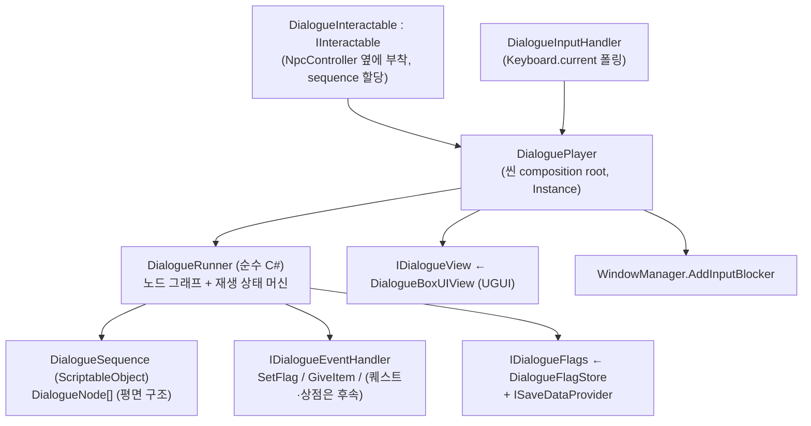

# 대화 시스템 (텍스트 대화)

[기획문서_대화시네마틱구조설계.md](../Docs/기획문서_대화시네마틱구조설계.md)의 **텍스트 대화(`isCinematic = false`)** 부분을 구현한 엔지니어링 설계. 시네마틱(레터박스·`CameraCut`)은 아직 없다 — 아래 "스코프 밖" 참고. 코드는 `Assets/Scripts/Dialogue`(`Game.Dialogue`).

## 구조

- **`DialogueRunner`** — UI·입력이 없는 순수 C#. `Start/Submit/Choose/Skip/Tick`으로 구동하고 `LineShown`/`ChoicesShown`/`Ended` 이벤트를 낸다. 그래서 뷰를 갈아끼울 수 있고 로직을 단독으로 테스트할 수 있다(의존성 역전). 노드를 순회하다가 `Branch`/`Event`는 즉시 처리하고, `Line`/`Choice`/`Wait`에서 멈춘다. 분기 루프 보호(1000 스텝), 없는 노드 id는 경고 후 종료.
- **`DialogueSequence` / `DialogueNode`** — 노드는 `type` 값에 따라 쓰는 필드가 달라지는 **평면 직렬화 클래스** 하나다. 타입별 서브클래스는 Unity 인스펙터에서 `[SerializeReference]` 다형 리스트를 편집할 방법이 없어서 피했다(기획 문서의 "id, type, data(타입별 필드)" 구조와 동일). 다음 노드 id가 비어 있으면 시퀀스 종료. 노드 타입: `Line`/`Choice`/`Branch`/`Event`/`Wait`/`End`. `Skippable`이 false면 Cancel 홀드 스킵이 무시된다.
- **조건** — `DialogueCondition`(플래그 이름 + 기대값, 빈 이름 = 항상 참). `Branch`와 `Choice` 선택지 표시 조건에 쓰인다(조건 안 맞는 선택지는 숨김).
- **`DialogueFlagStore`** — 스토리 플래그(true인 것만 저장) + `ISaveDataProvider`(키 `dialogue.flags`). `SaveDataRegistry.Instance` 등록을 `Start`에서 한다(Boot 오브젝트에 같이 놓을 때 레지스트리 `Awake`보다 `OnEnable`이 먼저 돌 수 있어서).
- **이벤트 핸들러** — `IDialogueEventHandler`를 `DialoguePlayer.RegisterEventHandler`로 등록한다. 러너는 이벤트 종류를 모르므로 새 이벤트 = 새 핸들러(개방-폐쇄). 조용한 이벤트는 `onCompleted(true)`를 바로 호출하고, 모달(퀘스트 제안·상점)은 창이 닫힌 뒤 `onCompleted(accepted)`를 호출한다 — 그동안 러너는 `ModalPending`이고, `accepted == false`면 `nextNodeIfDeclinedId`(비어 있으면 `nextNodeId`)로 간다. 구현된 핸들러: `SetFlag`, `GiveItem`(플레이어 컨테이너 그리드 → 플랫 인벤토리 순, 못 들어가면 발밑에 드롭). `StartQuest`/`OpenQuestOffer`/`OpenQuestTurnIn`/`OpenShop`은 퀘스트·상점 시스템이 없어서 **핸들러 미등록 — 경고 로그를 남기고 건너뛴다**.
- **`DialoguePlayer`** — 씬의 composition root. 러너를 만들고 뷰·핸들러를 연결하며, 재생 중에 `WindowManager`의 **입력 차단자**로 등록한다. `DialoguePlayer.Instance`로 `DialogueInteractable`이 찾는다(플레이어처럼 씬마다 프리팹이 아니라 씬 오브젝트라서).
- **`DialogueInteractable`** — 기존 골격(`Interact`가 TODO)을 채운 것. `Game.Dialogue`로 옮겼다: `Game.Interaction`에 두면 Interaction → Dialogue → Items → Interaction 순환이 생기기 때문(`WorldItem`이 `IInteractable`을 구현). `sequence`가 없거나 대화 중이면 `CanInteract`가 false라 프롬프트도 안 뜬다.

## 입력 (`DialogueInputHandler`)

새 Action Map 없이 프로젝트 관례대로 `Keyboard.current`를 폴링한다(기획 문서 4.2의 `Submit`/`Navigate`/`Cancel`에 해당하는 기본 키).

| 동작 | 기본 키 | 재생 상태별 효과 |
|---|---|---|
| Submit | `F`, `Enter` | 타이핑 중 = 즉시 완성 / 줄 끝 = 다음 / 선택지 = 포커스 확정 / 로그 열림 = 로그 닫기 |
| Navigate | `W`·`↑` / `S`·`↓` | 선택지 포커스 이동(순환) |
| Cancel 탭(≤0.2s) | `Esc` | 줄 사이에서 대화 로그 토글(선택지 화면에서는 무시) |
| Cancel 홀드(≥0.5s) | `Esc` | 시퀀스 전체 스킵(`skippable`일 때만) |

선택지는 마우스 클릭도 된다(`Button.onClick`).

## 게임 입력 차단

대화창은 창이 아니라서 `WindowManager` 스택/배경 가림에 넣지 않는다(`Esc`가 `CloseTopMost`로 대화를 닫거나 배경이 어두워지면 안 됨). 대신 `WindowManager`에 `AddInputBlocker`/`RemoveInputBlocker`를 추가했고, `IsAnyWindowOpen`이 차단자가 있어도 true가 된다 — 그래서 `PlayerInputHandler`(이동), `PlayerInteractionController`(F), 퀵슬롯·무기 입력이 창이 열렸을 때와 똑같이 막힌다. 기획 문서 3장의 "대화 중 Player OFF / UI ON"에 해당한다.

같은 키가 겹치는 문제 두 가지를 이렇게 막았다:
- **시작 프레임** — F로 대화를 시작한 그 프레임에 `DialogueInputHandler`도 F를 봐서 첫 줄이 바로 넘어가는 것을 막기 위해 `StartFrame`과 같은 프레임의 입력은 무시한다.
- **종료 프레임** — 마지막 줄을 F로 끝내면, 같은 프레임에 `PlayerInteractionController`가 같은 F로 대화를 다시 시작할 수 있다. 그래서 차단자 해제를 `LateUpdate`로 한 프레임 미룬다.

## 스토리 플래그와 세이브

플래그는 `SetFlag` 이벤트가 쓰고 `Branch`/선택지 조건이 읽는다. 재대화 분기("또 왔군"), 보상 수령 후 새로 나타나는 선택지 등이 이걸로 동작한다. `dialogue.flags`로 저장되므로 `SaveGameService`와 연결된 씬(Boot 경유)에서는 저장/불러오기가 된다.

## 테스트 씬

`Test_Dialogue.unity` — 촌장(재대화 분기·선택지·아이템 보상)과 경비병(스킵 불가·`Wait` 노드). 상세는 [test-scenes.md](test-scenes.md). 샘플 시퀀스는 `Assets/Data/Tests/Dialogue`, UI 프리팹은 `Assets/Prefabs/UI/DialogueBox`·`DialogueChoiceButton`.

## 기획 문서와 다른 점 / 스코프 밖

- **`speakerId` 대신 `speakerName` 문자열**과 `portrait` 스프라이트를 노드에 직접 둔다(화자 데이터 애셋 없음).
- **로컬라이제이션 키가 아니라 원문 문자열**을 `text`에 저장한다(기획 문서 7장은 초기부터 키를 권장 — 로컬라이제이션 파이프라인 도입 시 필드 의미만 바꾸면 되도록 필드는 하나로 유지).
- **스킵 시 남은 이벤트는 실행되지 않는다** — 기획 문서대로 `End`로 즉시 이동한다. 그래서 스킵 가능한 시퀀스 중간의 `SetFlag`/`GiveItem`이 통째로 건너뛰어질 수 있다. 상태를 바꾸는 이벤트가 있는 시퀀스는 `skippable = false`로 하거나, 스킵을 "남은 조용한 이벤트만 실행"으로 바꾸는 결정이 필요하다.
- **시네마틱 없음** — `isCinematic`, 레터박스, 하단 자막, `CameraCut`, 스킵 게이지 UI. `IDialogueView` 뒤에 시네마틱 뷰를 추가하는 방식으로 붙이면 러너는 바뀌지 않는다.
- **퀘스트/상점 모달 이벤트 핸들러** — 인터페이스는 준비됨, 구현은 해당 시스템 이후.
- 화자 강조(`focusTarget`), 타이핑 속도 설정 화면 연동(현재 `DialogueBoxUIView.charactersPerSecond` 인스펙터 값), 디버그 콘솔(F1) 시퀀스 점프(`DialogueTestHarness`가 임시로 대신함), 노드 그래프 저작 툴 — 후속.
- 대화 로그는 스크롤 없이 마지막 줄부터 보이는 단순 텍스트다(긴 대화는 위가 잘림).
- `Text`(레거시 UGUI) 기본 폰트를 쓴다 — 한글이 실제로 나오는지는 에디터에서 확인 필요(빌드 환경 폰트에 의존).
