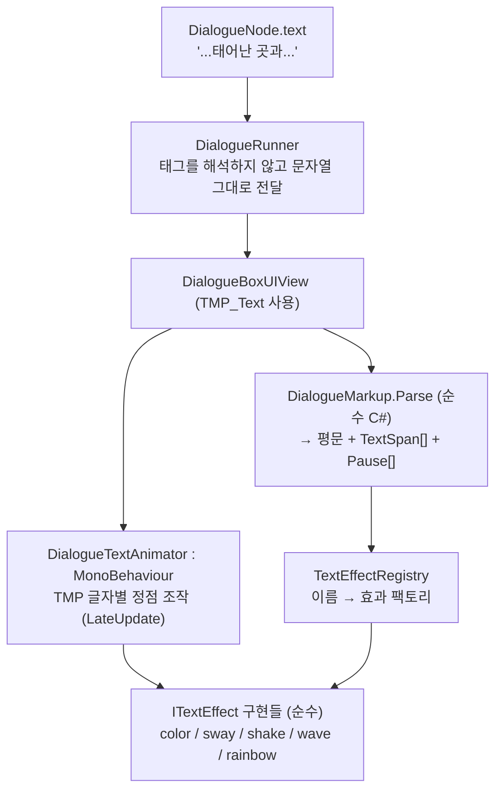

# 대화 텍스트 이펙트

대사 안의 **특정 구간**에만 색·움직임·연출을 주는 방법. 상태: **1단계 구현됨**(2026-09-20 — 태그·효과·타이핑·TMP 전환. 스타일 이름 등 후속은 맨 아래). 실제 결과와 설계에서 달라진 점은 "구현 결과" 절. 대상은 [dialogue-system.md](dialogue-system.md)의 텍스트 대화 — 예: "어른이 된 뒤, 나는 `<hl>태어난 곳을 향한 그리움</hl>`과 `<hl>마을에 숨겨진 비밀에 대한 호기심</hl>`을 안고 여정을 떠났다."에서 파란 구간만 색이 다르고 살짝 흔들리는 것.

## 결론

1. **대사 문자열 안에 인라인 태그**로 쓴다: `여정을 <wave>떠났다</wave>`. 구간을 인덱스로 따로 저장하지 않는다 — 번역(로컬라이제이션)으로 글자 수·어순이 바뀌어도 태그가 문장과 함께 움직이기 때문이다.
2. **파싱은 순수 C#**(`DialogueMarkup`)이 하고 결과는 `평문 + 구간 목록`이다. 러너·`DialogueNode`·뷰 인터페이스는 **태그를 해석하지 않는다**(태그가 든 문자열이 그대로 흐른다 — 다국어 때문에 들어온 변경은 [dialogue-localization.md](dialogue-localization.md)).
3. **효과는 작은 클래스**(`ITextEffect`)로 만들고 이름으로 레지스트리에 등록한다 — 새 효과 = 클래스 하나 + 등록 한 줄(개방-폐쇄). 효과 계산은 UnityEngine 렌더링에 의존하지 않는 순수 함수라서 EditMode 테스트가 된다.
4. **렌더링은 TextMeshPro의 글자별 정점 조작**으로 한다(`DialogueTextAnimator`). 레거시 UGUI `Text`는 글자별 이동·색이 불가능해서 **대화 UI만 TMP로 옮긴다**.

## 태그 문법

- `<이름>…</이름>` 구간, `<이름=값>`(대표 인자 하나), `<이름 키=값 키=값>`(이름 붙은 인자). 인자는 전부 생략 가능하고 효과마다 기본값이 있다 → 대부분 `<wave>` 만 쓰면 된다.
- 중첩 가능: `<color=#4aa3ff><sway>그리움</sway></color>`. 색은 안쪽이 이기고, 움직임은 겹쳐서 더해진다.
- **모르는 태그는 그냥 글자로 보인다** (`a <b 라고` 같은 문장이 깨지지 않게). 알려진 이름만 태그다. 글자 그대로 쓰고 싶으면 `\<`.
- 안 닫힌 태그는 줄 끝에서 닫힌 것으로 취급하고, 짝이 안 맞는 닫는 태그는 무시한다. 둘 다 에디터에서 경고(검증)를 남긴다.

### 첫 버전에 넣을 태그

| 태그 | 종류 | 효과 | 인자(기본값) |
|---|---|---|---|
| `color` | 색 | 글자색 | `#RRGGBB`/`#RRGGBBAA`, 이름(`red`…) |
| `sway` | 움직임 | **좌우** 흔들림(구간 안에서 위상이 이어져 물결처럼) | `amp`(3px) `speed`(1.5Hz) |
| `wave` | 움직임 | 위아래 물결 | `amp`(4px) `speed`(1.2Hz) |
| `shake` | 움직임 | 떨림(글자마다 무작위 위치, 결정적) | `amp`(1.5px) `rate`(30Hz) |
| `rainbow` | 색 | 색상 순환 | `speed`(0.5Hz) |
| `pause` | 타이밍 | 그 지점에서 타이핑 멈춤(닫는 태그 없음) | `초`(0.4) |

`fade`/`pulse`/`speed`(구간별 타이핑 속도)/`shout`(크기) 등은 같은 틀에 클래스만 더하면 되므로 후속.

### 스타일 이름 (2단계)

같은 조합을 여러 대사에서 반복하면 `<color=#4aa3ff><sway>`가 곳곳에 복사된다(DRY 위반). 그래서 **`DialogueTextStyles`(ScriptableObject)** — 이름 → 효과 목록(예: `hl` = 파란색 + sway)을 두고, 레지스트리가 모르는 이름을 이 애셋에서 찾게 한다. 문서 예시의 `<hl>`이 이것이다. 색을 바꾸고 싶을 때 애셋 한 곳만 고치면 된다. 1단계 구현에는 필요 없고 레지스트리가 조회 지점만 열어 두면 나중에 끼울 수 있다.

## 구성 요소

| 요소 | 위치 | 책임 |
|---|---|---|
| `DialogueMarkup.Parse(string)` → `ParsedText{ Plain, Spans, Pauses }` | `Game.Dialogue`(순수) | 태그 파싱. `TextSpan{ Start, Length, Effect }`의 인덱스는 **평문 글자 기준**. `ToStaticMarkup()`은 색만 남긴 TMP 태그 문자열을 만든다(대화 기록용). |
| `ITextEffect` | 〃 | `Apply(in GlyphContext, ref GlyphStyle)` — 입력: 줄 안 글자 인덱스, 구간 안 인덱스, 시간(초) / 출력: 위치 오프셋(`Vector2`), 색(`Color32`) 변경. **상태 없는 순수 함수**. |
| `TextEffectRegistry` | 〃 | 이름 → `Func<args, ITextEffect>`. 기본 효과를 등록. (2단계) 스타일 애셋 조회. |
| `DialogueTextAnimator` | 〃 (MonoBehaviour) | `TMP_Text` 하나를 맡아 매 프레임 글자별 정점을 다시 쓴다. |
| `DialogueBoxUIView` | 기존 | `Text` → `TMP_Text`로 교체, 타이핑을 `maxVisibleCharacters`로 구현하고 `Pauses`를 반영. `ShowLine`은 그대로(다국어로 `ShowChoices`만 라벨 목록을 받도록 바뀜). |

효과가 `TMP`를 모르기 때문에(`GlyphStyle`만 만든다) 로직 테스트가 렌더링 없이 된다 — 러너를 뷰에서 분리한 것과 같은 방식(의존성 역전).

## 렌더링 방식

1. `ShowLine`에서 `Parse` → `bodyText.text = Plain`(TMP 리치텍스트는 **끄고** 우리 태그만 쓴다 — 두 문법이 섞이지 않게), 구간·일시정지 목록 보관.
2. **타이핑은 `maxVisibleCharacters`로**: 글자를 미리 전부 배치하고 보이는 개수만 늘린다. 지금은 `Substring`으로 문자열을 잘라 넣어서 타이핑 중에 **단어 줄바꿈 위치가 튀는 문제**가 있는데 이것도 같이 해결된다. `Pauses`는 타이핑 타이머가 해당 글자에 도달하면 그 시간만큼 진행을 멈추는 식.
3. `LateUpdate`(구간이 하나라도 있는 줄에서만)에서 `ForceMeshUpdate` → 원본 정점 캐시 위에 글자마다 `ITextEffect`를 순서대로 적용 → `UpdateVertexData`. 색도 같은 경로의 정점 색으로 적용한다(색과 움직임을 한 메커니즘으로 — TMP가 텍스트를 재생성할 때 색이 초기화되는 문제를 매 프레임 덮어써서 피함).
4. 구간이 없는 줄(대부분)은 애니메이터가 아무것도 하지 않는다.
5. 시간은 `Time.unscaledTime`(타이핑과 같은 기준).
6. `IDialogueView.CompleteTyping`(F/Tab)은 전부 보이게 할 뿐 효과는 계속 움직인다.

## 접근성

`DialogueTextAnimator.MotionScale`(0~1): **0이면 움직임 효과(sway/wave/shake)만 끄고 색은 유지**한다. 흔들림·물결은 멀미/가독성 문제를 일으킬 수 있어서 기획 문서의 "타이핑 속도 옵션"(설계 문서 §접근성 권장)과 나란히 설정 화면에 연결할 자리다. 설정 화면이 없으니 지금은 인스펙터 값.

## 기존 설계와의 충돌 검토

| 항목 | 판단 |
|---|---|
| `DialogueRunner`/`DialogueNode`/`IDialogueView` | **충돌 없음.** 태그는 문자열의 일부라 그대로 흐른다. 러너는 (다국어 해석은 하지만) 태그 내용은 해석하지 않는다. |
| 대화 기록(`Log`) | 러너는 현재 언어로 해석한 문자열(태그 포함)을 기록한다. **표시 쪽에서** `ToStaticMarkup()`으로 색만 남겨 보이거나 태그를 제거한다 — 안 하면 로그에 `<wave>`가 그대로 찍힌다. **뷰 작업에 포함.** |
| 선택지 텍스트 | 같은 문법을 쓸 수 있게 `Parse`를 거쳐 평문(또는 정적 색)으로 표시. 움직임은 넣지 않는다(포커스 색 처리와 충돌). |
| 레거시 UGUI `Text` | 대화 UI(`DialogueBox`, `DialogueChoiceButton` 프리팹과 뷰의 `[SerializeField]` 필드)만 TMP로 교체. HUD·프롬프트 등 다른 UI는 그대로 → 게임 안에 두 종류의 텍스트가 공존한다. 프로젝트 전체 TMP 전환과 폰트 통일은 별도 결정. |
| 어셈블리 | `Game.asmdef`에 `Unity.TextMeshPro` 참조 추가 필요([testing.md](testing.md)의 "새 외부 패키지" 규칙). TMP는 `com.unity.ugui 2.5.0`에 포함돼 있어 패키지 설치는 불필요. |
| **폰트** | 해결됨(2026-09-20): `Assets/Fonts`의 NeoHyundai TTF로 동적 `TMP_FontAsset`을 만들어 `DialogueBoxUIView.fontOverride`에 연결했다. TMP 기본 폰트에는 한글이 없어서 이 연결이 없으면 네모로 나온다. 저장소에 포함되는 폰트라 **라이선스 확인**이 필요하다. |
| 로컬라이제이션 | **해결됨**(2026-09-20, [dialogue-localization.md](dialogue-localization.md)): 태그는 번역 문자열 안에 그대로 들어가고 번역가가 어순에 맞게 옮긴다. `DialogueMarkupValidator`/`Game > Dialogue > Validate Text Markup`이 원문과 번역의 태그 일치를 검사한다. 약점은 번역마다 같은 `<color=#…>`가 복사되는 것 — 스타일 이름(`<hl>`)이 다음 과제. |
| 세이브/플래그/이벤트 | 무관. |
| `Cancel`/`FastForward` | 무관(뷰의 `CompleteTyping` 경로 그대로). |
| 시네마틱(후속) | 하단 자막 뷰도 같은 `Parse` + `DialogueTextAnimator`를 재사용하면 된다(뷰만 다름). |

## 테스트 계획

- **EditMode(자동)**: 파싱(평문 인덱스가 한글 문장에서 맞는지, 중첩, 인자, 기본값, 안 닫힘/짝 안 맞음, 모르는 태그는 글자, `\<`, `pause` 위치), 효과 계산(`sway`의 좌우 진폭·주기·글자별 위상, `shake`의 결정성, `color` 우선순위, `MotionScale=0`), `ToStaticMarkup`, 레지스트리 등록/교체.
- **수동(에디터, 렌더링 필요)**: 실제로 흔들리는지, 타이핑 중 색이 깜빡이지 않는지(TMP 재생성 타이밍), 줄바꿈이 안 튀는지, 한글 폰트 — `Test_Dialogue`에 태그가 든 샘플 시퀀스를 추가해서 확인. 헤드리스에서는 렌더링이 없어서 못 본다.

## 구현 순서

1. ✅ TMP 필수 리소스 가져오기(`Assets/TextMesh Pro`), `Game.asmdef`에 `Unity.TextMeshPro` 추가, 폰트는 처음엔 임시 OS 폰트였다가 NeoHyundai 애셋으로 교체.
2. ✅ `DialogueMarkup` + `ITextEffect` + 기본 효과 + 레지스트리 + `TextTypist` + **EditMode 테스트 39개**.
3. ✅ `DialogueTextAnimator` + `DialogueBoxUIView`를 TMP·`maxVisibleCharacters`로 이전 + 프리팹 제자리 변환 + 로그/선택지 표시.
4. ✅ `Test_Dialogue`의 촌장 대사에 태그 추가 — **에디터에서 눈으로 확인은 아직**(아래).
5. (후속) `DialogueTextStyles`(`<hl>`), `fade`/`pulse`/`speed`, (✅ 태그 검증 도구는 다국어 작업에서 추가됨) `DialogueNode.text` 인스펙터 미리보기.

## 구현 결과 (설계와 달라진 점 포함)

- **태그**: `color` / `sway`(좌우) / `wave`(위아래) / `shake` / `rainbow`(무지개) / `pause`. 위 표의 기본값 그대로. 스타일 이름은 후속.
- **코드** (`Assets/Scripts/Dialogue/Text`): `DialogueMarkup`(파서), `ParsedText`(+`TextSpan`/`TextPause`, `ToStaticMarkup`), `TextTagArgs`, `ITextEffect`(+`GlyphContext`/`GlyphStyle`), `BuiltInTextEffects`(5개 효과), `TextEffectRegistry`, `TextTypist`(타이핑 시계 — 설계에는 없던 순수 클래스로 뺐다: 일시정지 처리를 뷰가 아니라 테스트 가능한 곳에 두려고), `DialogueTextAnimator`.
- **`TextEffectRegistry.Default`는 전역**이고, 테스트는 `CreateDefault()`로 새 인스턴스를 써서 오염을 피한다.
- **한글 폰트**: 프로젝트의 `Assets/Fonts/NeoHyundai *.ttf`(R/B/L/EB/EBK)에서 **동적 `TMP_FontAsset`**(`NeoHyundai R SDF`, `NeoHyundai B SDF`)을 만들어 `DialogueBoxUIView.fontOverride`(= R)에 연결했다. 동적 아틀라스라서 화면에 쓰이는 글자만 실행 중에 채운다. 한글·영문·기호 커버리지는 확인했다(`HasCharacters`). 처음에는 OS 폰트(맑은 고딕)로 런타임 임시 애셋을 썼으나(`OsFontProvider`) 이 폰트로 대체하면서 삭제했다. 나머지 굵기(L/EB/EBK)는 TTF만 있고 애셋은 아직 없다 — 필요할 때 같은 방식으로 만든다.
- **프리팹은 제자리 변환**: `DialogueBox`/`DialogueChoiceButton`의 `Text`를 같은 GameObject 위에서 `TextMeshProUGUI`로 바꿨다. 새로 만들면 `DialogueBoxUIView` 컴포넌트 id가 바뀌어 씬(`DialoguePlayer.view`)의 참조가 끊기기 때문이다.
- **마크업 경고**는 `ShowLine`에서 `Debug.LogWarning`으로 남긴다(안 닫힌 태그, 잘못된 색 등) — 에디터에서 한꺼번에 검사하려면 `Game > Dialogue > Validate Text Markup`(2026-09-20).
- **번역 연동**(2026-09-20): `TextSpan.Tag`(정규화한 여는 태그)와 `DialogueMarkupValidator`가 추가됐다. 노드 텍스트·선택지·화자는 `IDialogueTextResolver`를 거쳐 현재 언어로 오고, 그 문자열이 `DialogueMarkup.Parse`로 들어간다.
- **검증**: EditMode 122개 통과(기존 83 + 39). Play 모드에서 API로 확인 — 본문 폰트가 `NeoHyundai R SDF`로 잡히고 한글 글리프가 들어 있으며(`HasCharacters`), 태그가 벗겨진 평문이 들어가고, 한 프레임 돌렸을 때 `<wave>` 구간의 글자 2개만 움직인다(최대 1.5 단위).
- **아직 눈으로 못 본 것**(헤드리스라 렌더링 없음): 실제로 흔들리는 모습·무지개 색, 타이핑 중 색/위치가 깜빡이지 않는지(TMP 재생성 타이밍), 줄바꿈이 안 튀는지, 한글이 보기 좋게 나오는지 — `test-scenes.md`의 "Test_Dialogue" 참고.

## 열린 질문

- **NeoHyundai 폰트의 라이선스**(저장소에 포함해도 되는지, 빌드 배포 조건)를 확인해야 한다 — 파일 자체는 사용자가 추가했다.
- 스타일 이름(`<hl>`)을 넣을 시점(권장: 같은 조합이 실제로 반복될 때).
- 스크린샷처럼 파란 강조 + 움직임이 필요하면 `<color=#4aa3ff><sway>…</sway></color>`로 쓴다(촌장 샘플이 이 형태).
