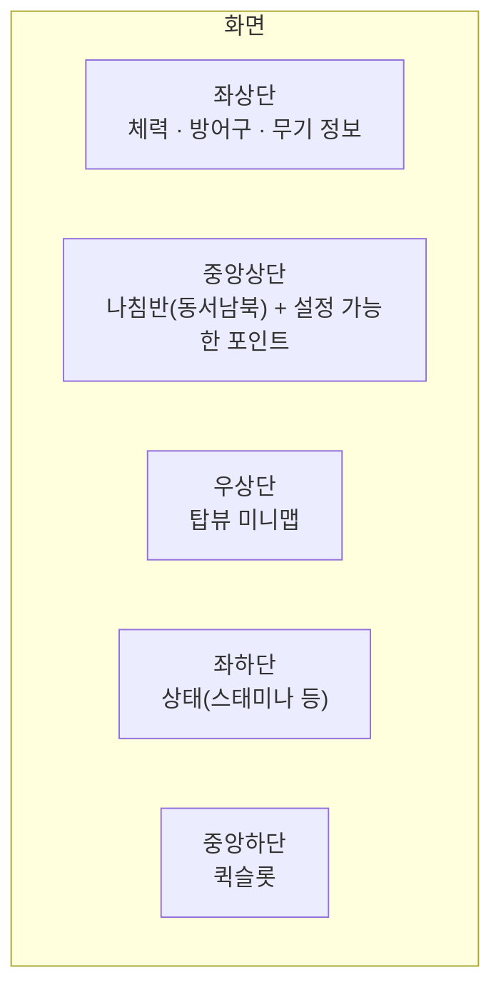
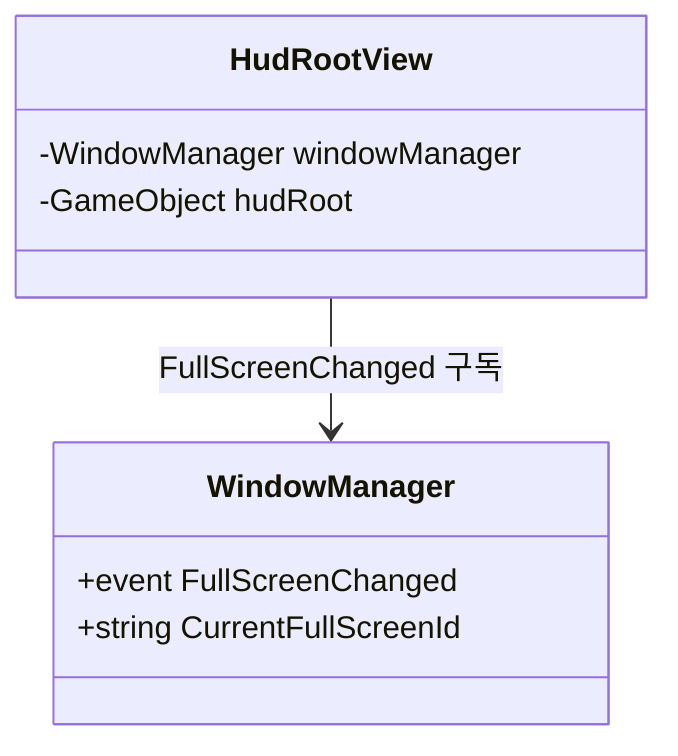
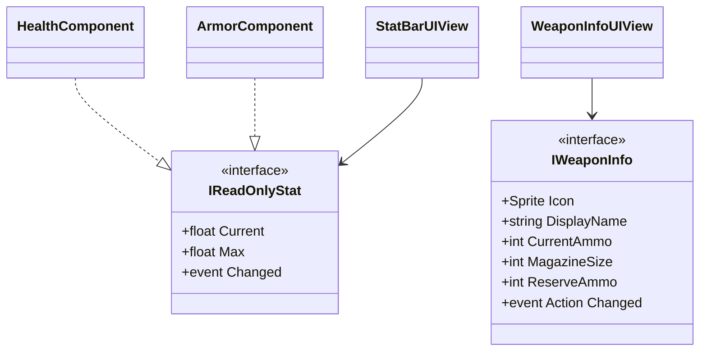
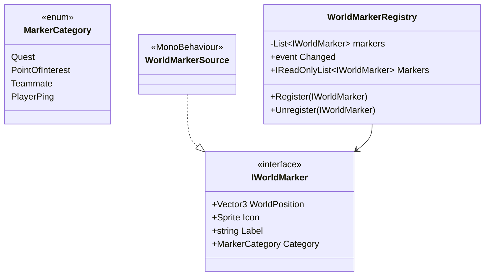
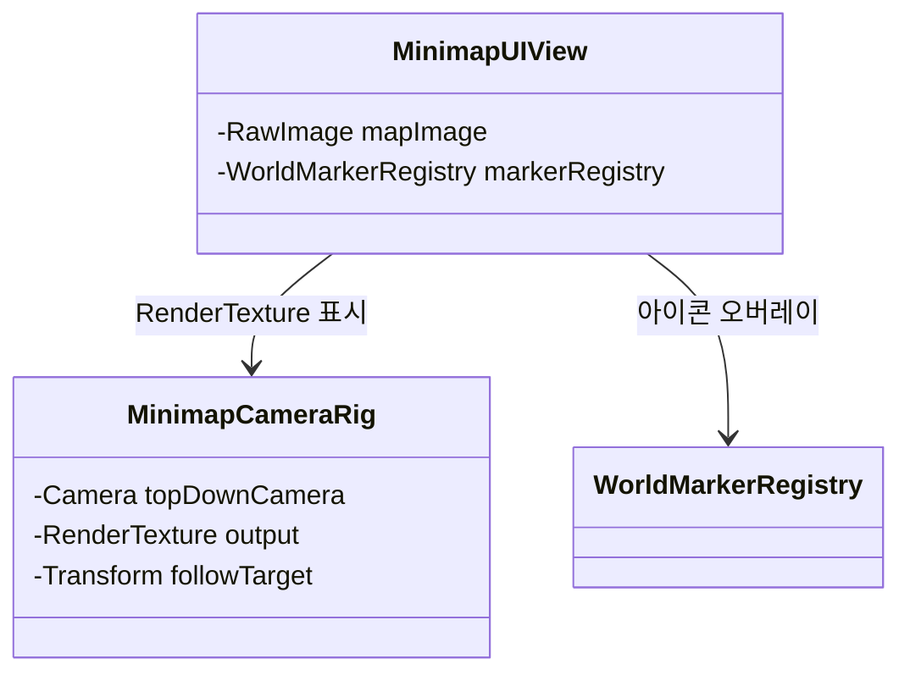

# HUD 시스템

1인칭/3인칭을 전환할 수 있는 슈팅 게임을 목표로 한 HUD 레이아웃과 그 이면의 데이터 배선을 설계한다. 예정 코드 위치는 `Assets/Scripts/HUD` 하위(`Game.HUD`, `Game.HUD.Markers`, `Game.HUD.Compass`, `Game.HUD.Minimap`), 무기 데이터는 `Assets/Scripts/Weapons`(`Game.Weapons`), 방어구 체력은 `Assets/Scripts/Combat`(`Game.Combat`, 기존 `HealthComponent` 옆).

## 화면 레이아웃

이 다섯 구역은 Canvas 하위에 고정 앵커로 배치되는 정적 레이아웃이다(런타임에 위치를 동적으로 바꿀 필요가 없으므로 "구역 레지스트리" 같은 추상화는 만들지 않았다 — KISS). 대신 각 구역의 위젯은 **자기 데이터 소스를 인터페이스로만 알기 때문에**, 위젯 내부 구현이나 데이터 제공자를 바꿔도 나머지 HUD는 전혀 영향받지 않는다. 확장은 "새 구역을 만드는 것"이 아니라 "기존 구역 안에 새 위젯을 추가하거나, 기존 위젯이 읽는 인터페이스의 구현체를 바꾸는 것"으로 이루어진다.

## 설계 원칙

- **카메라 시점과 무관하게 설계한다.** 1인칭이든 3인칭이든 HUD 위젯은 전부 캐릭터/게임 상태(체력, 스태미나, 위치, 진행 방향)를 읽지, 카메라 트랜스폼을 직접 읽지 않는다. 나침반은 카메라가 아니라 캐릭터의 진행/조준 방향(`CharacterMotor`가 향하는 방향)을 기준으로 삼는다 — 그래야 카메라 전환 시스템이 나중에 어떻게 만들어지든 HUD는 손댈 필요가 없다.
- **이미 있는 데이터 소스를 최대한 재사용한다.** 스태미나/허기/수분은 이미 `IReadOnlyStat`([player-attributes.md](player-attributes.md), [inventory-system.md](inventory-system.md))이고, 퀵슬롯은 이미 `IQuickSlotController`([quickslot-and-skills.md](quickslot-and-skills.md))다. HUD는 이들을 그대로 바인딩하는 뷰만 추가한다 — 새로 만드는 것은 나침반/미니맵이 공유하는 "월드 마커" 데이터와, 아직 없던 방어구·무기 데이터뿐이다.
- **나침반과 미니맵은 같은 데이터를 공유한다.** "동서남북 + 설정 가능한 포인트"(나침반)와 "탑뷰 미니맵의 아이콘들"은 사실 같은 정보(월드 상의 관심 지점 목록)를 다른 방식으로 그리는 것뿐이다. 하나의 `IWorldMarker` 레지스트리를 두 뷰가 함께 읽는다(DRY) — [inventory-system.md](inventory-system.md)에서 `GridInventoryUIView`를 pocket/rig/backpack이 공유한 것과 같은 결.
- **HUD 표시 여부는 창 시스템과 연동한다.** 인벤토리/설정/맵/임무 확인처럼 [window-system.md](window-system.md)의 전체화면 창이 열리면 그 창이 화면을 이미 다 차지하므로 HUD를 숨긴다. 팝업(퍼즐/이벤트)은 화면 일부만 가리는 짧은 인터럽션이므로 HUD는 계속 보여준다.

## HUD 표시 제어 — `HudRootView`

`WindowManager.FullScreenChanged`를 구독해서 `CurrentFullScreenId`가 `null`이 아니면 HUD 루트를 끄고, `null`이 되면 다시 켠다. HUD와 창 시스템이 서로의 내부를 몰라도 되도록 이 얇은 클래스 하나가 둘을 연결한다.

## 좌상단 — 체력 · 방어구 · 무기 정보

- **체력**: [combat-system.md](combat-system.md)의 `HealthComponent`를 `IReadOnlyStat`으로도 바인딩해서 기존 `StatBarUIView`를 그대로 쓴다 — 새 UI 클래스가 필요 없다.
- **방어구**: `ArmorComponent`(신규, `Game.Combat`)는 `HealthComponent`와 같은 모양(`Current`/`Max`/`IReadOnlyStat`)을 가진 별도 자원이다. 이번 설계는 HUD에 값을 보여주는 것까지만 다룬다 — "방어구가 체력보다 먼저 닳는다" 같은 데미지 계산 순서는 전투 시스템 쪽에서 `IDamageable.TakeDamage` 구현이 `ArmorComponent`를 먼저 소모하도록 확장해야 하는, 이 문서 범위 밖의 후속 과제다. 같은 `StatBarUIView`를 체력과 나란히 하나 더 놓으면 된다.
- **무기 정보**: 이 문서를 처음 쓸 때는 무기 시스템이 없어 `IWeaponInfo`를 HUD 쪽에 임시로 뽑아뒀지만, [weapon-system.md](weapon-system.md)에서 실제 무기 시스템이 만들어지면서 이 인터페이스는 자연스러운 소속인 `Game.Weapons`로 옮겼다(HUD가 무기 시스템을 참조하는 방향이 맞고, 그 반대가 아니어야 하므로). `FirearmInstance`가 `IWeaponInfo`(아이콘, 이름, 현재 탄창/장탄수, 변경 이벤트)를 직접 구현하고, 근접무기(`MeleeWeaponInstance`)는 탄약이 없으므로 더 작은 `IWeaponDisplay`(아이콘/이름만)만 구현한다 — `WeaponInfoUIView`는 `WeaponLoadout.ActiveWeapon`이 `IWeaponInfo`인지 검사해서 탄약 UI를 보이거나 숨긴다.
- 세 위젯 모두 `PlayerVitalsHudPanel` 같은 얇은 합성 컴포넌트 하나가 좌상단에 묶어서 배치한다(개별 위젯은 서로를 모른다).

## 좌하단 — 상태(스태미나 등)

이미 있는 [player-attributes.md](player-attributes.md)의 `StaminaController`, [inventory-system.md](inventory-system.md)의 `PlayerVitals`(허기/수분) 모두 `IReadOnlyStat`이므로, `StatBarUIView`를 세로로 나열하기만 하면 된다. 새 스탯(예: 방사능 수치, 산소)이 생겨도 같은 `PlayerStat`/`IReadOnlyStat` 조합이면 이 구역에 바로 추가할 수 있다 — 이 문서에서 새로 설계할 것이 없다.

## 중앙하단 — 무기 슬롯(1/2/3, 고정) + 퀵슬롯(4~0, 뱅크)

처음에는 [quickslot-and-skills.md](quickslot-and-skills.md)의 `QuickSlotBarUIView`만 이 자리에 두면 됐지만, 이후 [weapon-system.md](weapon-system.md)에서 무기 선택 키(`1`/`2`/`3`)가 퀵슬롯 숫자키와 충돌한다는 게 드러나면서([design-conflict-review.md](design-conflict-review.md) 1번) 이 구역은 **두 개의 독립된 시스템이 한 줄처럼 붙어 보이는 합성 구역**이 됐다:

- 왼쪽 3칸: `WeaponLoadoutBarUIView`(`Game.Weapons.UI`) — `WeaponLoadout`을 바인딩, 키 `1`/`2`/`3` 고정.
- 오른쪽 7칸: `QuickSlotBarUIView`(`Game.QuickSlot.UI`) — `IQuickSlotController`를 바인딩, 키 `4`~`9`,`0`, `` ` ``로 뱅크 스왑.

[`HotbarLayoutController`](../Assets/Scripts/HUD/HotbarLayoutController.cs)(`Assets/Scripts/HUD`, 실제 구현됨)가 이 10칸 전체의 **레이아웃**(한 줄/두 줄)만 관리한다 — `WindowManager.CurrentFullScreenId`가 인벤토리 창이면 두 줄(드래그로 슬롯을 설정하기 편하도록 여유 있게), 아니면 한 줄(평상시 HUD, 화면 차지 최소화)로 전환한다. **이 핫바는 이 문서 위쪽에서 정의한 `HudRootView`(전체화면 창이 열리면 나머지 HUD를 통째로 숨김, 아직 설계 단계)의 규칙에서 예외다** — 인벤토리를 포함해 어떤 창이 열려 있어도 계속 보여야 퀵슬롯/무기 설정이 가능하기 때문.

## 중앙상단 — 나침반 & 설정 가능한 포인트

### 월드 마커 레지스트리 — `IWorldMarker` / `WorldMarkerRegistry`

- **`IWorldMarker`** — "지도/나침반에 표시될 수 있는 지점"의 최소 계약. 퀘스트 목표, 관심 지점, 팀원, 플레이어가 찍은 핑(ping) 모두 같은 인터페이스로 표현한다.
- **`WorldMarkerRegistry`** — 씬에 하나 존재하는 등록소. 퀘스트 오브젝트, NPC, 플레이어의 핑 액션 등 **누구든** `Register`/`Unregister`만 호출하면 나침반과 미니맵에 즉시 나타나거나 사라진다 — "각종 설정할 수 있는 포인트"라는 요구를 그대로 만족한다. `Changed` 이벤트로 두 뷰(나침반, 미니맵)에 갱신을 알린다.
- **`WorldMarkerSource`** — 씬 오브젝트에 붙이기만 하면 되는 범용 구현체(위치는 자기 `transform.position`, 아이콘/라벨/카테고리는 인스펙터 값). 코드를 몰라도 레벨 디자이너가 오브젝트에 컴포넌트 하나 붙이는 것으로 마커를 추가할 수 있다.
- 카테고리(`MarkerCategory`)는 enum이라 다른 enum들(`ItemType`, `EnemyTier`, `ContainerCategory`, `AttributeType`, `PlayerActionType`)과 같은 확장 방식을 따른다 — 새 종류는 항목 추가만으로 끝난다.

### `CompassUIView`

- 캐릭터의 진행 방향(요(yaw))을 기준으로 가로 띠 위에 `N`/`E`/`S`/`W` 라벨을 스크롤시키고, `WorldMarkerRegistry`에서 캐릭터 전방 ±각도 범위 안에 들어오는 마커만 같은 띠 위에 상대 방위로 배치한다.
- 마커까지의 거리도 함께 표시할 수 있도록 `IWorldMarker.WorldPosition`과 캐릭터 위치의 차이를 매 프레임(또는 `Changed` 발생 시) 계산한다.
- 카메라가 아니라 캐릭터 요(yaw)를 읽으므로 1인칭/3인칭 전환과 무관하게 항상 정확하다.

## 우상단 — 탑뷰 미니맵

- **`MinimapCameraRig`** — 플레이어 머리 위에서 아래를 내려다보는 직교(Orthographic) 카메라를 플레이어 위치로 계속 따라가게 하고, 그 결과를 `RenderTexture`로 렌더링한다. 화면 UI 쪽은 이 텍스처를 `RawImage`로 표시하기만 하면 된다.
- **`MinimapUIView`** — 같은 `WorldMarkerRegistry`를 읽어서, 각 마커의 월드 XZ 좌표를 플레이어 기준 상대 좌표로 변환해 미니맵 텍스처 위에 아이콘을 겹쳐 그린다. 플레이어 자신은 항상 중앙에 고정된 화살표 아이콘으로 표시하고, 화살표 회전으로 진행 방향을 나타낸다.
- **북쪽 고정 vs 플레이어 방향 고정**은 흔한 선택지 두 가지다 — 이 설계는 어느 쪽이든 `MinimapCameraRig`의 카메라 회전 값 하나만 바꾸면 되도록 캡슐화해뒀다(구체 선택은 후속 과제로 남김).
- 나침반과 완전히 같은 `IWorldMarker`/`WorldMarkerRegistry`를 재사용하므로, 새 마커 종류를 추가하면 나침반과 미니맵 양쪽에 자동으로 나타난다 — 한쪽만 갱신해야 하는 상황이 생기지 않는다.

## 확장 시나리오

| 하고 싶은 것 | 필요한 작업 |
|---|---|
| 새 HUD 스탯 바 추가(예: 산소) | `PlayerStat` 하나 추가 + `StatBarUIView` 배치. 기존 위젯 변경 없음 |
| 새 마커 종류 추가(예: 위험 지역 경고) | `MarkerCategory`에 항목 추가 + 아이콘 애셋. `CompassUIView`/`MinimapUIView` 변경 없음 |
| 퀘스트 시스템이 목표 지점을 표시 | 퀘스트 오브젝트에 `WorldMarkerSource` 부착(또는 `IWorldMarker` 직접 구현) + `WorldMarkerRegistry.Register()` 호출 |
| 새 무기 종류 추가(예: 활, 투척 무기) | [weapon-system.md](weapon-system.md)의 `IWeapon`/`IWeaponDisplay` 구현체 하나 추가. `WeaponInfoUIView`는 그대로 동작 |
| 보스전 등 특수 HUD(보스 체력바) 추가 | 새 위젯을 화면 중앙 상단 등 별도 위치에 추가 — 기존 5개 구역과 독립적이므로 간섭 없음 |

## 스코프 밖으로 둔 것 (다음 단계 후보)

- 무기 정보 위젯(`WeaponInfoUIView`)과 [weapon-system.md](weapon-system.md)의 `WeaponLoadout`을 실제로 연결하는 배선 코드 — 인터페이스와 무기 시스템 자체는 구현됐지만 HUD 쪽 뷰는 아직 없음
- 방어구가 체력보다 먼저 닳는 데미지 계산 순서(전투 시스템 확장 과제)
- 1인칭/3인칭 카메라 전환 시스템 자체 — HUD는 그 결과(캐릭터 방향)만 읽도록 설계했을 뿐, 전환 로직은 이 문서 범위 밖
- 미니맵 확대/축소, 북쪽 고정·플레이어 방향 고정 토글 UI
- 나침반 마커의 화면 클릭/핑 찍기 입력 흐름
- 크로스헤어, 킬피드, 데미지 방향 인디케이터 등 슈팅 게임에 흔한 추가 HUD 요소(요청 범위 밖이라 우선 제외 — 필요해지면 위 "확장 시나리오" 방식대로 추가)
