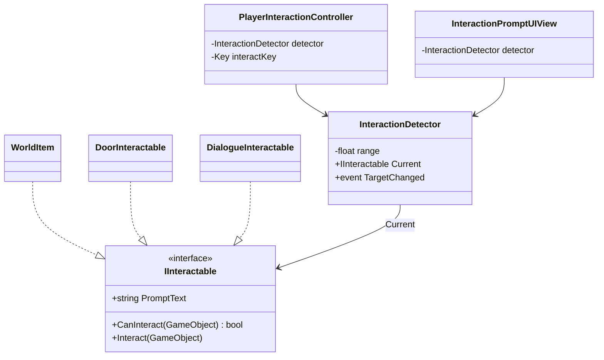

# 상호작용(Interaction) 시스템

문 열기, 대화하기 등 "플레이어의 키 입력으로 트리거되는 동작"을 하나의 인터페이스(`IInteractable`)로 묶고, 새 상호작용 종류가 계속 추가돼도 감지/입력/UI 쪽 코드는 손대지 않도록 설계한다. 코드 위치는 `Assets/Scripts/Interaction`(`Game.Interaction`, UI는 `Game.Interaction.UI`).

## 이전 설계에서 옮겨온 이유

`IInteractable`은 원래 [item-system.md](item-system.md)에서 `WorldItem`(아이템 줍기)을 위해 `Assets/Scripts/Items/World`(`Game.Items` 네임스페이스)에 만들었었다. 이후 [character-system.md](character-system.md)/[npc-roles.md](npc-roles.md)의 NPC 대화도 같은 인터페이스를 재사용하기로 했고, 그때 이미 "필요하면 `Game.Interaction` 같은 공용 네임스페이스로 옮기는 것도 고려할 수 있다"고 적어뒀다. 이번에 문(Door)까지 추가되어 아이템도, NPC도, 오브젝트도 아닌 세 번째 사용처가 생기면서 그 시점이 왔다고 보고 실제로 옮겼다 — `IDamageable`을 `Game.Combat`으로, `IAiBrain`을 `Game.AI`로 일반화했던 것과 같은 이유(교차 관심사는 특정 도메인 네임스페이스에 두지 않는다)다.

`WorldItem`은 `IInteractable`을 계속 구현하지만 이제 `Game.Interaction`을 참조하는 쪽으로 바뀌었을 뿐, 동작은 그대로다.

## 설계 원칙

- **"무엇을 할 수 있는가"와 "지금 할 수 있는가"와 "실제로 한다"를 분리한다.** `IInteractable`은 이 세 가지(`PromptText`, `CanInteract`, `Interact`)만 요구하고, 그 이상은 모른다.
- **감지·입력·실행을 서로 다른 클래스가 맡는다.** `InteractionDetector`(누가 상호작용 대상인지 찾기), `PlayerInteractionController`(언제 실행할지), 각 `IInteractable` 구현체(무엇을 할지) — 세 책임을 하나의 매니저 클래스에 몰아넣지 않는다(단일 책임).
- **새 상호작용 종류 = 새 클래스.** 문, 대화, 아이템 줍기 중 무엇을 봐도 `InteractionDetector`/`PlayerInteractionController`/UI 프롬프트 코드는 단 한 줄도 바뀌지 않는다(개방-폐쇄 원칙). 상호작용 종류를 나열하는 `enum` + `switch`를 일부러 만들지 않았다 — 그런 구조는 새 종류가 추가될 때마다 기존 `switch` 문을 계속 건드려야 한다.

## 구조



### `IInteractable`

```
string PromptText { get; }                       // "문 열기", "대화하기" 등 UI 표시용 짧은 문구
bool CanInteract(GameObject interactor);          // 잠긴 문, 대화 불가 상태 등
void Interact(GameObject interactor);
```

`CanInteract`는 [combat-system.md](combat-system.md)의 `IDamageable.IsAlive`, [quickslot-and-skills.md](quickslot-and-skills.md)의 `IQuickSlottable.IsUsable`과 같은 자리에 있는 가드다 — "지금 유효한가"를 실행 전에 물어볼 수 있게 해서, 감지/UI 쪽이 상태를 몰라도 회색 처리나 무시가 가능하다.

### `InteractionDetector` (플레이어에 부착)

- 매 프레임 주변(`Physics.OverlapSphere`)에서 `IInteractable`을 구현하고 `CanInteract`가 `true`인 것 중 가장 가까운 것을 `Current`로 유지한다.
- `TargetChanged` 이벤트로 대상이 바뀔 때만 알린다(매 프레임 폴링해야 하는 쪽은 UI 쪽에서 알아서 구독).
- "누가 상호작용 대상인지"만 책임진다 — 어떤 키가 상호작용 키인지, 대상이 상호작용 시 무엇을 하는지는 전혀 모른다.

### `PlayerInteractionController`

- 상호작용 키(기본 `F`, Input System 사용)를 읽어서 `detector.Current?.Interact(gameObject)`만 호출한다.
- 키 리바인딩이 필요해져도 이 클래스만 건드리면 되고, `InteractionDetector`나 각 `IInteractable` 구현체는 무관하다.

### `InteractionPromptUIView`

- `InteractionDetector.TargetChanged`를 구독해서 대상이 있으면 `PromptText`를 그대로 표시하고, 없으면 프롬프트를 숨긴다. 어떤 종류의 상호작용인지 전혀 모른 채로 동작한다.

## 예시 구현 — 서로 다른 세 가지 상호작용 종류가 같은 인터페이스로 동작

| 구현체 | 위치 | `PromptText` | `CanInteract` | `Interact` |
|---|---|---|---|---|
| `WorldItem` (기존, 네임스페이스만 갱신) | `Assets/Scripts/Items/World` | `"{아이템명} 줍기"` | 항상 `true` | 인벤토리에 추가, 다 들어가면 파괴 |
| `DoorInteractable` (신규) | `Assets/Scripts/Interaction` | 잠김/열림 상태별 문구 | `!isLocked` | 열림 상태 토글 + 애니메이터 |
| `DialogueInteractable` (신규, 골격만) | `Assets/Scripts/Interaction` | `"{NPC명}와 대화하기"` | 항상 `true` | TODO — 실제 대화 UI/트리는 [npc-roles.md](npc-roles.md) 후속 과제 |

세 구현체 모두 `InteractionDetector`/`PlayerInteractionController`/`InteractionPromptUIView`를 전혀 모른다. 이후 상자 열기, 레버 당기기, 낚시 포인트 등을 추가할 때도 이 표에 행을 하나 추가하는 것과 동일한 작업이 된다.

## 스코프 밖으로 둔 것 (다음 단계 후보)

- 상호작용 대상이 여러 개 겹칠 때의 우선순위/시야각(Raycast) 기반 판정(현재는 최단 거리만 사용)
- 홀드(누르고 있기) 상호작용, 진행률 표시(예: 문 강제로 열기)
- `DialogueInteractable`/도어의 실제 콘텐츠(대화 트리, 문 열림 애니메이션 클립)
- 상호작용 가능 오브젝트의 아웃라인/하이라이트 렌더링
