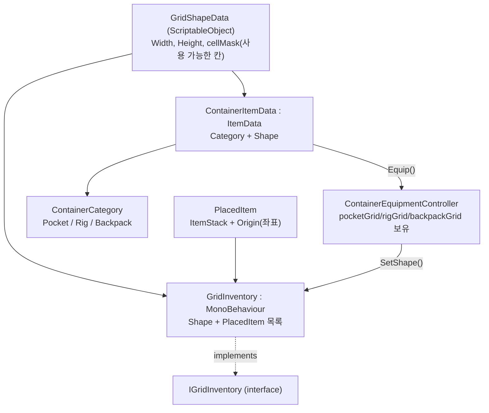
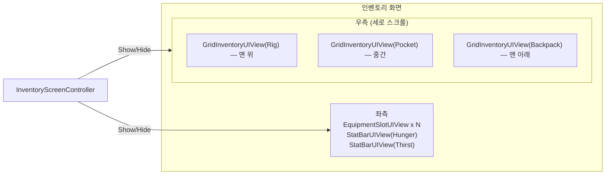

# 인벤토리 시스템 (Pocket / Rig / Backpack)

장비(포켓/릭/백팩)에 따라 인벤토리의 크기와 모양이 달라지는 그리드 기반 인벤토리 설계. 모양은 코드가 아니라 데이터(`GridShapeData` 애셋)로 정의해서, 새 모양을 추가할 때 코드 수정 없이 애셋만 추가하면 되도록 했다 (개방-폐쇄 원칙).

## 왜 별도 그리드 시스템인가

기존 `IInventory`(퀵슬롯용, [item-system.md](item-system.md) 참고)는 "슬롯 1개 = 아이템 1스택"인 1차원 구조다. pocket/rig/backpack은

- 아이템마다 차지하는 칸 수(가로×세로)가 다르고,
- 컨테이너 자체도 사각형이 아닌 모양(마스크)을 가질 수 있어야 하므로,

좌표 기반의 `IGridInventory`를 별도 인터페이스로 분리했다. 두 인터페이스를 하나로 합치면 퀵슬롯 같은 단순 소비자도 좌표/모양 개념을 알아야 해서 불필요하게 복잡해진다 (인터페이스 분리 원칙, KISS).

## 전체 구조

## 모양(Shape)을 데이터로 분리 — `Assets/Scripts/Items/Grid`

- **`GridShapeData.cs`** — "몇×몇 그리드에서 어떤 칸이 사용 가능한가"만 정의하는 `ScriptableObject`. `bool[] cellMask`(row-major)로 표현하며, 마스크를 비워두면(또는 크기가 안 맞으면) 전부 사용 가능한 사각형으로 취급한다.
  - **기본 포켓**: `Width = 4, Height = 2`, 마스크 비움 → 자동으로 8칸(2×4)이 된다.
  - **L자형 파우치** 등 비정형 모양도 같은 구조로 표현 가능 — 새 모양이 필요하면 애셋만 새로 만들면 된다.
- **`PlacedItem.cs`** — 그리드에 놓인 아이템 하나. `ItemStack` + `Origin`(좌상단 좌표). 차지하는 크기(`FootprintSize`)는 `ItemData.GridSize`에서 가져온다.
- **`IGridInventory.cs`** — `TryAddItem`(자동 배치), `TryPlaceAt`(좌표 지정 배치, 드래그&드롭용), `GetItemAt`, `RemoveItem`, `SetShape`(모양 교체) 등을 정의.
- **`GridInventory.cs`** — 구현체. 칸이 겹치지 않는지, 마스크상 사용 가능한지 검사한 뒤 배치한다.
  - `SetShape(newShape)`: 모양이 바뀌어(예: 더 작은 가방으로 교체) 기존에 놓인 아이템이 더는 들어갈 자리가 없으면 **해당 아이템들을 꺼내서 리스트로 반환**한다. "꺼내진 아이템을 어떻게 할지"(바닥에 버리기, 다른 칸으로 옮기기 등)는 `GridInventory`의 책임이 아니라 호출자(장비 컨트롤러)가 결정하도록 관심사를 분리했다.

`ItemData`([Assets/Scripts/Items/Core/ItemData.cs](../Assets/Scripts/Items/Core/ItemData.cs))에는 그리드에서 차지하는 크기를 나타내는 `GridSize`(gridWidth × gridHeight, 기본 1×1)를 추가해서, 기존 아이템 시스템과 그리드 인벤토리가 같은 아이템 데이터를 공유한다.

## 장비 연동 — `Assets/Scripts/Items/Equipment`

- **`ContainerCategory.cs`** — `Pocket / Rig / Backpack` (추후 다른 카테고리 추가 가능).
- **`ContainerItemData.cs`** — `ItemData`를 상속하는 "착용 가능한 컨테이너 아이템". `Category`(어느 슬롯에 착용되는지) + `Shape`(착용 시 부여할 `GridShapeData`)를 가진다. 같은 카테고리라도 아이템 애셋마다 다른 모양의 `GridShapeData`를 연결할 수 있어 "포켓 모양을 나중에 여러 개 중 선택"하는 요구를 만족한다.
- **`ContainerEquipmentController.cs`** — 플레이어가 보유한 세 개의 `GridInventory`(pocket/rig/backpack)를 들고 있다가, `Equip(ContainerItemData)` 호출 시 해당 카테고리 그리드의 `SetShape()`를 호출해 모양을 교체한다. `Unequip`은 `SetShape(null)`로 그리드를 비활성화(용량 0) 상태로 되돌린다. 두 메서드 모두 밀려난 아이템 목록(`List<ItemStack>`)을 반환한다.

## 플레이어 상태 — `Assets/Scripts/Player/Stats`

- **`PlayerStat.cs`** — `Current`/`Max` + 변경 이벤트를 가진 범용 스탯 클래스와 `IReadOnlyStat` 인터페이스. 허기/수분뿐 아니라 이후 스태미나 등 다른 스탯도 같은 클래스를 재사용하면 된다 (DRY).
- **`PlayerVitals.cs`** — `Hunger`, `Thirst` 두 `PlayerStat`을 보유하고 시간에 따라 자동 감소시키는 `MonoBehaviour`.

## 인벤토리 화면 UI — `Assets/Scripts/Items/UI`, `Assets/Scripts/UI`

요청대로 **레이아웃(배경 블러, 좌/우 배치)은 임시**로 잡되, 배선 구조(어떤 컴포넌트가 무엇에 의존하는지)는 실제 시스템으로 설계했다.

- **`IBackgroundObscurer.cs`** / **`DarkenOverlayObscurer.cs`** (`Assets/Scripts/UI`) — "배경을 블러 처리해서 안 보이게" 요구사항의 임시 구현으로, 어두운 반투명 패널을 켜고 끄는 자리표시자다.
- **`InventoryScreenController.cs`** — 인벤토리 화면 전체를 보이고/숨긴다. 배경 가림 처리, 설정 창 등 다른 전체화면 창과의 상호 배타(동시에 하나만 열림), 키 입력 바인딩은 더 이상 이 클래스의 책임이 아니다 — [window-system.md](window-system.md)에서 설계한 `WindowManager`가 전담한다. 즉 `InventoryScreenController`는 `SimpleWindow`를 상속하는 얇은 클래스로 축소됐다.
- **`GridInventoryUIView.cs`** / **`GridCellUIView.cs`** / **`GridItemUIView.cs`** — 임의의 `IGridInventory` 하나를 셀 배경(모양 마스크대로) + 아이템 아이콘(차지 크기만큼 확장)으로 렌더링. **pocket/rig/backpack 패널 세 개가 이 컴포넌트를 그대로 재사용**한다(DRY).
  - `GridInventoryUIView`에 `panelRoot`(자기 패널 전체를 감싸는 `RectTransform`)를 추가해서, 바인딩된 그리드의 `Shape.Width/Height * cellSize`로 자기 크기를 스스로 보고하도록 했다([GridInventoryUIView.cs](../Assets/Scripts/Items/UI/GridInventoryUIView.cs)). pocket/rig/backpack은 장비에 따라 크기가 계속 바뀌므로(고정 크기 가정 불가), 우측 패널을 `ScrollRect` + `VerticalLayoutGroup`으로 구성하고 Rig → Pocket → Backpack 순서로 세 `GridInventoryUIView`를 자식으로 배치하면 `VerticalLayoutGroup`이 각 패널의 `panelRoot` 크기를 읽어 세로로 쌓고, `ScrollRect`가 합산 높이가 화면을 넘칠 때 스크롤을 제공한다 — 이 조합 자체는 씬/프리팹 설정이고 새 스크립트가 필요하지 않다.
- **`EquipmentSlotUIView.cs`** — 장비 슬롯 1칸(현재는 클릭 시 해제만 구현, 장착은 드래그&드롭 확장 지점으로 남김).
- **`StatBarUIView.cs`** (`Assets/Scripts/UI`) — `IReadOnlyStat`에 바인딩되는 범용 바. Hunger/Thirst 둘 다 재사용.
- **`InventoryLayoutView.cs`** — 위 컴포넌트들을 좌/우로 배치하고 이벤트를 연결하는 합성 루트(composition root).

퀵슬롯(1~0, 뱅크 스왑, 스킬 탑재)은 이 화면과 별개의 상시 HUD 요소로 분리해서 설계했다 — [quickslot-and-skills.md](quickslot-and-skills.md) 참고. 예전에 "퀵슬롯은 `IInventory`를 재사용한다"고 적었던 부분은 이제 스킬도 올려야 해서 유효하지 않다; 대신 아이템과 스킬을 모두 담을 수 있는 별도 `IQuickSlottable` 계약을 새로 만들었다.

## 스코프 밖으로 둔 것 (다음 단계 후보)

- 그리드 안에서 드래그로 아이템 이동/회전
- `GridShapeData.cellMask`를 2D 체크박스로 편집하는 커스텀 에디터(현재는 인스펙터에서 1차원 리스트로만 보임)
- 실제 블러 렌더 피처(키 바인딩은 [window-system.md](window-system.md)의 카탈로그 기반 `FullScreenWindowHotkeyRouter`로 구현됨)
- 인벤토리 그리드에서 드래그해 장비 슬롯에 장착하는 흐름(현재 `Equip()`은 코드 호출만 가능)
