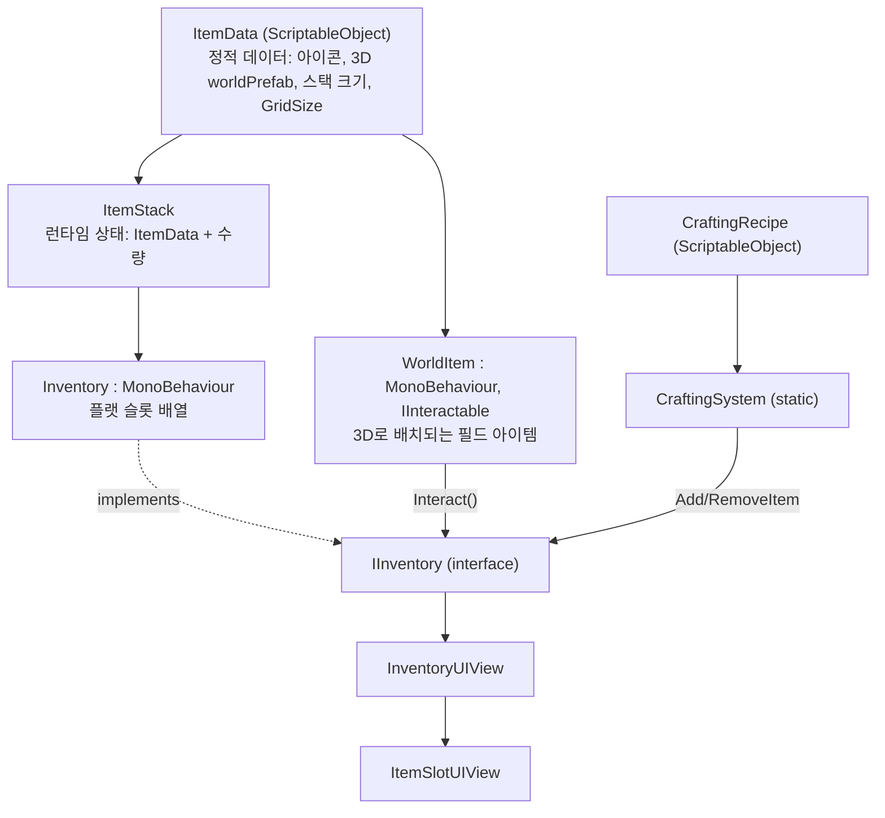

# 아이템 시스템 (기초 뼈대)

3D로 보여지는 월드 아이템과 UI(인벤토리/퀵슬롯/제작)를 모두 고려한 아이템 시스템의 기초 뼈대. 데이터(정적 정보) / 런타임 상태 / 3D 표현 / UI를 계층으로 분리하고, UI는 구체 클래스가 아닌 인터페이스(`IInventory`)에만 의존하도록 설계했다 (의존성 역전).

## 계층 구조

## 구성 요소

### Core — `Assets/Scripts/Items/Core`

- **`ItemType.cs`** — `Material / Consumable / Equipment / QuestItem / Misc` 분류 enum.
- **`ItemData.cs`** — 아이템의 정적 데이터를 담는 `ScriptableObject`. 아이콘, 설명, 3D 표현용 `WorldPrefab`, 스택 최대치, 그리드 인벤토리에서 차지하는 `GridSize`(W×H)를 가진다. 실제 인스턴스 상태(수량 등)는 갖지 않는다 — 같은 애셋을 여러 스택에서 공유.
- **`ItemStack.cs`** — `ItemData` + `Quantity`. `Add`/`Remove`는 남거나 실제로 처리된 양을 반환해 호출자가 후속 처리를 할 수 있게 한다.

### Inventory (플랫 슬롯) — `Assets/Scripts/Items/Inventory`

"슬롯 1개 = 아이템 1스택"인 단순 컨테이너. 좌표/모양이 필요한 pocket·rig·backpack용 그리드 인벤토리는 별도 시스템([inventory-system.md](inventory-system.md))으로 분리했다 — 두 컨테이너의 배치 방식이 근본적으로 달라 하나의 인터페이스로 억지로 합치지 않았다 (인터페이스 분리 원칙). 아이템 창고 등 순수 아이템 슬롯이 필요한 곳에서 계속 쓰인다. (퀵슬롯 자체는 스킬도 올려야 해서 결국 별도 계약(`IQuickSlottable`)으로 분리했다 — [quickslot-and-skills.md](quickslot-and-skills.md) 참고.)

- **`IInventory.cs`** — `AddItem`, `RemoveItem`, `GetQuantity`, `HasItem`, `InventoryChanged` 이벤트. UI는 이 인터페이스만 알면 된다.
- **`InventorySlot.cs`** — 슬롯 1칸의 상태(`ItemStack` 또는 비어있음).
- **`Inventory.cs`** — `IInventory` 구현체. 고정 슬롯 개수 배열로 관리.

### World — `Assets/Scripts/Items/World`

- **`WorldItem.cs`** — 3D 씬에 배치되는 필드 아이템. `ItemData.WorldPrefab`이 실제로 씬에 나타나는 3D 메시를 정의하고, `WorldItem`은 그 오브젝트에 붙어 `Interact()` 시 상대방의 `IInventory` 컴포넌트에 아이템을 넣는다. 상호작용 계약(`IInteractable`) 자체는 문 열기, NPC 대화 등 다른 상호작용 종류와 함께 `Game.Interaction`(`Assets/Scripts/Interaction`)으로 옮겨 일반화했다 — [interaction-system.md](interaction-system.md) 참고.

### Crafting — `Assets/Scripts/Items/Crafting`

- **`CraftingIngredient.cs`** — `ItemData` + 필요 수량.
- **`CraftingRecipe.cs`** — 재료 목록 + 결과물을 담는 `ScriptableObject`. `CanCraft(IInventory)`로 재료 보유 여부만 확인.
- **`CraftingSystem.cs`** — 정적 클래스. 재료 확인 → 차감 → 결과물 지급을 담당(단일 책임: 레시피 데이터와 제작 로직 분리).

### UI — `Assets/Scripts/Items/UI`

- **`ItemSlotUIView.cs`** — 슬롯 1칸의 아이콘/수량 표시 + 클릭 이벤트.
- **`InventoryUIView.cs`** — 임의의 `IInventory`를 슬롯 그리드로 렌더링. 순수 아이템 슬롯 화면(창고 등)이 늘어나면 이 컴포넌트를 그대로 재사용한다(DRY, 개방-폐쇄 원칙). ~~퀵슬롯도 이걸 재사용한다~~는 이후 스킬을 퀵슬롯에 올려야 하는 요구가 생기면서 더는 맞지 않게 됐다 — 퀵슬롯 UI는 [quickslot-and-skills.md](quickslot-and-skills.md)의 별도 `QuickSlotBarUIView`를 쓴다.
- **`CraftingUIView.cs`** — 레시피 1개 + 제작 버튼의 최소 구현.

## 스코프 밖으로 둔 것 (다음 단계 후보)

- 장비 착용 슬롯 stat 연동, 아이템 내구도/개별 인스턴스 데이터
- 드래그&드롭 슬롯 이동, 여러 레시피를 보여주는 제작 목록 UI
- 저장/로드(직렬화)
