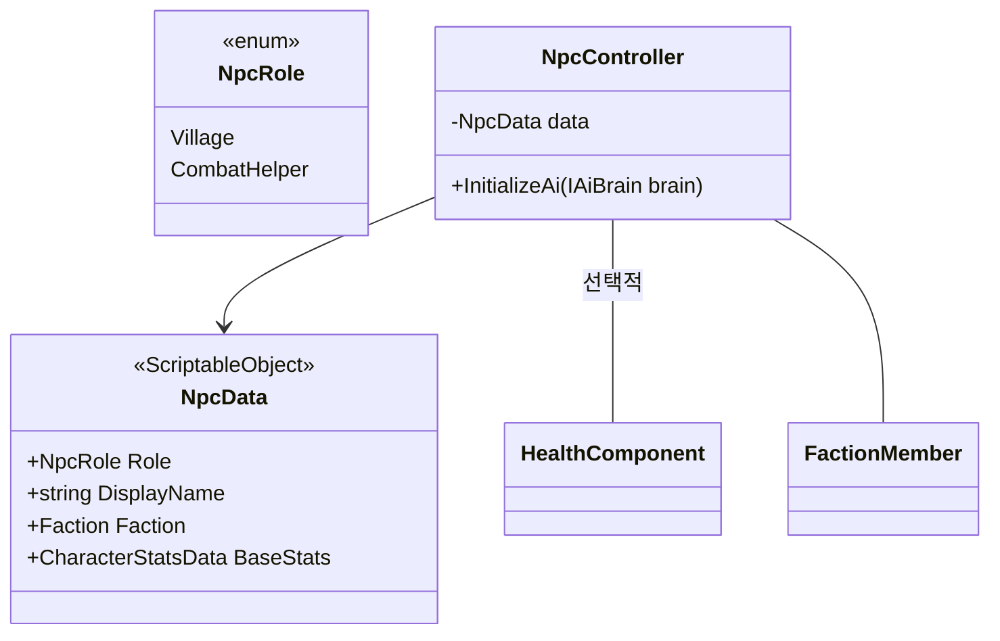
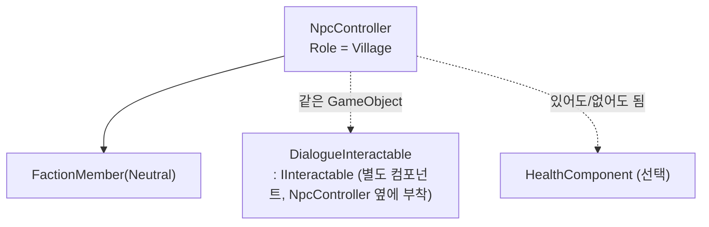
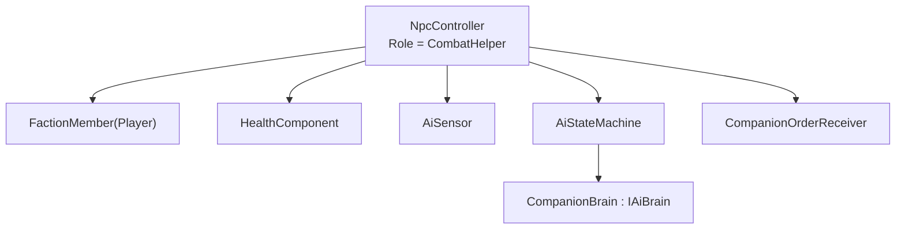
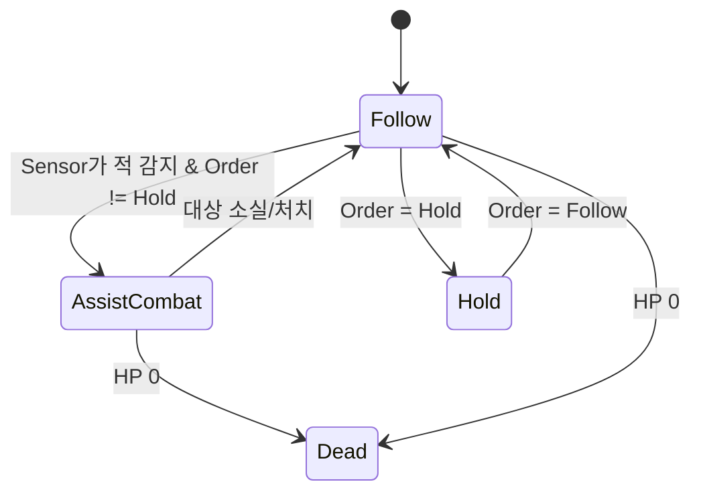

# NPC 역할 분화 — 전투 도움용(Companion) / 마을용(Village)

[character-system.md](character-system.md)에서 정의한 `NpcController`(`IInteractable` + 선택적 `HealthComponent`)를 기반으로, NPC를 "전투 도움용"과 "마을용" 두 역할로 나눈다. 이번에도 서브클래스 두 개(`CombatHelperNpc : NpcController`, `VillageNpc : NpcController`)를 만들지 않고, **같은 `NpcController`에 어떤 선택적 컴포넌트를 붙이느냐**로 역할을 구분한다 — 세 번째 역할(상인, 호위 대상 등)이 필요해져도 새 클래스 계층이 늘지 않도록 하기 위함이다.

## 선행 작업: `IAiBrain`을 Enemy 전용에서 프레임워크로 승격

[character-system.md](character-system.md)의 Enemy 설계에서 `EnemyController`가 티어별 AI 상태 그래프를 고르기 위해 `IEnemyBrain`을 썼다. 전투 도움용 NPC도 정확히 같은 능력(“`AiContext`로부터 초기 상태를 만든다”)이 필요하므로, 이 인터페이스를 Enemy 전용 네임스페이스에서 꺼내 프레임워크 레벨로 옮긴다.

```
namespace Game.AI
{
    public interface IAiBrain
    {
        IAiState BuildInitialState(AiContext context);
    }
}
```

`NormalEnemyBrain`/`EliteEnemyBrain`/`BossEnemyBrain`은 그대로 `Game.Characters.Enemy`에 남고, 이 인터페이스의 구현체라는 사실만 유지한다. 이렇게 옮겨두면 `AiStateMachine`, `AiContext`, `AiSensor`, 그리고 이미 만든 `IdleState`/`PatrolState`/`ChaseState`/`AttackState`까지 **Enemy와 Companion NPC가 코드 변경 없이 그대로 공유**할 수 있다.

## 공통 구조



- **`NpcRole`**은 분류용 값이며(스폰 테이블, 저장 데이터 구분 등), 동작 차이의 근거는 아니다 — Enemy의 `EnemyTier`와 동일한 접근.
- **`NpcData`**는 이름/소속/기본 스탯을 담은 애셋. `CharacterStatsData`를 재사용해 Player/Enemy와 동일한 스탯 개념을 공유한다.
- 새 역할이 필요하면: (1) `NpcRole`에 항목 추가 (2) 아래처럼 해당 역할에 필요한 컴포넌트 조합의 프리팹 추가. `NpcController` 자체는 건드리지 않는다(개방-폐쇄 원칙).
- **`NpcController`는 `IInteractable`을 구현하지 않는다** (실제 구현 단계에서 확정 — 아래 Village 절 참고). AI도 항상 켜져 있지 않다 — `HealthComponent`처럼 선택적이며, `InitializeAi(IAiBrain)`를 호출한 NPC만 `AiSensor`/`AiStateMachine`이 동작한다(고정 위치 Village NPC는 아예 호출 안 함).

## 마을용(Village) NPC 구성



- `FactionMember(Neutral)` — Enemy의 적대 대상 탐지에서 제외된다.
- `DialogueInteractable`이 `IInteractable.Interact()`를 구현해 대화창/상점을 연다(구체 UI는 범위 밖). `IInteractable`은 `Game.Interaction`에 있으며([interaction-system.md](interaction-system.md)), 실제로 `DialogueInteractable`이라는 최소 골격(`Interact` 본문은 TODO)까지 구현되어 있다 — **`NpcController`가 이를 구현하는 게 아니라, 대화가 필요한 Village 프리팹에 이 컴포넌트를 `NpcController` 옆에 그대로 붙이기만 하면 된다**(위 "공통 구조" 절에서 확정한 대로 — 한 GameObject에 `IInteractable` 구현이 두 개 경쟁하는 걸 피하기 위함).
- 대부분 `AiStateMachine` 없이 고정 위치에 서 있는다. 배회가 필요하면 Enemy와 **동일한** `IdleState`/`PatrolState`를 그대로 붙인 `WanderBrain : IAiBrain`을 하나 추가하면 된다 — 두 상태 모두 전투 개념(Chase/Attack)을 참조하지 않으므로 코드 재사용에 아무 문제가 없다.
- 공격받을 수 있는 마을 NPC(습격 이벤트 대상 등)만 선택적으로 `HealthComponent`를 붙인다.

## 전투 도움용(Companion) NPC 구성



- `FactionMember(Player)` — 플레이어와 같은 편으로 취급되어 Enemy의 `AiSensor`가 공격 대상으로 감지하고, 반대로 이 NPC의 `AiSensor`도 `Hostile` 진영을 적으로 감지한다. 즉 적대 판정 로직(`FactionUtility.IsHostileTo`)을 그대로 재사용하고 새 분기를 추가하지 않는다.
- `CompanionOrderReceiver` — 플레이어가 내리는 명령(`CompanionOrder`: `Follow` / `Hold` / `AttackTarget`)을 받아 `AiContext`에 반영하는 작은 컴포넌트. 상태들은 이 값을 읽기만 하고, 명령 입력 방식(UI 버튼, 단축키 등)은 몰라도 된다.

### 상태 그래프 — 기존 상태 재사용



| 상태 | 구현 |
|---|---|
| `FollowState` (신규) | 플레이어 주변 일정 거리를 유지하도록 `CharacterMotor`에 이동 목표 전달 |
| `AssistCombatState` | **신규 클래스가 아니라 Enemy가 쓰는 `ChaseState`/`AttackState`를 그대로 재사용한다.** 두 상태는 `context.CurrentTarget`을 쫓고 때릴 뿐, 그 대상이 "플레이어인지 몬스터인지"를 전혀 모르기 때문에 그대로 동작한다 — 상태 패턴을 제대로 분리해둔 것의 실질적 이득. |
| `HoldState` (신규) | 제자리 대기, Sensor 결과를 무시 |
| `DeadState` | Enemy와 동일한 것을 재사용 |

새로 만드는 상태는 `FollowState`/`HoldState` 둘뿐이고, 나머지는 기존 `Game.AI.States` 자산을 그대로 가져다 쓴다.

## 확장 예시 — 세 번째 역할(상인 NPC)

나중에 "상인 NPC"가 필요해지면: `NpcRole.Merchant` 추가 + `ShopInteraction : IInteractable` 컴포넌트 하나 추가 + (배회가 필요하면) 기존 `WanderBrain` 재사용. `NpcController`, `IInteractable`, `AiStateMachine` 등 이미 있는 코드는 전혀 수정하지 않는다.

## 스코프 밖으로 둔 것 (다음 단계 후보)

- Companion 명령 UI(단축키/라디얼 메뉴 등 입력 방식)
- Companion 사망 시 부활/영구 사망 정책
- 마을 NPC의 스케줄(시간대별 이동 경로) 시스템
- 상점/대화 트리 콘텐츠 자체(‘Interact가 무엇을 여는지’는 이 문서 범위 밖)
