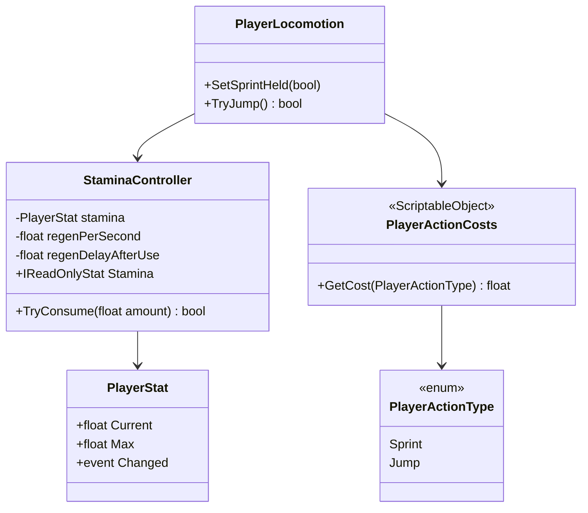
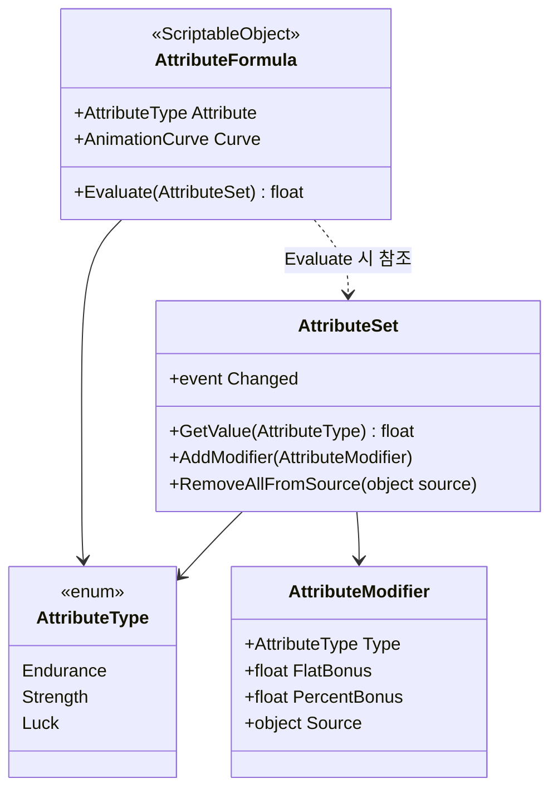

# 플레이어 스태미나 & 기초 스탯

플레이어 전용 자원 두 가지를 설계한다: (1) 달리기/점프 등 행동을 제한하는 **스태미나**, (2) 지구력/힘/행운 등 **기초 스탯**이 게임 전반의 확률·능력치에 영향을 주는 구조. 예정 코드 위치는 `Assets/Scripts/Characters/Player`(`Game.Characters.Player`)와 `Assets/Scripts/Characters/Core`(`Game.Characters`, 속성 관련 타입).

## 설계 원칙

- **스태미나 소모 지점을 하드코딩하지 않는다.** `StaminaController`는 "얼마가 있고 얼마를 쓸 수 있는가"만 알고, "달리기"나 "점프"라는 개념을 전혀 모른다. 새 소모 행동(구르기, 강공격 등)을 추가해도 `StaminaController`는 손댈 필요가 없다.
- **속성(Attribute) → 확률/능력치 변환도 하드코딩하지 않는다.** "행운이 크리티컬에 영향을 준다"는 공식을 전투 코드 안에 박아 넣지 않고, 데이터 애셋(`AttributeFormula`)으로 분리해서 기획자가 코드 없이 커브를 조정하고 새 확률을 추가할 수 있게 한다.
- 이미 있는 `PlayerStat`/`IReadOnlyStat`([character-system.md](character-system.md) 이전에 만든 `Game.Player` 소지 — 허기/수분에 쓰던 것)을 스태미나에도 그대로 재사용해서, 기존 `StatBarUIView`가 손대지 않고 스태미나 바로도 쓰인다(DRY).

## 스태미나



### `StaminaController`

- 내부적으로 `PlayerStat`을 하나 들고 `Current/Max`, `Changed` 이벤트를 그대로 노출한다.
- `TryConsume(float amount)` — 남은 스태미나가 충분하면 차감하고 `true`, 부족하면 `false`(아무 것도 소모하지 않음). 호출자는 이 결과만 보고 행동을 이어갈지 취소할지 결정한다.
- 소모 직후 일정 시간(`regenDelayAfterUse`) 동안은 회복이 멈춘다 — 계속 달리는 동안 조금씩 다시 차오르는 것을 방지.
- `TryConsume`을 호출하는 쪽이 "왜" 소모하는지는 `StaminaController`가 전혀 알 필요가 없다 — 이 컴포넌트는 숫자 계산과 회복 타이머만 책임진다(단일 책임).

### 행동별 비용을 데이터로 분리

```
public enum PlayerActionType { Sprint, Jump }   // 확장 시 여기에 항목만 추가

[CreateAssetMenu]
public class PlayerActionCosts : ScriptableObject
{
    [Serializable]
    public struct Entry
    {
        public PlayerActionType Action;
        public float Cost;
        public bool PerSecond;   // true: 초당 소모(달리기), false: 1회성 소모(점프)
    }

    [SerializeField] private Entry[] costs;
    public float GetCost(PlayerActionType action) { ... }
}
```

- **Sprint**: `PerSecond = true`. 스프린트 입력이 켜져 있는 동안 매 프레임 `TryConsume(cost * Time.deltaTime)`을 호출하고, 실패하는 순간 자동으로 걷기 속도로 되돌린다.
- **Jump**: `PerSecond = false`. 점프 입력이 들어온 순간 `TryConsume(cost)`를 한 번 호출해서 성공할 때만 점프를 실행한다. 실패하면 점프 입력을 무시한다(허탕 피드백은 확장 지점).
- 나중에 "구르기(Dodge)"를 추가하고 싶으면: `PlayerActionType.Dodge` 추가 + `PlayerActionCosts` 애셋에 행 하나 추가. `StaminaController`, `PlayerActionCosts` 클래스 구조 모두 변경 없음(개방-폐쇄 원칙).

### `PlayerLocomotion`

[character-system.md](character-system.md)의 `CharacterMotor`를 플레이어 전용으로 확장한 컨트롤러로, `StaminaController` + `PlayerActionCosts`를 참조해서 위 게이팅을 수행하고 실제 이동/점프 물리를 실행한다. 스태미나 판단과 이동 실행을 한 클래스가 맡되, "얼마가 필요한지"는 데이터에서, "얼마가 남았는지 판단"은 `StaminaController`에서 가져오므로 각 부품은 여전히 하나의 책임만 가진다. Space/Shift는 이 클래스가 직접 읽기 때문에 선택적 `windowManager`(`IsAnyWindowOpen`)로 게이팅한다 — 대화나 창이 열려 있으면 점프·달리기가 막히고 달리기 상태도 풀린다.

## 기초 스탯 (지구력 / 힘 / 행운 …)



### `AttributeType`

`Endurance`(지구력) / `Strength`(힘) / `Luck`(행운)으로 시작하되, enum 항목 추가만으로 새 속성(민첩 등)을 늘릴 수 있게 열어둔다.

### `AttributeSet`

- 속성별 기본값 + 모디파이어(장비/버프 보너스)를 관리한다. 최종 값은 `(기본값 + Σ가산 보너스) * (1 + Σ퍼센트 보너스)`로 계산.
- `AddModifier`/`RemoveAllFromSource(source)` — 예를 들어 힘 반지를 착용하면 `AddModifier(...)`, 해제하면 `RemoveAllFromSource(ringItem)`로 그 반지가 준 보너스만 정확히 제거한다. [inventory-system.md](inventory-system.md)의 장비 착용/해제 이벤트에 연결하는 지점.
- `Changed` 이벤트로 UI(스탯 창)나 다른 시스템에 변경을 알린다.

### `AttributeFormula` — 속성을 확률/능력치로 변환

크리티컬 확률, 희귀 아이템 확률, 소지 무게 한도처럼 "속성 하나 → 게임 수치 하나"로 이어지는 계산을 전부 같은 모양의 애셋으로 정의한다.

```
[CreateAssetMenu]
public class AttributeFormula : ScriptableObject
{
    [SerializeField] private AttributeType attribute;
    [SerializeField] private AnimationCurve curve;  // x = 속성 값, y = 결과 값

    public float Evaluate(AttributeSet attributes) => curve.Evaluate(attributes.GetValue(attribute));
}
```

사용하는 쪽(전투 시스템, 루팅 시스템, 인벤토리 시스템)은 필요한 `AttributeFormula` 애셋을 참조로 들고 있다가 `Evaluate(player.Attributes)`만 호출하면 된다. 예시:

| 사용처 | 속성 | 애셋 예시 |
|---|---|---|
| 전투 크리티컬 확률 | Luck | `CritChance_FromLuck` |
| 희귀 아이템 드롭 확률 | Luck | `RareDropChance_FromLuck` |
| 소지 무게 한도 | Strength | `CarryCapacity_FromStrength` |
| 스태미나 최대치 보너스 | Endurance | `StaminaMaxBonus_FromEndurance` |
| 스태미나 회복 속도 보너스 | Endurance | `StaminaRegen_FromEndurance` |

새로운 "속성이 영향을 주는 확률/능력치"가 필요해지면 코드를 건드리지 않고 `AttributeFormula` 애셋을 하나 추가해 해당 시스템에 연결하기만 하면 된다. 커브 형태(선형/체감/역치 등)도 코드 수정 없이 에디터에서 조정 가능하다.

**스태미나 쪽 연결 지점**: 위 스태미나 섹션의 `StaminaController`는 그 자체로는 `AttributeSet`을 전혀 모른다(단일 책임 유지). Endurance 보너스를 반영하려면 두 가지가 필요하다: (1) 현재 `Game.Player.PlayerStat`([Assets/Scripts/Player/Stats/PlayerStat.cs](../Assets/Scripts/Player/Stats/PlayerStat.cs))은 `Max`가 읽기 전용이라 `SetMax(float)` 같은 메서드를 추가해야 하고, (2) `PlayerController` 조립 시점에 `StaminaMaxBonus_FromEndurance`/`StaminaRegen_FromEndurance`를 평가해서 그 결과를 `StaminaController`에 밀어넣는 얇은 연결 코드(예: `PlayerController`가 `AttributeSet.Changed`를 구독해 재계산 후 반영)가 필요하다. `StaminaController` 내부 로직을 고치는 게 아니라 바깥에서 값을 주입하는 방식이며, 둘 다 아직 구현되지 않았다(아래 스코프 참고).

### `AttributeSet`은 어디에 두나

이번 요청 범위는 플레이어이므로 `PlayerController`가 `AttributeSet`을 보유하지만, 타입 자체는 `Game.Characters`(Player 전용 네임스페이스가 아님)에 둬서 나중에 Companion NPC나 특정 Boss에도 동일한 방식으로 붙일 수 있게 여지를 남긴다 — 예: 보스가 자체 `Luck` 값을 가져서 특정 회피 판정에 쓰이는 식.

## 스코프 밖으로 둔 것 (다음 단계 후보)

- 레벨업/스탯 포인트 분배 UI
- 장비 모디파이어를 실제로 붙였다 떼는 연동 코드(지점만 명시, 구현은 인벤토리 시스템 쪽 후속 과제)
- Endurance/Strength/Luck 외 추가 속성(민첩 등) — enum 추가 외에 별도 설계가 필요 없음을 의도적으로 확인해 둠
- 상태이상(디버프)이 속성에 일시적으로 영향을 주는 경우(모디파이어 구조로 이미 가능하지만 구체 사용처는 후속 과제)
- `AttributeFormula` 결과를 `StaminaController.Max`/회복 속도에 실제로 밀어넣는 연결 코드(현재는 지점만 명시)
