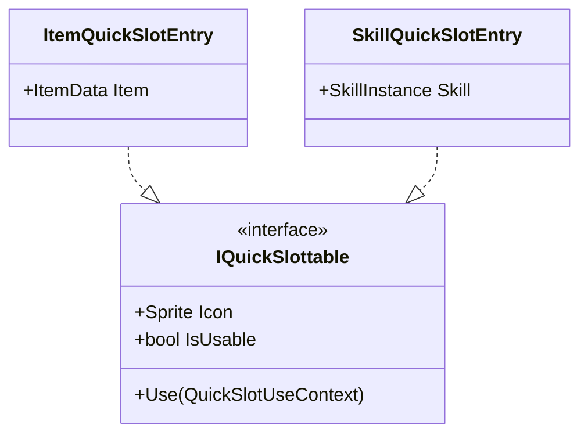
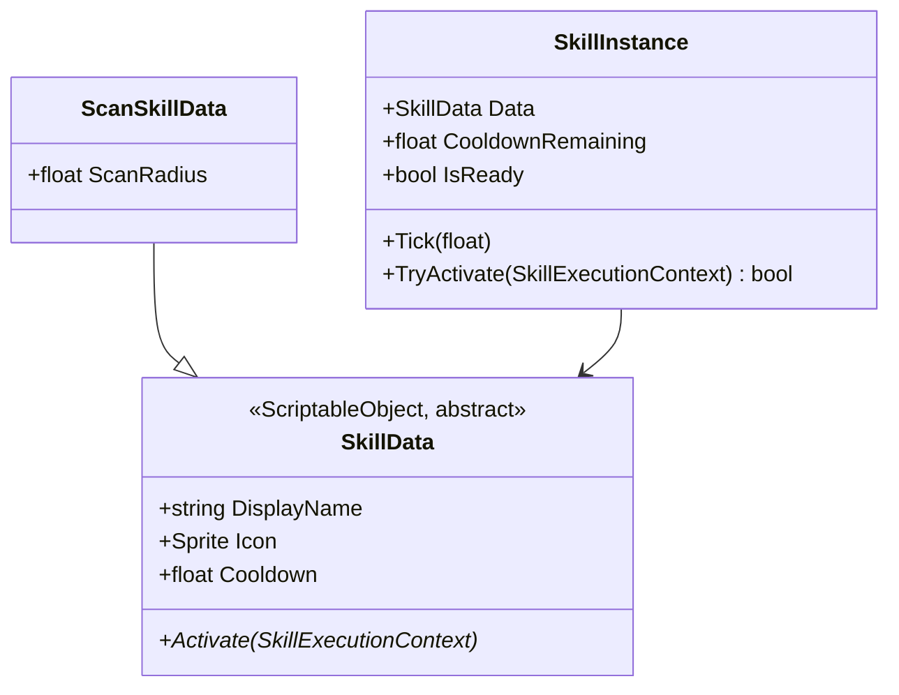
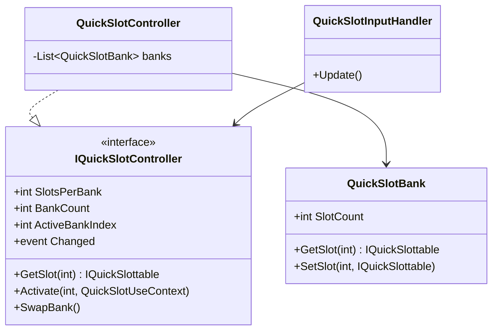

# 퀵슬롯 & 스킬 시스템

퀵슬롯에 아이템뿐 아니라 스킬(예: 근처를 스캔하는 스킬)도 올릴 수 있어야 한다는 요구를 시작으로, "퀵슬롯에 올릴 수 있는 것"을 인터페이스로 뽑아내고, 뱅크(페이지) 전환이 가능한 구조([`~`] 키로 스왑)를 설계한다. 스킬 자체는 [combat-system.md](combat-system.md)의 `IDamageable`처럼 확장 지점만 만들고 세부 내용(쿨다운 수치, 실제 효과 로직)은 이후 과제로 남긴다. 코드는 `Assets/Scripts/QuickSlot`(`Game.QuickSlot`, `Game.QuickSlot.UI`)와 `Assets/Scripts/Skills`(`Game.Skills`)에 구현되어 있다.

**키 배정 변경**: 처음에는 `1`~`9`,`0` 10칸 전체가 뱅크에 속했지만, [weapon-system.md](weapon-system.md)/[design-conflict-review.md](design-conflict-review.md)에서 밝혀진 대로 `1`,`2`,`3`은 무기 로드아웃(주무기/보조무기/근접)이 항상 고정으로 쓰는 키라 퀵슬롯과 충돌했다. **결정**: `1`,`2`,`3`은 무기 전용으로 완전히 분리하고(뱅크 스왑의 영향을 받지 않음), 퀵슬롯 뱅크는 `4`~`9`,`0`(**7칸**)만 쓴다. 화면에는 두 시스템이 한 줄의 핫바처럼 나란히 보이지만(4장 참고), 데이터/입력상으로는 완전히 분리된 두 시스템이다.

## 왜 퀵슬롯을 `IInventory` 재사용에서 분리했나

[item-system.md](item-system.md)에서는 처음에 퀵슬롯을 슬롯 수가 적은 `Inventory`(`IInventory`) 인스턴스로 재사용할 계획이었다. 하지만 퀵슬롯에는

- 아이템(소비/장착)뿐 아니라
- 스킬(쿨다운을 가진, 인벤토리에 존재하지 않는 대상)도

올라가야 한다. `IInventory`는 `ItemData`/`ItemStack`에 강하게 묶여 있어 스킬을 억지로 아이템인 척 넣게 되므로, "퀵슬롯에 놓일 수 있는 것"이라는 더 좁고 공통된 계약을 새로 뽑아냈다 — [combat-system.md](combat-system.md)에서 "피격 가능"을 캐릭터와 분리했던 것과 같은 이유(인터페이스 분리 원칙)다.

## 퀵슬롯에 놓일 수 있는 것 — `IQuickSlottable`

- **`IQuickSlottable`** — `Icon`(표시용), `IsUsable`(쿨다운/조건에 따라 회색 처리), `Use(context)`(실행) 세 가지만 요구한다. 퀵슬롯 UI는 슬롯에 무엇이 들었는지 몰라도 렌더링/클릭 처리를 할 수 있다.
- **`ItemQuickSlotEntry`** — `ItemData`를 감싼다. 아이템별 실제 사용 효과(소비, 즉시 장착 등)는 `Use()` 안의 확장 지점으로 남겨뒀다 — 이번 요청 범위는 "퀵슬롯에 올릴 수 있는 구조"이지 아이템 사용 효과 자체가 아니다.
- **`SkillQuickSlotEntry`** — `SkillInstance`(아래 참고)를 감싸고, `Use()`가 `SkillInstance.TryActivate()`를 호출한다. `IsUsable`은 스킬의 쿨다운 상태를 그대로 반영한다.

새로운 종류(예: 감정 표현, 소모되지 않는 도구)가 필요해지면 `IQuickSlottable` 구현체 하나만 추가하면 되고, 퀵슬롯 컨트롤러/UI는 전혀 손대지 않는다(개방-폐쇄 원칙).

## 스킬 — 확장 가능한 뼈대만 (`Game.Skills`)

- **`SkillData`** — 아이템/Enemy와 같은 `ScriptableObject` 데이터 패턴. 추상 클래스이며 `Activate(SkillExecutionContext)`만 하위 스킬이 구현한다.
- **`SkillInstance`** — `SkillData`(공유 데이터)와 쿨다운 진행 상태(개별 상태)를 짝짓는 런타임 객체 — `ItemStack`이 `ItemData` + 수량을 짝짓는 것과 동일한 패턴이다. `Tick(deltaTime)`으로 쿨다운을 감소시키고, `TryActivate`가 준비 여부를 확인한 뒤 `SkillData.Activate()`를 호출하고 쿨다운을 다시 채운다.
- **`ScanSkillData`** — "근처를 스캔하는 스킬" 예시. `Activate()` 본문은 비워두고 TODO만 남겼다 — 요청대로 상세 동작(탐지 반경 처리, 하이라이트 연출)은 나중에 채운다. 이 클래스의 존재 이유는 "새 스킬을 추가하려면 `SkillData`를 상속해서 `Activate`만 채우면 된다"는 확장 지점이 실제로 동작함을 보여주는 것.
- 쿨다운 틱은 스킬 소유자가 직접 관리하지 않고 `QuickSlotController.Update()`가 자신이 들고 있는 모든 뱅크의 `SkillQuickSlotEntry`를 순회하며 호출한다 — 활성 뱅크가 아니어도 쿨다운은 계속 돈다(뱅크를 스왑해도 스킬이 갑자기 다시 꽉 찬 것처럼 보이지 않도록).

## 7슬롯 뱅크 & 뱅크 스왑 (`Game.QuickSlot`)

- **`QuickSlotBank`** — 슬롯 7개(`slotsPerBank`)짜리 배열 하나. "페이지" 한 장에 해당.
- **`QuickSlotController`** — 뱅크를 `bankCount`(기본 2)개 들고 있고, 그중 하나만 `ActiveBankIndex`로 활성화된다. `GetSlot`/`SetSlot`/`Activate`는 항상 **활성 뱅크** 기준으로 동작한다. `SwapBank()`는 다음 뱅크로 순환 이동(뱅크가 3개 이상이어도 그대로 동작). 기본값(뱅크 2개 × 7칸 = 14칸)이며, 뱅크를 하나 더 늘리면(인스펙터 값만 변경) 21칸으로 확장된다 — 코드 변경 없음.
- **`QuickSlotInputHandler`** — 숫자키 `4`~`9`, `0`을 인덱스 0~6으로, `` ` `` (backquote) 키를 `SwapBank()`로 매핑한다. `1`,`2`,`3`은 의도적으로 이 목록에서 빠져 있다(아래 4장). 입력 매핑을 컨트롤러와 분리해서 나중에 키 리바인딩을 붙여도 `QuickSlotController`는 그대로 둘 수 있다. Unity의 새 Input System 패키지(`UnityEngine.InputSystem`)를 사용하므로, 프로젝트 Player Settings의 Active Input Handling이 "Input System Package" 또는 "Both"로 설정되어 있어야 한다.

## 통합 핫바 UI — 무기(1/2/3, 고정) + 퀵슬롯(4~0, 뱅크)

퀵슬롯은 전투 중 언제든 숫자키로 눌러야 하므로, [inventory-system.md](inventory-system.md)의 `InventoryScreenController`가 여닫는 전체화면 인벤토리 오버레이 **안이 아니라**, 항상 보이는 HUD 캔버스에 둔다. 화면 중앙 하단에 무기 슬롯 3칸(왼쪽, 고정) + 퀵슬롯 7칸(오른쪽, 뱅크)을 하나의 핫바처럼 나란히 배치한다.

- **`QuickSlotUIView`** — 슬롯 1칸: 아이콘, 사용 불가 시(쿨다운 등) 반투명 처리, 클릭 이벤트. 키 힌트(`4`~`0`)도 같이 표시.
- **`QuickSlotBarUIView`** — `IQuickSlotController` 하나를 7개의 `QuickSlotUIView`에 바인딩. `Changed` 이벤트(슬롯 변경, 뱅크 스왑, 사용)마다 전체를 다시 그린다 — 뱅크가 스왑되면 같은 7개의 뷰가 새 뱅크 내용으로 다시 채워질 뿐, 뷰 자체를 새로 만들지 않는다.
- 왼쪽의 무기 슬롯 3칸(`WeaponSlotUIView`/`WeaponLoadoutBarUIView`)은 [weapon-system.md](weapon-system.md)에서 다룬다 — 이 문서의 `QuickSlotBarUIView`와는 완전히 다른 데이터 소스(`WeaponLoadout`)를 바인딩하는 별개의 컴포넌트이며, 화면에서만 나란히 붙어 보인다.
- 이 핫바 전체(무기 3 + 퀵슬롯 7)는 인벤토리 화면이 열리면 **한 줄에서 두 줄로 레이아웃만 바뀌고 계속 보인다** — [hud-system.md](hud-system.md)의 `HotbarLayoutController` 참고. 나머지 HUD(체력/방어구/무기 정보, 나침반, 미니맵)는 전체화면 창이 열리면 통째로 숨는 것과 다른 예외적인 취급이다.

## 스코프 밖으로 둔 것 (다음 단계 후보)

- 아이템/스킬을 인벤토리 그리드에서 퀵슬롯으로 드래그해 등록하는 흐름(현재 `SetSlot`은 코드 호출만 가능)
- 스킬별 상세 파라미터/이펙트/애니메이션 연동(`ScanSkillData.Activate` 등 각 스킬 본문)
- 아이템 퀵슬롯의 실제 사용 효과(`ItemQuickSlotEntry.Use` 본문)
- 쿨다운 UI(라디얼 필/숫자 카운트다운) — 지금은 사용 가능 여부만 반투명으로 표시
