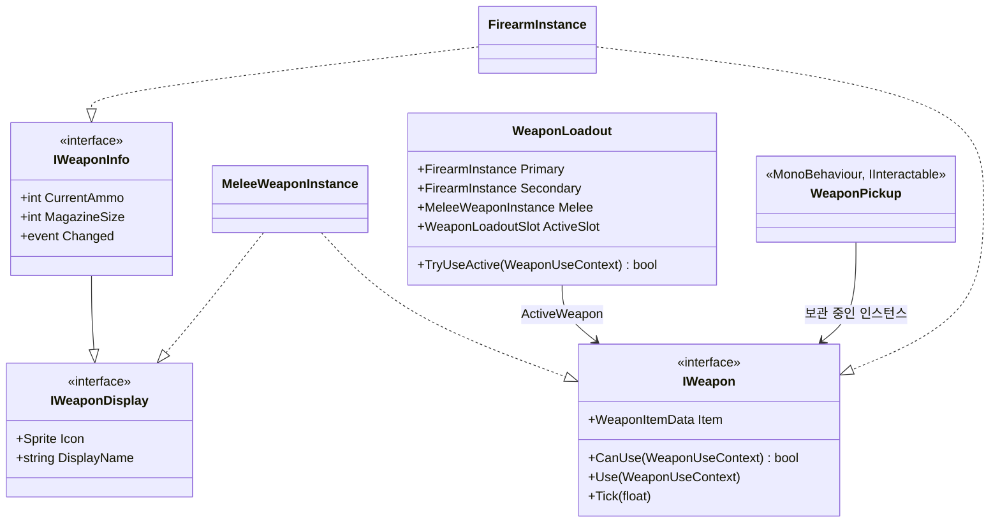
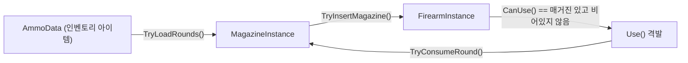

# 무기 시스템 — 총기 / 근접무기 / 파츠 모딩 / 탄약

플레이어(그리고 동일한 구조를 쓰는 Enemy)가 총기 2정 + 근접무기 1개를 장착할 수 있고, 총기는 파츠를 갈아 끼워 모딩할 수 있으며, 탄약을 탄창에 삽탄해야만 격발이 가능한 구조를 설계·구현한다. 코드 위치는 `Assets/Scripts/Weapons`(`Game.Weapons`). 무기가 실제로 데미지를 주려면 피격 대상이 필요하므로, 그동안 문서로만 있던 [combat-system.md](combat-system.md)의 `IDamageable`/`HealthComponent`도 이번에 `Assets/Scripts/Combat`(`Game.Combat`)에 구현했다.

## 설계 원칙 (객체지향)

- **다형성으로 총기/근접무기를 통일한다.** `IWeapon` 하나를 `FirearmInstance`(총기)와 `MeleeWeaponInstance`(근접)가 각자의 방식으로 구현한다. 장착 슬롯, 입력 처리 코드는 `IWeapon.Use()`만 호출할 뿐 어떤 무기인지 모른다 — if/switch로 "총기면 이렇게, 근접이면 저렇게" 분기하지 않는다.
- **인터페이스 분리로 "표시 가능"과 "탄약 있음"을 나눈다.** 아이콘/이름만 필요한 쪽은 `IWeaponDisplay`, 탄약까지 필요한 쪽은 이를 확장하는 `IWeaponInfo`를 쓴다. 근접무기는 탄약이 없으므로 `IWeaponDisplay`만 구현하고, `IWeaponInfo`를 억지로 구현해 가짜 0을 채우지 않는다(인터페이스 분리 원칙).
- **파츠 모디파이어는 속성 시스템과 같은 공식을 쓴다.** [player-attributes.md](player-attributes.md)의 `AttributeSet`이 "기본값 + Σ가산 후 Σ퍼센트"로 최종 능력치를 계산했듯, `FirearmInstance.GetEffectiveStat`도 같은 공식으로 부착된 파츠들의 보너스를 합산한다 — 같은 문제(기본값 + 여러 보너스 합성)를 다른 도메인에서도 같은 패턴으로 푼다.
- **런타임 상태와 공유 데이터를 분리한다.** `FirearmData`(애셋, 모두가 공유)와 `FirearmInstance`(런타임, 개별 장착 파츠·탄창 보유)를 나누는 것은 이 프로젝트 전반의 `ItemData`/`ItemStack`, `SkillData`/`SkillInstance` 패턴을 그대로 따른 것이다. `MagazineData`/`MagazineInstance`도 동일하다 — 탄창 두 개가 같은 `MagazineData`(같은 30발들이 탄창 모델)를 쓰더라도 각자 다른 탄약/잔탄을 가질 수 있어야 하기 때문이다.
- **누가 들고 있는지 모른다.** `WeaponLoadout`, `FirearmInstance`, `WeaponPickup` 어디에도 "Player"라는 이름이 등장하지 않는다 — `GameObject Wielder`로만 다룬다. 그래서 Enemy가 정확히 같은 컴포넌트로 무기를 줍고 쏠 수 있다.

## 전체 구조



### `IWeapon` / `WeaponUseContext`

```
WeaponItemData Item { get; }
bool CanUse(WeaponUseContext context);
void Use(WeaponUseContext context);
void Tick(float deltaTime);
```

`WeaponUseContext`는 `{ GameObject Wielder; Vector3 AimOrigin; Vector3 AimDirection; }` — [quickslot-and-skills.md](quickslot-and-skills.md)의 `QuickSlotUseContext`, [interaction-system.md](interaction-system.md)의 상호작용 계약과 같은 자리에 있는, "누가·어디서·어느 방향으로"만 담은 최소 컨텍스트다. 카메라를 직접 참조하지 않으므로 [hud-system.md](hud-system.md)에서 이미 강조한 "카메라 시점과 무관"한 설계 원칙과도 맞는다 — 1인칭이든 3인칭이든 조준 원점/방향만 넘기면 된다.

`Tick`이 인터페이스에 있는 이유: 총기와 근접무기 둘 다 쿨다운(연사 간격/공격 속도)이 필요해서, `WeaponLoadout`이 매 프레임 세 무기 모두를 동일하게 `Tick`할 수 있게 했다 — 활성 무기가 아니어도 쿨다운은 계속 돈다([quickslot-and-skills.md](quickslot-and-skills.md)에서 비활성 뱅크의 스킬도 쿨다운이 계속 도는 것과 같은 이유).

### 장착 — `WeaponLoadout` (총기 2 + 근접 1)

```
FirearmInstance Primary, Secondary;
MeleeWeaponInstance Melee;
WeaponLoadoutSlot ActiveSlot;   // Primary / Secondary / Melee

EquipFirearm(firearm, slot) -> 이전 총기 반환
EquipMelee(melee) -> 이전 근접무기 반환
SwitchTo(slot)
TryUseActive(context)
```

- 총기 슬롯이 `Primary`/`Secondary` 정확히 두 개로 고정되어 있다(타입 시스템으로 강제 — `EquipFirearm`에 `Melee`를 넘기면 예외). 근접무기는 별도 필드라 총기 두 자리와 경합하지 않는다.
- `ActiveWeapon`은 `IWeapon` 하나만 반환한다 — 입력 처리 쪽(`TryUseActive`)은 지금 활성 무기가 총인지 칼인지 몰라도 된다.
- `EquipFirearm`/`EquipMelee`가 이전 무기를 반환하는 것은 [inventory-system.md](inventory-system.md)의 `ContainerEquipmentController.Equip`이 밀려난 아이템을 반환하던 것과 같은 패턴 — "장착 해제된 것을 어떻게 할지"는 호출자 책임으로 남긴다.

### 무기 선택 키 — `1`/`2`/`3` 고정 (퀵슬롯과의 충돌 해결)

[design-conflict-review.md](design-conflict-review.md) 1번 항목("퀵슬롯의 숫자키와 무기 슬롯 선택 키가 겹친다")에 대한 결정: **`1`/`2`/`3`은 각각 Primary/Secondary/Melee에 영구히 고정된 키이며, 퀵슬롯 뱅크 스왑(`` ` ``)의 영향을 전혀 받지 않는다.** 퀵슬롯 쪽은 [quickslot-and-skills.md](quickslot-and-skills.md)에서 뱅크를 `4`~`9`,`0`(7칸)으로 줄여 이 세 키를 완전히 비웠다 — 무기와 퀵슬롯은 이제 물리적으로 겹칠 수 없는 별개의 키 영역을 쓴다.

```
WeaponLoadoutInputHandler   // Key.Digit1/2/3 → WeaponLoadout.SwitchTo(Primary/Secondary/Melee)
```

- `WeaponLoadoutInputHandler`는 [`QuickSlotInputHandler`](../Assets/Scripts/QuickSlot/QuickSlotInputHandler.cs)와 나란히 있지만 서로의 존재를 모른다 — 각자 자기 키 영역(1-3 vs 4-9,0)만 읽는다. 입력 소스가 다르니 코드로도 완전히 분리해, 나중에 한쪽 키 배치를 바꿔도 다른 쪽에 영향이 없다.
- UI 쪽도 대칭이다: `WeaponSlotUIView`/`WeaponLoadoutBarUIView`(`Game.Weapons.UI`)가 무기 3칸을, [quickslot-and-skills.md](quickslot-and-skills.md)의 `QuickSlotBarUIView`가 나머지 7칸을 그린다. 화면에서는 한 줄의 핫바처럼 나란히 붙어 보이지만(레이아웃만 [hud-system.md](hud-system.md)의 `HotbarLayoutController`가 관리), 데이터 바인딩은 각자 `WeaponLoadout`/`IQuickSlotController`로 독립적이다.

### 파츠 모딩 — `WeaponPartData` / `FirearmInstance`

```
enum WeaponPartSlot { Barrel, Sight, Stock, Muzzle, Grip, Magazine }
enum WeaponStatType { Damage, FireRate, Accuracy, ReloadSpeed, RecoilControl }

class WeaponStatModifier { WeaponStatType Stat; float FlatBonus; float PercentBonus; }

abstract class WeaponPartData : ItemData { WeaponPartSlot Slot; WeaponStatModifier[] Modifiers; }
class GenericWeaponPartData : WeaponPartData { }   // 배럴/조준경/개머리판/소염기/그립
class MagazineData : WeaponPartData { int Capacity; AmmoType CompatibleAmmoType; }  // Magazine 슬롯 전용
```

- **파츠는 그냥 아이템이다.** `WeaponPartData : ItemData`라서 [inventory-system.md](inventory-system.md)의 그리드 인벤토리에 그대로 들어간다 — 파츠 전용 저장 공간을 새로 만들 필요가 없다. "파츠를 분리해 모딩 가능"이라는 요구를 인벤토리 시스템 재사용만으로 만족한다.
- **탄창도 파츠다.** `MagazineData`가 `WeaponPartData`를 상속해 `Magazine` 슬롯을 차지한다 — 탄창 교체(장전)도 결국 "파츠 하나 갈아 끼우기"와 같은 매커니즘이라는 것을 그대로 반영했다.
- `FirearmInstance.AttachPart(slot, part)` / `DetachPart(slot)` — 슬롯당 파츠 하나, 새 파츠를 끼우면 이전 파츠를 반환한다(위와 같은 "밀려난 것 반환" 패턴).
- `GetEffectiveStat(stat)` — `FirearmData`의 기본값에 부착된 모든 파츠의 `Modifiers` 중 해당 스탯에 해당하는 것만 합산해 `(기본값 + Σ가산) * (1 + Σ퍼센트)`로 계산한다. 새 파츠 종류가 필요하면 `GenericWeaponPartData` 애셋을 하나 더 만들면 되고, `FirearmInstance`/`WeaponStatType` 코드는 건드리지 않는다(개방-폐쇄 원칙).

### 탄약 → 삽탄 → 격발 파이프라인



1. **삽탄**: `MagazineInstance.TryLoadRounds(AmmoData ammo, int count)` — 탄약 타입이 탄창의 `CompatibleAmmoType`과 다르면 아무 것도 넣지 않고 전량을 "안 들어간 수량"으로 반환한다(`ItemStack.Add`/`GridInventory.TryAddItem`과 동일한 "leftover 반환" 관용구). 이미 다른 탄약이 들어 있으면 역시 거부한다 — 한 탄창에 두 종류의 탄약이 섞이지 않는다.
2. **장전(탄창 삽입)**: `FirearmInstance.TryInsertMagazine(MagazineInstance magazine, out MagazineInstance previous)` — 탄창의 `CompatibleAmmoType`이 총기의 `CompatibleAmmoType`과 다르면 `false`를 반환하고 아무 것도 바꾸지 않는다. 성공하면 이전에 끼워져 있던 탄창(잔탄 포함)을 `previous`로 돌려준다 — 실제 재장전처럼 반쯤 남은 탄창을 다시 주머니에 넣을 수 있게.
3. **격발 가능 여부**: `CanUse(context)`가 `LoadedMagazine != null && !LoadedMagazine.IsEmpty`를 확인한다 — **탄창이 끼워져 있고, 그 탄창에 탄약이 삽탄되어 있어야만** 격발이 가능하다는 요구를 그대로 코드로 표현한 부분이다.
4. **격발**: `Use(context)`가 탄창에서 한 발을 소모(`TryConsumeRound`)하고, 연사 쿨다운을 재설정한 뒤, `Physics.Raycast`로 맞은 대상이 `IDamageable`이면 `TakeDamage`를 호출한다.

### 근접무기 — `MeleeWeaponInstance`

총기와 달리 파츠도 탄약도 없다. 조준 방향 앞의 반경 안에서 `Physics.OverlapSphere`로 `IDamageable`을 찾아 즉시 데미지를 준다. 공격 속도(`AttackRate`)만큼의 쿨다운을 가진다 — `IWeapon`의 `Tick`/`CanUse` 계약은 총기와 동일하게 따르지만 내부 구현은 훨씬 단순하다(불필요한 파츠/탄약 개념을 강제로 갖다 붙이지 않음 — KISS).

## 픽업 — 적도 집어서 즉시 사용 가능


일반 아이템은 `WorldItem`(`ItemData` + 수량)으로 충분하지만, 무기는 **부착된 파츠와 탄창의 잔탄 상태를 그대로 보존**해야 픽업의 의미가 있다(모딩해둔 총, 탄이 half 남은 탄창인 채로). 그래서 전용 `WeaponPickup : MonoBehaviour, IInteractable`을 만들었다 — [interaction-system.md](interaction-system.md)의 `IInteractable`을 그대로 재사용한 세 번째 사례(기존 `WorldItem`/`DoorInteractable`/`DialogueInteractable`에 이어)다.

- `CanInteract(interactor)`는 `interactor.GetComponent<WeaponLoadout>() != null`만 확인한다 — **플레이어인지 Enemy인지 전혀 구분하지 않는다.** `WeaponLoadout`을 붙인 대상이면 누구든 주워서 쓸 수 있다는 요구가 이 한 줄로 만족된다.
- `Interact()`가 장착시키면서 밀려난 무기가 있으면(`EquipFirearm`/`EquipMelee`의 반환값), 그 자리에 `dropPrefab`으로 새 `WeaponPickup`을 만들어 자동으로 떨어뜨린다 — 무기를 교체했다고 기존에 들고 있던 무기가 사라지지 않는다.
  - **변경 예정**: `dropPrefab`을 직접 `Instantiate`하는 대신 [world-item-factory.md](world-item-factory.md)의 `IWorldItemFactory`로 떨어뜨리고 `dropPrefab` 필드는 삭제한다(무기 쪽 `WeaponWorldSpawner`가 `WeaponPickup` 생성을 맡음). 아래 "사망한 소지자 → 드롭" 다이어그램은 아직 코드가 없다.

## 확장 시나리오

| 하고 싶은 것 | 필요한 작업 |
|---|---|
| 새 총기 모델 추가 | `FirearmData` 애셋 추가(수치만 다름) |
| 새 파츠 종류 추가 | `GenericWeaponPartData` 애셋 추가 + `WeaponStatModifier` 설정. 코드 변경 없음 |
| 새 탄약 규격 추가 | `AmmoType`에 항목 추가 + 해당 탄약을 쓰는 `AmmoData`/`MagazineData`/`FirearmData` 애셋 구성 |
| 새 무기 종류(활, 투척 무기 등) 추가 | `IWeapon`(필요하면 `IWeaponDisplay`/`IWeaponInfo`도) 구현 클래스 하나 추가. `WeaponLoadout`은 손댈 필요 없음(단, 새 장착 슬롯이 필요하면 `WeaponLoadoutSlot`에 항목 추가는 필요) |
| Enemy가 특정 무기를 들고 스폰 | Enemy 프리팹에 `WeaponLoadout` 부착 + 스폰 시 `EquipFirearm`/`EquipMelee` 호출. `WeaponPickup`/`FirearmInstance` 등 기존 코드 변경 없음 |
| HUD에 탄약 표시 | [hud-system.md](hud-system.md)의 `WeaponInfoUIView`가 `WeaponLoadout.ActiveWeapon as IWeaponInfo`를 바인딩(근접무기면 `null`이라 자동으로 숨겨짐) |

## 스코프 밖으로 둔 것 (다음 단계 후보)

- 실제 재장전 애니메이션/입력 흐름(현재는 `TryInsertMagazine` API까지만)
- 정확도(`Accuracy`)/반동(`RecoilControl`) 스탯이 실제 탄착점 산포에 반영되는 계산(현재는 값만 존재)
- 버스트/연사(`FireMode.Burst`/`Auto`) 트리거 홀드 처리(현재는 발사 간격 쿨다운만 게이팅, 트리거를 누르고 있는 동안의 반복 발사 로직은 후속 과제)
- 파츠를 실제로 장착/분리하는 UI(모딩 화면) — 이번 설계는 데이터/런타임 모델까지만
- 방어구가 데미지를 흡수하는 계산 순서([combat-system.md](combat-system.md)/[hud-system.md](hud-system.md)에서 이미 스코프 밖으로 명시된 것과 동일)
