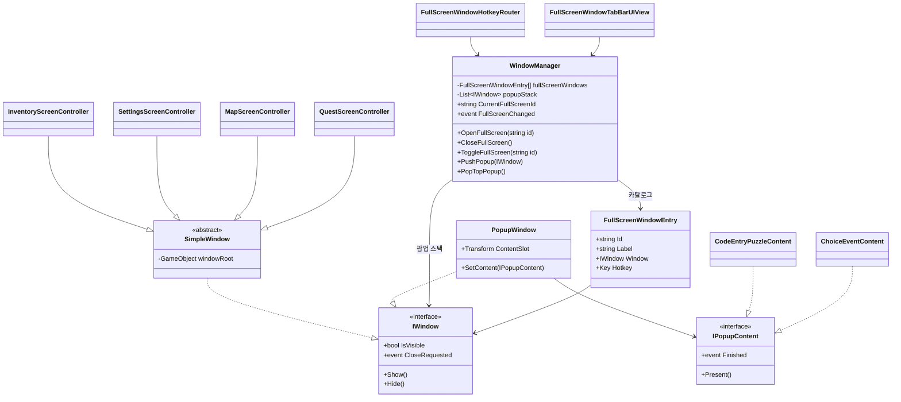

# 창(Window) 시스템 — 전체화면 창 & 팝업

인벤토리, 설정, 맵, 임무 확인 같은 "전체화면 창"과 간단한 퍼즐/이벤트를 띄우는 "팝업 창"을 하나의 프레임워크로 관리한다. 코드 위치는 `Assets/Scripts/UI/Windows`(`Game.UI.Windows`), 팝업 콘텐츠 예시는 `Assets/Scripts/UI/Windows/Popups`(`Game.UI.Windows.Popups`).

## 이전 설계에서 무엇이 바뀌었나

[inventory-system.md](inventory-system.md)의 `InventoryScreenController`는 원래 자기 화면을 열고/닫는 것과 동시에 배경 가림(`IBackgroundObscurer`)까지 직접 제어했다. "설정 창"이 추가되면서 "인벤토리와 설정이 동시에 열리면 안 된다(전체화면은 하나만)"는 요구, 그리고 "팝업은 여러 개 겹쳐 쌓일 수 있다"는 요구가 생겨 그 배타 처리/가림 처리를 `WindowManager` 하나로 모았고, 개별 창은 "보이기/숨기기"만 아는 얇은 클래스로 축소했다 — `InventoryScreenController`는 `SimpleWindow`를 상속하기만 하는 빈 클래스다.

여기서 한 번 더 바뀐 부분: 처음에는 전체화면 창마다 `FullScreenWindowHotkey` 컴포넌트를 하나씩 씬에 배치해 "이 키 = 이 창"으로 직접 연결했다. 그런데 "전체 화면의 종류를 계속 늘릴 수 있어야 한다(맵, 임무 확인 추가)"는 요구가 들어오면서, 창이 늘어날 때마다 씬에 컴포넌트를 추가하는 방식보다 **"종류" 자체를 하나의 목록(카탈로그)으로 등록**하는 편이 실제로 확장 가능한 구조다 — 새 창을 추가할 때 손댈 코드가 없다는 것과 "새 창을 추가할 때 반복 작업이 한 곳(카탈로그에 항목 추가)으로 끝난다"는 것은 다른 수준의 확장성이기 때문이다. 그래서 `FullScreenWindowHotkey`는 폐기하고 `WindowManager`가 `FullScreenWindowEntry[]` 카탈로그(`id`, 표시 이름, 창 참조, 단축키)를 직접 들고, 이 카탈로그 하나로 단축키 라우팅과 탭 버튼 UI를 둘 다 구동한다.

## 설계 원칙

- **창은 자기 자신이 무엇과 배타적인지, 언제 가려지는지 모른다.** `IWindow`는 `Show`/`Hide`/`IsVisible`/`CloseRequested`만 요구한다. "동시에 하나만"(전체화면)이나 "쌓인다"(팝업) 같은 정책은 전부 `WindowManager`에 있다.
- **닫힘 요청은 이벤트로, 실제 처리는 매니저가.** 창은 닫기 버튼을 누르면 스스로를 `Hide()`하지 않고 `CloseRequested`만 올린다. `WindowManager`가 이걸 받아서 배타 상태/가림 상태까지 함께 정리한다 — 창이 직접 닫히면 매니저가 그 사실을 모르게 된다.
- **팝업 내용물(퍼즐/이벤트)과 팝업 틀(배경, 닫기 버튼)을 분리한다.** `PopupWindow`는 틀만 담당하고, 내용은 `IPopupContent` 구현체로 갈아 끼운다 — 새 퍼즐/이벤트 종류를 추가해도 `PopupWindow`, `WindowManager`는 전혀 바뀌지 않는다(개방-폐쇄 원칙). [combat-system.md](combat-system.md)의 `IDamageable`, [interaction-system.md](interaction-system.md)의 `IInteractable`과 같은 결의 설계다.

## 전체 구조



### `IWindow` / `SimpleWindow`

```
bool IsVisible { get; }
event Action CloseRequested;
void Show();
void Hide();
```

`SimpleWindow`는 루트 `GameObject` 하나를 켜고 끄는 최소 구현이다. `InventoryScreenController`, `SettingsScreenController`, `MapScreenController`, `QuestScreenController`는 전부 여기서 상속만 받는 빈 클래스 — 각 화면의 실제 콘텐츠(설정 탭, 지도 렌더링, 임무 목록)는 후속 과제이고, 이 시점에는 "전체화면 창이 네 개 존재하고 서로 배타적으로 동작한다"는 구조만 증명하면 된다.

### 전체화면의 "종류"를 확장 가능하게 만들기 — `FullScreenWindowEntry` 카탈로그

```
string Id;          // "inventory", "settings", "map", "quest" 등 식별자
string Label;        // 탭 버튼에 표시할 이름
IWindow Window;      // 실제 SimpleWindow 인스턴스
Key Hotkey;          // 이 창을 토글할 단축키 (Key.None이면 단축키 없음)
```

`WindowManager`가 이 항목들의 배열(인스펙터에서 설정)을 받아 `id → IWindow` 딕셔너리로 구성한다. **전체화면의 "종류"는 코드가 아니라 이 배열의 데이터다** — 새 화면을 추가하는 절차는 항상 다음 두 가지뿐이다: (1) `SimpleWindow`를 상속하는 빈 클래스(또는 콘텐츠가 있는 서브클래스) 작성 (2) `WindowManager`의 배열에 `{Id, Label, Window, Hotkey}` 한 줄 추가. `WindowManager`, `FullScreenWindowHotkeyRouter`, `FullScreenWindowTabBarUIView` 세 클래스 중 무엇도 "인벤토리"나 "맵" 같은 구체적인 이름을 알지 못한다(개방-폐쇄 원칙) — 맵과 임무 확인 화면도 이 카탈로그에 두 줄 추가하는 것만으로 들어왔다.

### `WindowManager` — 배타(전체화면) + 스택(팝업) + 가림을 한 곳에서

- **전체화면**: `OpenFullScreen(id)`가 호출되면 기존에 열려 있던 전체화면 창을 먼저 `CloseFullScreen()`으로 닫은 뒤 카탈로그에서 찾은 창을 연다 — 인벤토리를 보다가 설정을 열면 인벤토리가 자동으로 닫힌다. `ToggleFullScreen(id)`는 같은 id면 닫고 아니면 연다 — 단축키 하나로 열고 닫기를 반복하는 일반적인 UX에 맞춘 것. `CurrentFullScreenId`와 `FullScreenChanged` 이벤트로 "지금 뭐가 열려 있는지"를 외부(탭 바 UI 등)에 알린다.
- **팝업**: `PushPopup(window)`로 스택에 쌓고 `PopTopPopup()`으로 맨 위부터 닫는다. **가정: 항상 맨 위 팝업만 조작 가능하다**(표준 모달 스택 UX). 그래서 팝업의 `CloseRequested`는 항상 "현재 맨 위를 닫아라"로 처리하면 충분하고, 어떤 팝업 인스턴스가 요청했는지 따로 추적하지 않는다 — 이 가정이 깨지는 경우(예: 비모달 팝업)가 생기면 재검토가 필요하다. 팝업은 전체화면과 달리 실행 중에 동적으로 생성/파괴되므로 고정된 카탈로그로 관리하지 않는다.
- **가림**: 전체화면 창이 하나라도 열려 있거나 팝업 스택이 비어있지 않으면 `IBackgroundObscurer`를 켠다. 개별 창은 가림 처리를 전혀 모른다.

### `FullScreenWindowHotkeyRouter` / `FullScreenWindowTabBarUIView`

- `FullScreenWindowHotkeyRouter` — 매 프레임 카탈로그를 순회하며 `Hotkey`가 눌렸는지 확인하고 `windowManager.ToggleFullScreen(entry.Id)`를 호출한다. 창마다 별도 컴포넌트를 씬에 두던 이전 방식(`FullScreenWindowHotkey`)을 대체 — 이제 단축키를 바꾸거나 추가하려면 카탈로그 데이터만 고치면 된다. [quickslot-and-skills.md](quickslot-and-skills.md)의 `QuickSlotInputHandler`, [interaction-system.md](interaction-system.md)의 `PlayerInteractionController`와 같은 자리(입력을 로직에서 분리)에 있다.
- `FullScreenWindowTabBarUIView` — 카탈로그 항목 수만큼 탭 버튼(`FullScreenWindowTabButtonUIView`)을 생성하고, 클릭 시 `windowManager.ToggleFullScreen(entry.Id)`를 호출한다. `FullScreenChanged` 이벤트를 구독해 `CurrentFullScreenId`와 일치하는 탭만 선택 표시로 갱신한다. 메뉴에 "맵" 탭이 보이길 원하면 카탈로그에 항목을 추가하는 것으로 끝난다 — 이 뷰는 인벤토리/설정/맵을 이름으로 구분하지 않는다.

## 팝업 — 퍼즐/이벤트를 위한 확장 지점

### `IPopupContent`

```
void Present();          // 팝업이 보이기 시작할 때 초기화(버튼 리스너 연결 등)
event Action Finished;   // 퍼즐 정답, 이벤트 선택 완료 등 — 이 이벤트 하나로 팝업이 닫힌다
```

### `PopupWindow`

틀(배경, 닫기 버튼, `ContentSlot`)만 가진 셸. `SetContent(IPopupContent)`로 내용물을 연결하면 `content.Finished`를 자신의 `CloseRequested`로 그대로 전달한다 — `WindowManager`는 `PopupWindow`만 알고, 그 안의 퍼즐/이벤트가 무엇인지는 끝까지 모른다.

### `PopupLauncher`

```
PopupWindow Launch<TContent>(TContent contentPrefab) where TContent : MonoBehaviour, IPopupContent
```

팝업 셸 인스턴스화 → 콘텐츠 프리팹 인스턴스화 → `SetContent` → `WindowManager.PushPopup`까지 한 번에 처리하는 진입점. 제네릭 제약이 `IPopupContent`뿐이라 새 퍼즐/이벤트 프리팹을 만들 때 `PopupLauncher` 코드는 그대로 두고 호출부만 다른 프리팹을 넘기면 된다.

### 예시 구현 — "간단한 퍼즐"과 "이벤트"가 같은 셸에서 동작

| 구현체 | 종류 | `Finished` 발생 조건 |
|---|---|---|
| `CodeEntryPuzzleContent` | 퍼즐 | 입력한 코드가 정답과 일치할 때 |
| `ChoiceEventContent` | 이벤트 | 선택지 버튼 중 하나를 고를 때(`SelectedChoice`로 결과 조회) |

두 콘텐츠 모두 `PopupWindow`/`WindowManager`를 전혀 참조하지 않는다. 이후 "슬라이딩 타일 퍼즐", "타이머가 있는 이벤트" 등을 추가해도 이 표에 행을 하나 추가하는 것과 같은 작업이 된다.

## 스코프 밖으로 둔 것 (다음 단계 후보)

- 설정/맵/임무 확인 창의 실제 콘텐츠(그래픽·사운드 탭, 지도 렌더링, 임무 목록)
- 팝업이 비모달(뒤 화면과 동시에 조작 가능)이어야 하는 경우의 스택 정책 재검토
- 팝업/전체화면 전환 애니메이션(페이드/슬라이드)
- Escape 키로 현재 창(팝업 우선, 없으면 전체화면) 닫기 — 지금은 각 창의 닫기 버튼/`FullScreenWindowHotkeyRouter`만 존재
- 실제 블러 렌더 피처(여전히 `DarkenOverlayObscurer` 자리표시자 사용 중)
- 카탈로그 항목의 잠금 상태(레벨 도달 전에는 "맵" 탭이 비활성화되는 등) — 지금은 등록된 항목이 항상 열 수 있다고 가정
