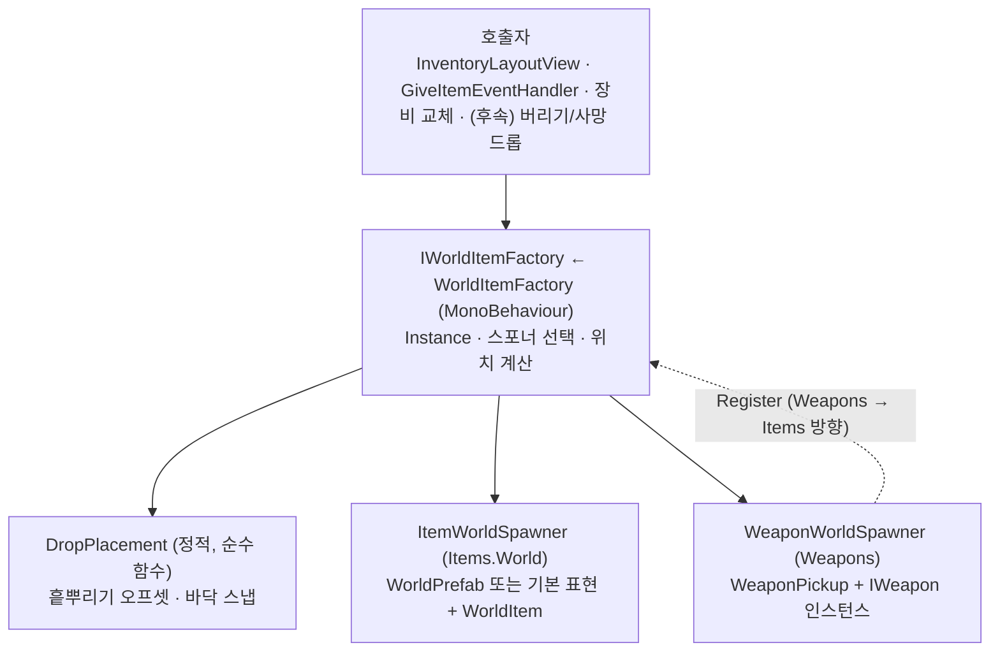

# 월드 아이템 팩토리 (설계 — 미구현)

아이템을 월드 오브젝트로 만드는 경로를 한곳으로 모으는 설계. 상태: **설계만 완료, 코드는 아직 없다.** 다른 문서·코드와의 충돌 검토 결과는 마지막 절과 [design-conflict-review.md](design-conflict-review.md) #11에 있다.

## 1. 현황과 문제

| 경로 | 위치 | 하는 일 |
|---|---|---|
| 일반 아이템 | `WorldItemSpawner`(정적) | `ItemData.WorldPrefab`을 `Instantiate` → `WorldItem.SetStack` |
| 무기 인스턴스 | `WeaponPickup.dropPrefab` | 교체돼 밀려난 무기를 `Instantiate` → `Initialize(IWeapon)` |
| 투척물 | `ThrowableItemData.OnUse` | `projectilePrefab`을 직접 `Instantiate` (줍는 물건이 아니라 발사체) |

- 진입점이 하나가 아니라서 드롭 정책(위치, 프리팹 없을 때, 이펙트)을 넣을 자리가 없다.
- `WorldPrefab`이 비어 있는 아이템은 경고만 남고 **월드에 아무것도 안 생긴다** → 장비 교체로 밀려난 아이템이 사라진다.
- 정적 클래스라 구현을 바꿀 수 없다(풀링, 스폰 이펙트).
- 한 점에 여러 개를 떨어뜨리면 겹치고, 지면을 확인하지 않는다.
- 무기는 상태 없는 `WorldItem`으로 만들면 파츠·잔탄이 사라지는데, 이를 막는 분기가 없다.

## 2. 범위

**포함**: 아이템 스택과 무기 인스턴스를 월드에 놓는 단일 진입점, 종류별 스포너 등록, 프리팹이 없을 때의 기본 표현, 드롭 위치(흩뿌리기 + 바닥 스냅).

**포함하지 않음** (각각 이유):
- **무엇을 떨어뜨릴지(루팅 테이블, 확률)** — 부적/상점 기획 문서가 "후속 루팅 시스템"으로 미뤄둔 영역이고, `player-attributes.md`의 `RareDropChance_FromLuck`가 소비할 곳이다. 팩토리는 "어디에 어떻게 놓는가"만 담당하고 "무엇을"은 모른다.
- **월드 상태 저장** — 바닥의 아이템은 세이브 대상이 아니다. 씬을 떠나면 사라진다(§7).
- **투척물** — 줍는 물건이 아니라 발사체라 `ThrowableItemData`가 계속 직접 만든다.
- **풀링** — 필요해지면 구현체 교체로 붙인다.
- **개별 아이템 상태**(내구도, 파츠 등) — 그리드는 `ItemStack`만 저장한다. 무기를 인벤토리·상자에 넣을 수 있게 하는 것은 [item-system.md](item-system.md)의 "개별 인스턴스 데이터" 항목으로 별도 작업이다.
- **Enemy/NPC 스폰** — `EnemySpawner`/`NpcSpawner`는 호출자가 프리팹을 넘기는 방식이라 성격이 다르다(§8 참고).

## 3. 구조



### 요청 = 아이템 + 수량 + 선택적 상태

```csharp
namespace Game.Items
{
    public readonly struct WorldSpawnRequest
    {
        public ItemData Item { get; }
        public int Quantity { get; }
        public object State { get; }   // 종류별 인스턴스 상태. 일반 아이템은 null
    }

    public interface IWorldItemSpawner
    {
        bool CanSpawn(in WorldSpawnRequest request);
        GameObject Spawn(in WorldSpawnRequest request, Vector3 position);
    }

    public interface IWorldItemFactory
    {
        void Register(IWorldItemSpawner spawner);
        GameObject Spawn(in WorldSpawnRequest request, Vector3 position);
        void SpawnAll(IEnumerable<ItemStack> stacks, Vector3 center);   // 흩뿌려서
    }
}
```

- **종류별 스포너 등록**: 팩토리는 등록된 스포너에게 `CanSpawn`을 물어 **가장 나중에 등록된 것부터** 처음 `true`를 답한 스포너를 쓴다. 기본 `ItemWorldSpawner`는 항상 `true`이고 팩토리가 맨 마지막 후보로 내장한다. 새 아이템 종류는 스포너 하나를 등록하면 되고 팩토리는 안 바뀐다(개방-폐쇄).
- **왜 `object State`인가**: 무기 인스턴스(`IWeapon`)는 `Game.Weapons`에 있고 `Weapons`가 이미 `Items`에 의존한다. `Items`가 `IWeapon`을 직접 알면 순환이 생긴다(§9-C). 상태를 `object`로 받고 무기 쪽이 캐스팅하게 해서 의존 방향을 지킨다. 타입 안전성은 약해지지만 호출자는 각 모듈의 헬퍼를 통해서만 부른다.
- **`Instance`**: 씬에 `WorldItemFactory`가 없으면 첫 사용 시 **런타임에 기본 설정으로 하나 만든다.** 씬에 직접 배치하면 인스펙터에서 설정(기본 프리팹, 흩뿌리기 반경, 지면 레이어)을 바꿀 수 있다. 팩토리가 없다고 드롭이 조용히 사라지는 일이 없게 하려는 것이다.

### `ItemWorldSpawner` (기본)

1. `item.WorldPrefab`이 있으면 인스턴스화, 없으면 **기본 표현**(런타임에 만든 작은 큐브 + 트리거 콜라이더)을 쓴다 — 어떤 아이템도 항상 눈에 보인다.
2. 결과에 `WorldItem`이 없으면 붙이고(콜라이더가 없으면 트리거 콜라이더도), `SetStack(item, quantity)`를 호출한다.
3. 무기 데이터(`WeaponItemData`)라도 상태가 없으면 이 경로로 오지 않는다 — `WeaponWorldSpawner`가 먼저 가져간다.

### `WeaponWorldSpawner` (Weapons 모듈)

- `CanSpawn`: `request.State is IWeapon` 또는 `request.Item is WeaponItemData`.
- 상태(`IWeapon`)가 있으면 그 인스턴스를 그대로, 없으면 데이터에서 **기본 인스턴스**(`new FirearmInstance(FirearmData)` / `new MeleeWeaponInstance(MeleeWeaponData)`: 파츠 없음, 탄창 없음)를 만들어 `WeaponPickup`을 생성하고 `Initialize(weapon)`.
- 프리팹은 `item.WorldPrefab`(그 안에 `WeaponPickup`이 있어야 함), 없으면 기본 표현 + `WeaponPickup`.
- `WeaponPickup.dropPrefab` 필드는 삭제되고, 교체돼 나온 무기는 `IWorldItemFactory.Spawn`으로 떨어뜨린다. 등록은 씬의 무기 시스템 조립 지점(작은 설치용 컴포넌트)에서 한다.

### 드롭 위치 (`DropPlacement`)

- **흩뿌리기**: `SpawnAll`이 중심 주변에 황금각 나선으로 오프셋을 준다(1개면 중심 그대로). 순수 함수라 EditMode 테스트가 가능하다.
- **바닥 스냅**: 위쪽에서 아래로 레이캐스트해 지면에 붙이고 오브젝트 절반 높이만큼 띄운다. 지면이 없으면 요청 위치를 그대로 쓴다. 지면 레이어 마스크는 팩토리 설정이며 **아이템과 캐릭터 레이어는 제외**한다(아이템 위에 아이템이 얹히지 않게).
- 기본 표현과 새로 만드는 `WorldItem`의 콜라이더는 **트리거**다 — 물리 충돌로 플레이어를 막지 않고, `InteractionDetector`의 `OverlapSphere`는 트리거도 잡는다.

## 4. 호출자 이전

| 지금 | 이후 |
|---|---|
| `WorldItemSpawner.SpawnAll(stacks, pos)` (`InventoryLayoutView`, 테스트 하니스 2종) | `WorldItemFactory.Instance.SpawnAll(stacks, pos)` |
| `WorldItemSpawner.Spawn(stack, pos)` (`GiveItemEventHandler`) | 팩토리 `Spawn` |
| `WeaponPickup.dropPrefab` + `Instantiate` | 팩토리 `Spawn`(상태 = 밀려난 `IWeapon`) |
| `WorldItemSpawner` | 삭제 |

## 5. 후속 소비자 (이번에 만들지 않음)

- 인벤토리 컨텍스트 메뉴의 **버리기**(기획 문서 4장) — 플레이어 발밑에 `Spawn`. 버리기 = 월드에 떨어뜨리기로 확정(§9-E). 그리드에서 `RemoveItem`한 스택을 그대로 팩토리에 넘기면 된다.
- 사망한 소지자의 무기 드롭 — [weapon-system.md](weapon-system.md)에 다이어그램만 있고 코드는 없다. `WeaponLoadout`을 가진 대상이 죽을 때 팩토리로 떨어뜨리는 컴포넌트를 붙이면 된다.
- 루팅 시스템 — 테이블이 정한 `(ItemData, 수량)`을 팩토리에 넘긴다.
- 상자/보상 — 대화 `GiveItem`처럼 "못 들어간 나머지"를 넘긴다.

## 6. 테스트 계획

- **EditMode**: `DropPlacement`(오프셋 개수·겹침 없음), 스포너 선택(등록 순서, `CanSpawn`), `WeaponWorldSpawner.CanSpawn`.
- **Play 모드(API 호출)**: 프리팹 없는 아이템이 기본 표현으로 생김, `WorldItem` 자동 부착, 무기 인스턴스 상태 보존, 팩토리 없는 씬에서 자동 생성.
- **에디터 직접 확인 필요**: 바닥 스냅과 흩뿌리기의 실제 배치, 플레이어가 트리거 아이템에 막히지 않는지.

## 7. 알려진 제한

- **무기는 인벤토리에 들어가면 상태를 잃는다.** 그리드/플랫 인벤토리는 `ItemStack`만 저장한다. 팩토리가 살릴 수 있는 것은 로드아웃에서 교체돼 나온 무기의 상태까지다.
- **월드 상태는 저장되지 않는다.** 바닥의 아이템은 씬 전환 시 사라진다(Lobby ↔ Combat 이동 포함). 장비를 바꾸다 밀려난 아이템을 줍기 전에 씬을 떠나면 잃는다.
- **정확한 위치 보장 없음.** 지면 레이어 설정이 안 맞으면 스냅이 안 돼 요청 위치(공중일 수 있음)에 생긴다.

## 8. 남기는 일관성 문제

`EnemySpawner`/`NpcSpawner`는 정적 클래스이고 호출자가 프리팹과 데이터를 넘긴다. 월드 아이템 팩토리는 인스턴스(`Instance`)에 종류별 등록 구조다. 스타일이 갈리지만, 적/NPC는 "프리팹을 이미 아는 호출자"가 만드는 반면 아이템은 "데이터에서 프리팹을 찾아야 하는" 문제라 요구가 달라서 이번에는 통합하지 않는다. 필요해지면 적/NPC도 같은 `Instance` 접근 방식으로 맞춘다.

## 9. 충돌 검토 결과

기존 문서·코드와 대조한 결과. 심각도: 🔴 설계를 바꿔야 했음(반영됨) / 🟡 문서 갱신 필요 / ⚪ 확인만.

| # | 대상 | 내용 | 조치 |
|---|---|---|---|
| A | 🟡 `item-system.md` | `WorldItem`이 "상대방의 `IInventory`에 넣는다"고 적혀 있으나 실제는 그리드 우선(이미 낡음). 팩토리 도입 시 "프리팹에 `WorldItem`이 없어도 붙는다"가 추가됨 | 문서 갱신 |
| B | 🟡 `weapon-system.md` | "밀려난 무기를 `dropPrefab`으로 드롭"이 팩토리 경유로 바뀜. "사망한 소지자 드롭"은 다이어그램만 있고 미구현 | 문서에 변경 예정 명시 |
| C | 🔴 모듈 의존 | `Items` → `Weapons` 직접 의존을 두면 순환(`Weapons` → `Items`). 팩토리 API가 `IWeapon`을 받는 첫 안이 이 문제였음 | 상태를 `object`로 받고 무기 쪽이 스포너를 등록하는 방향 역전으로 변경 |
| D | ⚪ `Docs/기획문서_인벤토리아이템시스템설계.md` 8장, 부적·상점 기획 | 획득/드랍(필드 루팅, 처치 드랍, 상자)과 확률 테이블은 후속 문서로 위임됨 | 충돌 없음 — 팩토리는 "어디에 놓는가"만 담당, "무엇을"은 루팅 시스템 몫으로 경계를 명시(§2) |
| E | ✅ `Docs/기획문서_인벤토리아이템시스템설계.md` 4장·`UI조작설계.md` | 컨텍스트 메뉴 "버리기"의 의미(파괴/드롭)가 정의되지 않았음 | **확정(2026-09-19): 버리기 = 아이템을 월드에 떨어뜨리는 것.** 이 설계의 가정과 일치, 소비자로 §5에 반영 |
| F | ⚪ 상호작용 | 한 점에 여러 개가 겹치면 `InteractionDetector`가 가장 가까운 것 하나만 잡음. 기존 `WorldItemPickup.prefab` 콜라이더는 트리거가 아니라 플레이어를 막음(기존 문제) | 흩뿌리기 + 트리거 콜라이더로 완화, 기존 프리팹은 이전 때 수정 |
| G | 🟡 씬/세이브 | 바닥 아이템이 씬 전환에서 사라짐 — `scene-and-persistence-system.md`는 월드 상태 지속을 다루지 않음 | 제한 사항으로 명시(§7), 문서 충돌은 아님 |
| H | ⚪ `ThrowableItemData` | `projectilePrefab`(발사체)과 `WorldPrefab`(바닥에 놓인 모습)은 별개 개념 | 투척물 발사는 팩토리 범위 밖으로 명시. 투척물 스택을 드롭하는 것은 일반 경로 |
| I | ⚪ `Dialogue` | `GiveItemEventHandler`의 남은 수량 드롭이 정적 스포너를 씀 | 호출자 이전 목록(§4)에 포함 |
| J | ⚪ 인벤토리 스택 | 그리드 스택은 항상 `MaxStackSize` 이하 | 팩토리는 수량을 쪼개지 않음(줍기가 `TryAddItem`으로 알아서 분할) |
| K | ⚪ `CLAUDE.md` 원칙 | DRY: 생성 경로 통합. KISS 우려: 스포너 등록 구조가 과해 보일 수 있음 | 순환 의존(C)을 피하려면 등록 방향 역전이 필요하고, 소비자는 2종뿐이라 최소한(`CanSpawn` + `Spawn`)으로 유지 |
| L | ⚪ 일관성 | `EnemySpawner`/`NpcSpawner`와 스타일이 다름 | §8에 남김 |
